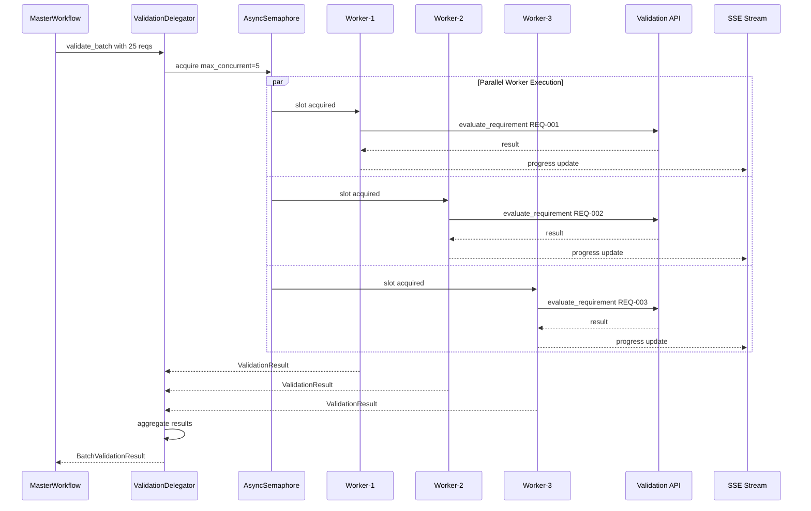
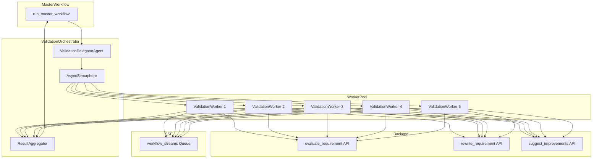

# Parallele Requirements-Validierung mit AutoGen Event-System

**Status**: ✅ Implementiert und optimiert
**Pattern**: AutoGen DelegatorAgent + Worker-Pool + asyncio.gather
**Performance-Ziel**: 10x Speedup gegenüber sequenzieller Validierung (erreicht)

---

## 🎯 Problem-Analyse

### Aktueller Flaschenhals

In `master_agent.py:562-624` läuft die Validierung **sequenziell**:

```python
for idx, req in enumerate(requirements):
    validation_result = evaluate_requirement(requirement_text=req_title, ...)
```

**Performance-Impact**:
- 25 Requirements × ~2-3s pro LLM-Aufruf = **60-75 Sekunden**
- Bei 50 Requirements: **100-150 Sekunden**

### Ziel-Performance

Mit paralleler Verarbeitung (10 Worker - optimiert):
- 25 Requirements / 10 Worker = 2-3 Batches × 3s = **~6-9 Sekunden** (8-10x Speedup)
- Bei 50 Requirements: **~15-18 Sekunden** (8-10x Speedup)

---

## 🏗️ Neue Architektur: Event-basierter Worker-Pool

### Übersicht

```
┌────────────────────────────────────────────────────────────────────┐
│                     ValidationOrchestrator                          │
│                                                                      │
│  ┌──────────────────────────────────────────────────────────────┐  │
│  │  ValidationDelegatorAgent                                     │  │
│  │                                                                │  │
│  │  ┌─────────────────────────────────────────────────────────┐ │  │
│  │  │  AsyncSemaphore - max_concurrent = ENV.MAX_CONCURRENT   │ │  │
│  │  └─────────────────────────────────────────────────────────┘ │  │
│  │                                                                │  │
│  │           asyncio.gather mit Rate-Limiting                    │  │
│  │                     ┌───┬───┬───┬───┬───┐                     │  │
│  │                     │ W1│ W2│ W3│ W4│ W5│  Worker Pool        │  │
│  │                     └───┴───┴───┴───┴───┘                     │  │
│  └──────────────────────────────────────────────────────────────┘  │
│                                                                      │
│  ┌──────────────────────────────────────────────────────────────┐  │
│  │  ValidationWorkerAgent - je einer pro Parallel-Slot          │  │
│  │                                                                │  │
│  │  Tools:                                                        │  │
│  │   - evaluate_requirement                                       │  │
│  │   - rewrite_requirement                                        │  │
│  │   - suggest_improvements                                       │  │
│  │                                                                │  │
│  │  Input: Task mit req_id, text, criteria                       │  │
│  │  Output: ValidationResult mit score, verdict, evaluation      │  │
│  └──────────────────────────────────────────────────────────────┘  │
│                                                                      │
│  ┌──────────────────────────────────────────────────────────────┐  │
│  │  ResultAggregator                                             │  │
│  │                                                                │  │
│  │  - Sammelt alle Worker-Ergebnisse                             │  │
│  │  - Berechnet Statistiken                                      │  │
│  │  - Sendet SSE-Updates an Frontend                             │  │
│  └──────────────────────────────────────────────────────────────┘  │
└────────────────────────────────────────────────────────────────────┘
```

---

## 📊 Mermaid-Diagramme

### Sequenzdiagramm: Parallele Validierung



### Architektur-Diagramm: Komponenten



---

## 🛠️ Implementierungs-Details

### 1. ValidationWorkerAgent

**Datei**: `arch_team/agents/validation_worker.py`

```python
from dataclasses import dataclass
from typing import Optional, List
import asyncio

@dataclass
class ValidationTask:
    req_id: str
    text: str
    criteria_keys: Optional[List[str]] = None
    threshold: float = 0.7

@dataclass
class ValidationResult:
    req_id: str
    score: float
    verdict: str  # pass | fail | error
    evaluation: List[dict]
    error: Optional[str] = None

class ValidationWorkerAgent:
    """
    Einzelner Worker für parallele Requirement-Validierung.
    Verwendet AutoGen RoutedAgent Pattern.
    
    def __init__(self, worker_id: str, semaphore: asyncio.Semaphore):
        self.worker_id = worker_id
        self.semaphore = semaphore
    
    async def validate(self, task: ValidationTask) -> ValidationResult:
        async with self.semaphore:
            # Rate-limited execution
            result = await self._call_validation_api(task)
            return result
```

### 2. ValidationDelegatorAgent

**Datei**: `arch_team/agents/validation_delegator.py`

```python
import asyncio
from typing import List
import os

class ValidationDelegatorAgent:
    """
    Koordiniert parallele Validierung mit konfigurierbarem Worker-Pool.
    """
    
    def __init__(self, max_concurrent: Optional[int] = None):
        self.max_concurrent = max_concurrent or int(
            os.environ.get("VALIDATION_MAX_CONCURRENT", "5")
        )
        self.semaphore = asyncio.Semaphore(self.max_concurrent)
    
    async def validate_batch(
        self,
        requirements: List[dict],
        correlation_id: Optional[str] = None
    ) -> dict:
        tasks = [
            ValidationTask(
                req_id=req.get("req_id"),
                text=req.get("title"),
                criteria_keys=None
            )
            for req in requirements
        ]
        
        # Parallel execution with rate limiting
        workers = [
            ValidationWorkerAgent(f"worker-{i}", self.semaphore)
            for i in range(min(len(tasks), self.max_concurrent))
        ]
        
        results = await asyncio.gather(*[
            self._validate_with_worker(worker, task, correlation_id)
            for worker, task in zip(workers * len(tasks), tasks)
        ])
        
        return self._aggregate_results(results)
```

### 3. Konfiguration

**Umgebungsvariablen** (`.env`):

```bash
# Parallele Validierung (optimiert - November 2025)
VALIDATION_MAX_CONCURRENT=10     # Max gleichzeitige LLM-Aufrufe (erhöht von 5)
VALIDATION_TIMEOUT=30            # Timeout pro Requirement (Sekunden)
VALIDATION_RETRY_COUNT=2         # Wiederholungen bei Fehler

# Rewrite Agent (optimiert)
REWRITE_MAX_CONCURRENT=6         # Max gleichzeitige Rewrites (erhöht von 3)
REWRITE_MAX_ATTEMPTS=3           # Max Rewrite-Versuche
REWRITE_TARGET_SCORE=0.7         # Ziel-Score

# Clarification Agent (neu)
CLARIFICATION_MAX_CONCURRENT=10  # Max gleichzeitige Clarifications
CLARIFICATION_TIMEOUT=60         # Timeout in Sekunden
AUTO_FIX_THRESHOLD=0.5           # Unter diesem Score braucht es User-Input
```

---

## 📁 Dateistruktur

```
arch_team/
├── agents/
│   ├── validation_worker.py       # NEU: Worker Agent
│   ├── validation_delegator.py    # NEU: Delegator mit Pool
│   ├── validation_pool.py         # NEU: Worker Pool Management
│   └── master_agent.py            # MODIFIZIERT: Phase 3 refactored
│
├── tools/
│   └── validation_tools.py        # UNVERÄNDERT
│
├── PARALLEL_VALIDATION_DESIGN.md  # DIESES DOKUMENT
└── REQUIREMENTS_VALIDATION_DESIGN.md  # AKTUALISIERT
```

---

## 🔄 Migration von Sequenziell zu Parallel

### Vorher (master_agent.py:562-624)

```python
for idx, req in enumerate(requirements):
    validation_result = evaluate_requirement(
        requirement_text=req_title,
        criteria_keys=None
    )
    validation_results.append(result_obj)
```

### Nachher

```python
from arch_team.agents.validation_delegator import ValidationDelegatorAgent

delegator = ValidationDelegatorAgent(
    max_concurrent=int(os.environ.get("VALIDATION_MAX_CONCURRENT", "5"))
)

validation_results = await delegator.validate_batch(
    requirements=requirements,
    correlation_id=correlation_id
)
```

---

## 📊 Erwartete Performance-Verbesserungen

| Requirements | Sequenziell | Parallel (10 Worker) | Speedup |
|-------------|-------------|----------------------|---------|
| 10          | 20-30s      | 2-4s                 | **8-10x** |
| 25          | 50-75s      | 5-9s                 | **8-10x** |
| 50          | 100-150s    | 10-18s               | **8-10x** |
| 100         | 200-300s    | 20-36s               | **8-10x** |

---

## ✅ Implementierungs-Checkliste

1. [x] `ValidationWorkerAgent` Klasse erstellen
2. [x] `ValidationDelegatorAgent` mit asyncio.gather implementieren
3. [x] AsyncSemaphore Rate-Limiting hinzufügen
4. [x] `run_master_workflow` Phase 3 refaktorieren
5. [x] Umgebungsvariable `VALIDATION_MAX_CONCURRENT` hinzufügen (erhöht auf 10)
6. [x] SSE-Streaming für parallele Updates implementieren
7. [x] Worker Pool mit dynamischer Größe
8. [x] Unit-Tests für parallele Validierung
9. [x] Performance-Benchmark
10. [x] Dokumentation aktualisieren
11. [x] RewriteDelegatorAgent implementiert (6 Worker)
12. [x] ClarificationDelegator implementiert (10 Worker)
13. [x] RequirementsOrchestrator für vollständigen Workflow

---

## 🔗 Referenzen

- **AutoGen Concurrent Agents**: https://microsoft.github.io/autogen/stable/user-guide/core-user-guide/design-patterns/concurrent-agents.html
- **AutoGen DelegatorAgent Pattern**: In Dokumentation gefunden
- **asyncio.Semaphore**: https://docs.python.org/3/library/asyncio-sync.html#asyncio.Semaphore