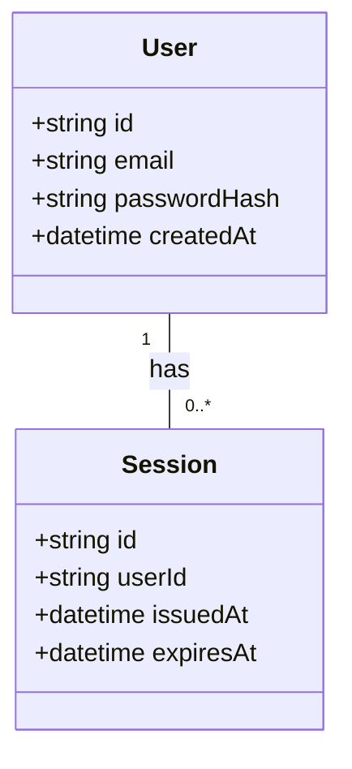
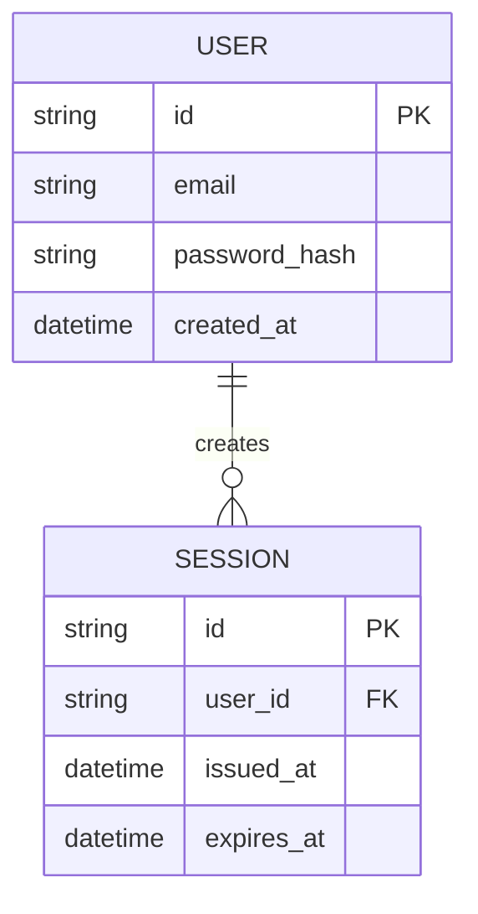

# TypesMermaidAgent – Spezifikation
Erstellungsdatum: 2025-08-23T13:21:23Z (UTC)
Quellen:
- Basisprompts/Guards: [`arch_team/prompts/base_prompt_guard.md`](arch_team/prompts/base_prompt_guard.md:1), [`arch_team/prompts/requirements_policy.md`](arch_team/prompts/requirements_policy.md:1), [`arch_team/prompts/mermaid_rules.md`](arch_team/prompts/mermaid_rules.md:1) (Legacy-Quelle fehlt – neutrale Spezifikation)
- CoT/Privacy: [`arch_team/runtime/cot_postprocessor.py`](arch_team/runtime/cot_postprocessor.py:1)
- RAG/Memory und Tooling: [`arch_team/memory/retrieval.py`](arch_team/memory/retrieval.py:1), [`arch_team/workbench/workbench.py`](arch_team/workbench/workbench.py:1), [`arch_team/workbench/tools/qdrant_search.py`](arch_team/workbench/tools/qdrant_search.py:1)

Hinweis: Quelle nicht verfügbar – neutrale Spezifikation nach Architekturleitlinien.

## 1) Titel und Kurzbeschreibung
Rolle: TypesMermaidAgent. Erzeugt gültige Mermaid-Klassendiagramme (classDiagram) oder Entity-Relationship-Diagramme (erDiagram) zur Modellierung zentraler Datentypen/Entities inkl. Beziehungen und optionaler REQ-Referenzen.

## 2) Rolle und Verantwortlichkeiten
- Erkennen und Modellieren von Haupt-Entities, deren Attribute/Felder und Typen.
- Beziehungen (Assoziation/Aggregation/Komposition oder PK/FK) prägnant darstellen.
- REQ-IDs in Notizen/Labels kommentieren, wo zutreffend.
- Gültige Mermaid-Syntax, kompakt und eindeutig.

## 3) Eingaben
Pflichtfelder:
- context: Domänen-/Problemkontext als Freitext.
- diagram: "class"|"er" (Diagrammtyp).
Optional:
- entities_hint: Liste bekannter Entities/Felder als Starthinweis.
- memory_refs: Verweise/REQ-IDs für RAG.
- prior_outputs: Vorherige Artefakte (z. B. REQ-Liste, Dataflow-Diagramm).
- rag_hint: Freitext für semantische Suche.

## 4) Ausgaben (Output-Vertrag)
- UI erhält ausschließlich FINAL_ANSWER; darin genau ein mermaid-Codeblock.
- Bei ausreichender Abdeckung optional letzte Zeile „COVERAGE_OK“.

Beispiel (classDiagram):

COVERAGE_OK

Beispiel (erDiagram):


## 5) Qualitäts-/Validierungsregeln
- Mermaid-Code syntaktisch valide; mindestens 2 Entities, 3+ Attribute gesamt, 1+ Beziehung.
- Feldnamen und einfache Typen (string, int, float, bool, datetime) angeben.
- REQ-IDs referenzieren, sofern REQs vorhanden sind.
- Beachte:
  - [`arch_team/prompts/base_prompt_guard.md`](arch_team/prompts/base_prompt_guard.md:1)
  - [`arch_team/prompts/requirements_policy.md`](arch_team/prompts/requirements_policy.md:1)
  - [`arch_team/prompts/mermaid_rules.md`](arch_team/prompts/mermaid_rules.md:1)

## 6) Privacy und CoT
- Nur FINAL_ANSWER an UI; THOUGHTS/EVIDENCE/CRITIQUE/DECISION privat (vgl. [`arch_team/runtime/cot_postprocessor.py`](arch_team/runtime/cot_postprocessor.py:1)).

## 7) Tool-/RAG-Nutzung
- JSON-Tool-Call gemäß Workbench: [`arch_team/workbench/workbench.py`](arch_team/workbench/workbench.py:1)
- Qdrant-Suche/Contexts: [`arch_team/workbench/tools/qdrant_search.py`](arch_team/workbench/tools/qdrant_search.py:1), [`arch_team/memory/retrieval.py`](arch_team/memory/retrieval.py:1)
Beispiel-Tool-Call:
```json
{ "tool": "qdrant_search", "args": { "query": "entities authentication", "top_k": 5 } }
```

## 8) Akzeptanzkriterien
- Diagramm rendert ohne Fehler in Mermaid.
- Entities/Felder/Beziehungen sind konsistent und aus dem Kontext herleitbar.
- Falls REQs existieren: mindestens eine REQ-Referenz im Diagramm-Kommentar.
- Optional: „COVERAGE_OK“ am Ende bei hinreichender Modellabdeckung.