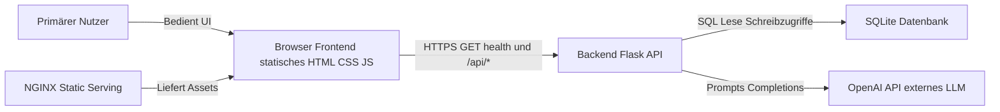
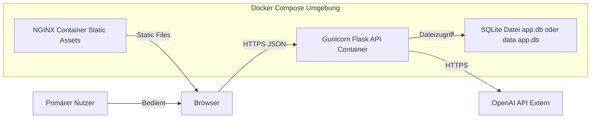
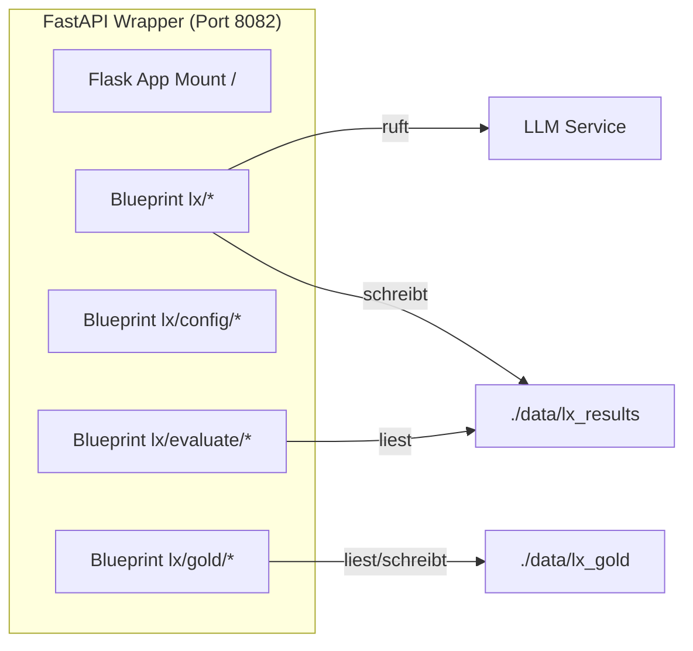

# C4 Architektur-Übersicht Zielzustand

Hinweis: Quelle in docs/architecture/C4.puml. Diese Datei enthält eine Mermaid-Preview je Level.

## Level 1 System Context

## Level 2 Container

## Dev System Setup (v2 LangExtract)

- Dienste/Ports (lokal):

  - Frontend Dev: `http://localhost:5173` (alternativ statisch: `frontend/mining_demo.html`)
  - Nginx Proxy: `http://localhost:8080` (optional)
  - v2 FastAPI Wrapper (Flask eingebettet): `http://localhost:8082`
  - SQLite: `./data/app.db`
  - Qdrant (optional): `6333/6335`
  - OpenAI API: extern
- Start (lokal):

  - Backend v2: `python -m uvicorn backend_app_v2.main:fastapi_app --host 0.0.0.0 --port 8082 --reload`
  - Frontend: beliebiger Static-Server für `frontend/` oder direkt im Browser öffnen
- Hauptendpunkte (v2):

  - `POST /api/v1/lx/extract` – Mining (Datei-Upload, Chunking, Fast-Mode, Few-shot via Gold)
  - `GET/POST /api/v1/lx/config/*` – Konfigurationsverwaltung (Prompts/Beispiele)
  - `GET/POST /api/v1/lx/gold/*` – Gold-Sets verwalten/auto-generieren
  - `POST /api/v1/lx/evaluate` – Evaluation P/R/F1 gegen Gold
  - `POST /api/v1/lx/evaluate/auto` – One‑Click: Extract → Auto‑Gold → Evaluate

- Speicherpfade (v2):
  - Ergebnisse (LX): `./data/lx_results/*.json`
  - Gold‑Sets: `./data/lx_gold/{goldId}.json`

## Level 3 Komponenten Backend

### Komponenten-Ergänzung v2 (LangExtract)

Abweichungen zum aktuellen Stand werden in docs/architecture/README.md genannt.
