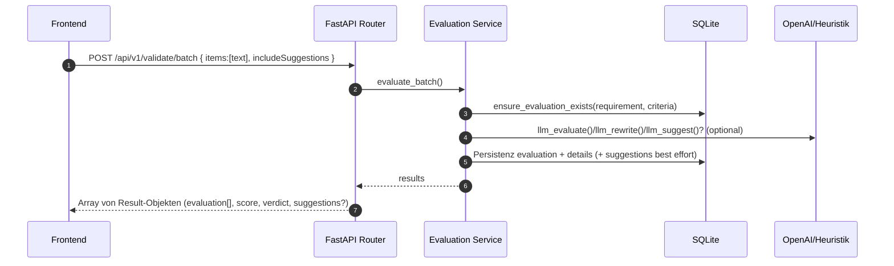
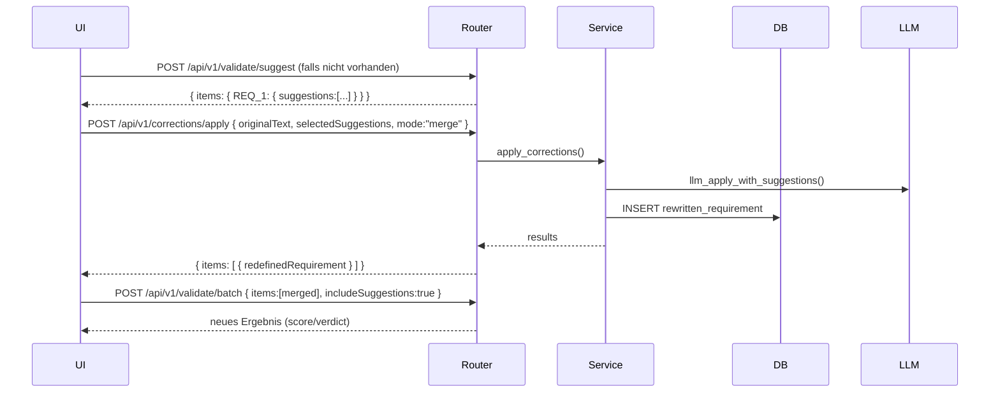
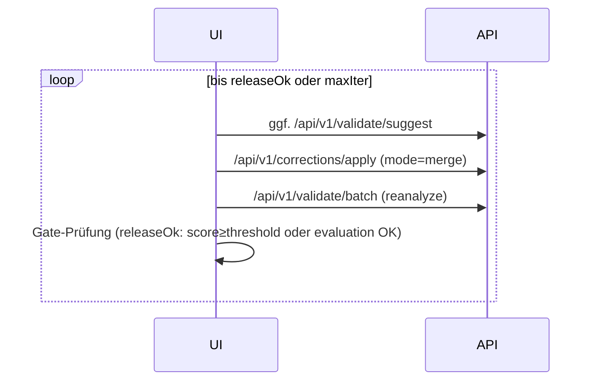
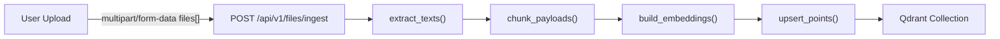
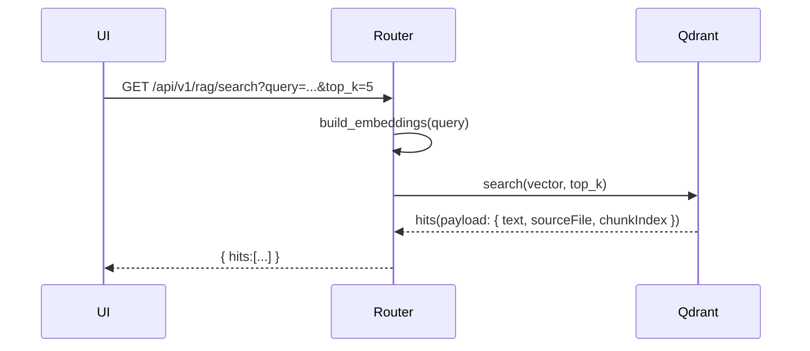
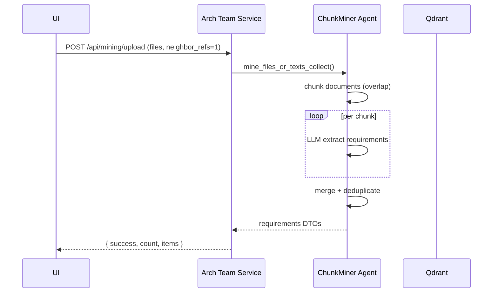
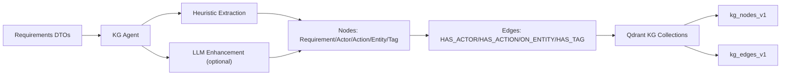
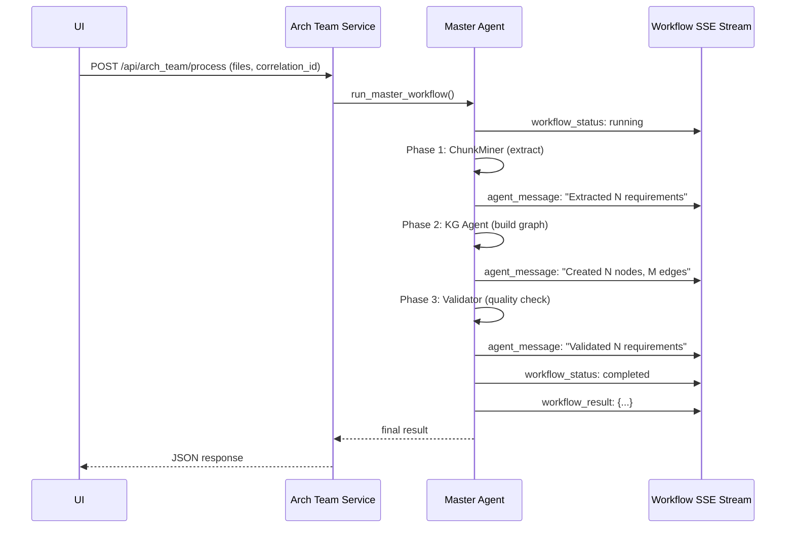

# Features, System-Diagramme und Technologie-Stacks

Ziel:

- Systemdiagramme je logischem Feature (Mermaid)
- Kompakte, aber vollständige Dokumentation pro Technologie-Stack
- 10+ Showcase-Szenarien (verschiedene Länge, verschiedene Projektvarianten), alle aus diesem Template ableitbar
- Deep-Links in den Code mit klickbaren Sprachelementen (Datei/Zeile)

Verweis auf den Systemüberblick und Abhängigkeits-Matrix:

- [docs/architecture/SYSTEM_OVERVIEW.md](./SYSTEM_OVERVIEW.md)
- [docs/ARCHITECTURE_OVERVIEW.md](../ARCHITECTURE_OVERVIEW.md) (Englisch, detailliert)

Hinweis Link-Konvention:

- Dateien und Sprachelemente sind klickbar, z. B. [backend.core.__init__.create_app()](../../backend/core/__init__.py:13), [backend.routers.validate_router.*](../../backend/routers/validate_router.py)

---

## 1) Feature-Diagramme

### 1.1 Validate Batch (Array-basierte Auswertung)



Hauptcode:

- Router: [backend.routers.validate_router.*](../../backend/routers/validate_router.py)
- Service: [backend.services.evaluation_service.evaluate_batch()](../../backend/services/evaluation_service.py)
- Core: [backend.core.llm.llm_evaluate()](../../backend/core/llm.py:102), [backend.core.llm.llm_rewrite()](../../backend/core/llm.py:253)

### 1.2 Suggestions + Apply (Merge) + Re-Analyze



Hauptcode:

- Routers: [backend.routers.validate_router.*](../../backend/routers/validate_router.py), [backend.routers.corrections_router.*](../../backend/routers/corrections_router.py)
- Core: [backend.core.llm.llm_apply_with_suggestions()](../../backend/core/llm.py:339)

### 1.3 Auto-Refine (UI-gesteuerte Schleife)



Hauptcode (Frontend):

- Gates/Heuristik: [frontend.app_optimized.computeOk()](../../frontend/app_optimized.js:25), [frontend.app_optimized.releaseOk()](../../frontend/app_optimized.js:53)
- Flow: [frontend.app_optimized.autoRefineIndex()](../../frontend/app_optimized.js:1947), [frontend.app_optimized.ensureSuggestions()](../../frontend/app_optimized.js:162), [frontend.app_optimized.mergeApply()](../../frontend/app_optimized.js:211), [frontend.app_optimized.reanalyzeIndex()](../../frontend/app_optimized.js:1834)

### 1.4 Datei-Ingest → Vektor-Index (Qdrant)



Hauptcode:

- API: [backend.core.api.files_ingest()](../../backend/core/api.py) (Flask legacy)
- Ingest: [backend.core.ingest.extract_texts()](../../backend/core/ingest.py:230), [backend.core.ingest.chunk_payloads()](../../backend/core/ingest.py:287)
- Embeddings: [backend.core.embeddings.build_embeddings()](../../backend/core/embeddings.py:59)
- Vector Store: [backend.core.vector_store.upsert_points()](../../backend/core/vector_store.py:109)

### 1.5 RAG-Suche (einfach)



Hauptcode:

- Router: [backend.routers.vector_router.*](../../backend/routers/vector_router.py)
- Vector Store: [backend.core.vector_store.search()](../../backend/core/vector_store.py:151)

### 1.6 Requirements Mining (Arch Team ChunkMiner)



Hauptcode:

- Service: [arch_team.service.mining_upload()](../../arch_team/service.py:93)
- Agent: [arch_team.agents.chunk_miner.mine_files_or_texts_collect()](../../arch_team/agents/chunk_miner.py)

### 1.7 Knowledge Graph Construction (Arch Team KG Agent)



Hauptcode:

- Service: [arch_team.service.kg_build()](../../arch_team/service.py:214)
- Agent: [arch_team.agents.kg_agent.run()](../../arch_team/agents/kg_agent.py)
- Memory: [arch_team.memory.qdrant_kg.QdrantKGClient](../../arch_team/memory/qdrant_kg.py)

### 1.8 Society of Mind Workflow (Master Agent)



Hauptcode:

- Service: [arch_team.service.arch_team_process()](../../arch_team/service.py:1358)
- Master Agent: [arch_team.agents.master_agent.run_master_workflow()](../../arch_team/agents/master_agent.py:305)
- SSE: [arch_team.service.workflow_stream()](../../arch_team/service.py:1214)

### 1.9 Vector-Reset (Admin)

```mermaid
flowchart LR
  UI-->Router[/api/v1/vector/reset (POST)/]
  Router-->Q[reset_collection()]
  Q-->Router
  Router-->UI
```

Hauptcode:

- Router: [backend.routers.vector_router.*](../../backend/routers/vector_router.py)
- Vector Store: [backend.core.vector_store.reset_collection()](../../backend/core/vector_store.py:197)

---

## 2) Technologie-Stacks

### 2.1 Backend/Consolidated (FastAPI + Flask)

**Struktur:**
- FastAPI App: [backend/main.py](../../backend/main.py) - Haupt-Entry mit Flask WSGI mount
- Flask App: [backend.core.__init__.create_app()](../../backend/core/__init__.py:13) - Legacy-Kompatibilität
- FastAPI Routers: [backend/routers/](../../backend/routers/) - lx_router, validate_router, vector_router, batch_router, corrections_router, gold_router, structure_router
- Service Layer: [backend/services/](../../backend/services/) - Port-Adapter pattern
- Core Business Logic: [backend/core/](../../backend/core/) - llm, db, embeddings, vector_store, ingest, rag, agents

**Logging/Middleware:**
- Request-ID: [backend/main.py:47](../../backend/main.py:47)
- Structured Logging: [backend.core.logging_ext.*](../../backend/core/logging_ext.py)
- Runtime Config: [backend.core.settings.get_runtime_config()](../../backend/core/settings.py)

**Persistenz:**
- SQLite DDL: [backend.core.db.DDL](../../backend/core/db.py)
- Init: [backend.core.db.init_db()](../../backend/core/db.py)
- Migrations: [backend.core.db.ensure_schema_migrations()](../../backend/core/db.py)

**Utils:**
- [backend.core.utils.*](../../backend/core/utils.py)

**Laufzeit:**
- Port: 8087 (API_PORT in ENV)
- WSGI: Gunicorn (siehe [Dockerfile](../../Dockerfile))

### 2.2 Arch Team (Society of Mind Multi-Agent System)

**Purpose:** Requirements mining, Knowledge Graph construction, validation with AutoGen 0.4+

**Struktur:**
- Service: [arch_team/service.py](../../arch_team/service.py) - Flask app mit SSE streaming
- Master Agent: [arch_team.agents.master_agent.*](../../arch_team/agents/master_agent.py) - Society of Mind orchestration
- Specialized Agents:
  - ChunkMiner: [arch_team.agents.chunk_miner.*](../../arch_team/agents/chunk_miner.py)
  - KG Agent: [arch_team.agents.kg_agent.*](../../arch_team/agents/kg_agent.py)
  - Validator: Requirements quality evaluation
  - RAG: Semantic search, duplicate detection
  - QA: Final quality review
  - UserClarification: Human-in-the-loop

**Tools:**
- Mining: [arch_team.tools.mining_tools.*](../../arch_team/tools/mining_tools.py)
- KG: [arch_team.tools.kg_tools.*](../../arch_team/tools/kg_tools.py)
- Validation: [arch_team.tools.validation_tools.*](../../arch_team/tools/validation_tools.py)
- RAG: [arch_team.tools.rag_tools.*](../../arch_team/tools/rag_tools.py)

**Memory & Persistence:**
- Qdrant KG: [arch_team.memory.qdrant_kg.*](../../arch_team/memory/qdrant_kg.py) - kg_nodes_v1, kg_edges_v1
- Retrieval: [arch_team.memory.retrieval.*](../../arch_team/memory/retrieval.py)
- Trace Sink: [arch_team.memory.qdrant_trace_sink.*](../../arch_team/memory/qdrant_trace_sink.py)

**Laufzeit:**
- Port: 8000 (APP_PORT in ENV)
- SSE Streaming: /api/workflow/stream, /api/clarification/stream
- AutoGen 0.4+: AssistantAgent, RoundRobinGroupChat, TextMentionTermination

### 2.3 LLM/OpenAI

**Backend Core:**
- Evaluate/Suggest/Rewrite/Apply: [backend.core.llm.*](../../backend/core/llm.py)
- Fallbacks (kein API-Key): Heuristiken / Originaltext - [backend.core.llm._heuristic_mock_evaluation()](../../backend/core/llm.py:18)
- Embeddings (REST): [backend.core.embeddings.build_embeddings()](../../backend/core/embeddings.py:59)
- Prompts aus Dateien: [backend.core.settings.get_system_prompt()](../../backend/core/settings.py); Pfade in [.env](../../.env)

**Arch Team:**
- Agent-gesteuerte LLM-Calls über AutoGen
- ChunkMiner: Dokumenten-basierte Extraktion
- KG Agent: Optional LLM-Enhancement für Entitäten

**Wichtige ENV:**
- OPENAI_API_KEY, OPENAI_MODEL (default: gpt-4o-mini)
- LLM_TEMPERATURE, LLM_TOP_P, LLM_MAX_TOKENS
- EMBEDDINGS_MODEL (default: text-embedding-3-small)
- MODEL_NAME (Arch Team, default: gpt-4o-mini)
- MOCK_MODE (true für heuristische Evaluation)

### 2.4 Vector-DB/Qdrant

**Backend Collections:**
- `requirements_v2`: RAG document chunks mit embeddings
- Client: [backend.core.vector_store.*](../../backend/core/vector_store.py)
- Port-Fallback: [backend.core.vector_store.get_qdrant_client()](../../backend/core/vector_store.py:41) prüft 6333/6401

**Arch Team Collections:**
- `kg_nodes_v1`: Knowledge Graph Knoten (Requirement, Actor, Action, Entity, Tag)
- `kg_edges_v1`: Knowledge Graph Kanten (HAS_ACTOR, HAS_ACTION, ON_ENTITY, HAS_TAG)
- `arch_trace`: Agent conversation traces
- Client: [arch_team.memory.qdrant_kg.QdrantKGClient](../../arch_team/memory/qdrant_kg.py)

**Compose:**
- [docker-compose.qdrant.yml](../../docker-compose.qdrant.yml)
- Ports: Container 6333, Host 6401 (fallback)

### 2.5 Frontend/UI

**React App (Modern):**
- Entry: [src/App.jsx](../../src/App.jsx)
- Components:
  - Configuration: [src/components/Configuration.jsx](../../src/components/Configuration.jsx)
  - Knowledge Graph: [src/components/KnowledgeGraph.jsx](../../src/components/KnowledgeGraph.jsx) - Cytoscape.js visualization
  - Requirements: [src/components/Requirements.jsx](../../src/components/Requirements.jsx)
  - Agent Status: [src/components/AgentStatus.jsx](../../src/components/AgentStatus.jsx) - SSE integration
  - Chat Interface: [src/components/ChatInterface.jsx](../../src/components/ChatInterface.jsx)
- Vite Dev Server: Port 5173
- SSE Integration: EventSource für real-time agent messages

**Static HTML/JS (Legacy):**
- Einstieg: [frontend/index.html](../../frontend/index.html)
- Mining Demo: [frontend/mining_demo.html](../../frontend/mining_demo.html)
- KG View: [frontend/kg_view.html](../../frontend/kg_view.html)
- Logik/Flow: [frontend/app_optimized.js](../../frontend/app_optimized.js) - Batch-only UI, Auto-Refine, RAG, Upload
- Styles: [frontend/styles.css](../../frontend/styles.css)

### 2.6 Tests/Playwright

**UI E2E:**
- Auto-Refine: [tests/ui/auto-refine.spec.ts](../../tests/ui/auto-refine.spec.ts)
- E2E: [tests/e2e/](../../tests/e2e/)
- Config: [playwright.config.ts](../../playwright.config.ts)

**Backend Tests:**
- RAG Models: [tests/backend/test_rag_models.py](../../tests/backend/test_rag_models.py)
- LangExtract v2: [tests/backend/test_lx_extract_v2.py](../../tests/backend/test_lx_extract_v2.py)

**Service Tests:**
- Evaluation Service: [tests/services/test_evaluation_service.py](../../tests/services/test_evaluation_service.py)

**Parity Tests:**
- v1 vs v2: [tests/parity/test_parity_core.py](../../tests/parity/test_parity_core.py) - MOCK_MODE=true

**Arch Team Tests:**
- AutoGen Smoke: [tests/arch_team/test_autogen_rac_smoke.py](../../tests/arch_team/test_autogen_rac_smoke.py)
- E2E Pipeline: [tests/arch_team/test_e2e_pipeline.py](../../tests/arch_team/test_e2e_pipeline.py)
- ChunkMiner CLI: [tests/arch_team/test_chunk_miner_cli.py](../../tests/arch_team/test_chunk_miner_cli.py)

**RAG Benchmark:**
- [tests/rag_benchmark.py](../../tests/rag_benchmark.py)

### 2.7 Docker/Infra

**Backend Image:**
- Dockerfile: [Dockerfile](../../Dockerfile)
- Konsolidierte Backend (FastAPI+Flask): Port 8087

**Arch Team Image:**
- Separater Service: Port 8000

**Qdrant:**
- [docker-compose.qdrant.yml](../../docker-compose.qdrant.yml)
- Ports: 6333 (container), 6401 (host fallback)

**ENV Beispiele:**
- [.env.example](../../.env.example)
- [.env.example.models](../../.env.example.models)

**Docker Compose:**
- Full stack: [docker-compose.yml](../../docker-compose.yml)
- Services: backend, arch_team, nginx, qdrant

---

## 3) 12 Showcases (aus diesem Template ableitbar)

Ziel: Vielfalt bei Länge/Scope, alle rein aus Bestandteilen dieses Repos.

### 1) Evaluate-Only API (ohne RAG)

- Ziel: Nur /api/v1/validate/batch konsumieren.
- Einstiegscode: [backend.routers.validate_router.*](../../backend/routers/validate_router.py)
- Minimal-Call:
  ```bash
  curl -X POST "$API_BASE/api/v1/validate/batch" -H "Content-Type: application/json" \
       -d '{"items":["System shall respond within 200 ms."],"includeSuggestions":true}'
  ```

### 2) Suggestions-Apply Pipeline (Atom-Merge)

- Ziel: Vorschläge generieren und konsolidiert anwenden.
- Endpunkte: [backend.routers.validate_router.*](../../backend/routers/validate_router.py) (suggest), [backend.routers.corrections_router.*](../../backend/routers/corrections_router.py) (apply)
- Schrittfolge: suggest → apply(merge) → validate/batch

### 3) Auto-Refine UI Loop

- Ziel: Automatisches Erreichen des Release-Gates.
- Codepfad (UI): [frontend.app_optimized.autoRefineIndex()](../../frontend/app_optimized.js:1947)
- Testabdeckung: [tests/ui/auto-refine.spec.ts](../../tests/ui/auto-refine.spec.ts)

### 4) Markdown-Batch Verarbeitung (Server-Quelle)

- Ziel: Serverseitig Markdown-Tabelle evaluieren.
- Endpunkte: [backend.routers.batch_router.*](../../backend/routers/batch_router.py), [backend.core.utils.parse_requirements_md()](../../backend/core/utils.py)
- Ergebnis: mergedMarkdown (optional nach [.env OUTPUT_MD_PATH](../../.env))

### 5) RAG Suche (einfach)

- Ziel: Query → topK Treffer aus Qdrant.
- Endpunkt: [backend.routers.vector_router.*](../../backend/routers/vector_router.py) (rag_search)
- Voraussetzung: Ingest via [files/ingest](../../backend/core/api.py) (Flask legacy)

### 6) RAG Semantic Search (Arch Team)

- Ziel: Semantic search über requirements_v2 collection mit grouping.
- Endpunkt: [arch_team.service.rag_semantic_search()](../../arch_team/service.py:833)
- Features: Duplicate detection, clustering, related requirements

### 7) Vector-Index Admin (Reset, Health, Collections)

- Ziele: Reset, Health, List.
- Endpunkte:
  - Backend: [backend.routers.vector_router.*](../../backend/routers/vector_router.py)
  - Arch Team: [arch_team.service.kg_search_nodes()](../../arch_team/service.py:292), [arch_team.service.kg_neighbors()](../../arch_team/service.py:334)
- UI-Integration: [frontend.index reset-index-btn](../../frontend/index.html), Handler [frontend.app_optimized.resetIndex()](../../frontend/app_optimized.js:424)

### 8) Streaming-Validate (NDJSON)

- Ziel: Item-weise Ergebnisse streamen.
- Endpunkt: [backend.routers.validate_router.*](../../backend/routers/validate_router.py) (validate_batch_stream)
- Client: fetch ReadableStream (Browser) oder curl --no-buffer

### 9) Mock-Mode Offline Demo

- Ziel: Ohne OPENAI_API_KEY evaluieren.
- Heuristiken: [backend.core.llm._heuristic_mock_evaluation()](../../backend/core/llm.py:18)
- Steuerung: ENV MOCK_MODE / leerer Schlüssel

### 10) RAG Benchmark Suite

- Ziel: Einfaches Qualitäts-Benchmarking der RAG-Treffer.
- Script: [tests/rag_benchmark.py](../../tests/rag_benchmark.py)
- Ergebnisartefakte: tests/out/rag_report.json, tests/out/rag_report.md

### 11) Requirements Mining with ChunkMiner

- Ziel: Automatische Extraktion aus Dokumenten mit Chunk-basiertem Mining.
- Endpunkt: [arch_team.service.mining_upload()](../../arch_team/service.py:93)
- Features:
  - Neighbor evidence (±1 chunk context)
  - Token-based chunking mit overlap
  - DTO format mit evidence_refs
- Frontend: [frontend/mining_demo.html](../../frontend/mining_demo.html)

### 12) Knowledge Graph Construction & Visualization

- Ziel: KG aus Requirements bauen und visualisieren.
- Endpunkte:
  - Build: [arch_team.service.kg_build()](../../arch_team/service.py:214)
  - Search Nodes: [arch_team.service.kg_search_nodes()](../../arch_team/service.py:292)
  - Neighbors: [arch_team.service.kg_neighbors()](../../arch_team/service.py:334)
- Features:
  - Heuristic + LLM entity extraction
  - Node types: Requirement, Actor, Action, Entity, Tag
  - Edge types: HAS_ACTOR, HAS_ACTION, ON_ENTITY, HAS_TAG
  - Qdrant persistence (kg_nodes_v1, kg_edges_v1)
- Frontend: [src/components/KnowledgeGraph.jsx](../../src/components/KnowledgeGraph.jsx) - Cytoscape.js interactive visualization

---

## 4) Schnittstellen und Verträge (Kurzreferenz)

### Backend Endpoints

**Evaluate Batch**
- Request: `{ items: string[], includeSuggestions?: boolean }`
- Response: `Array<{ id, originalText, correctedText, evaluation[], score, verdict, suggestions? }>`
- Implementierung: [backend.routers.validate_router.*](../../backend/routers/validate_router.py)

**Suggestions**
- Request: `string[]` oder `{ items: string[] }`
- Response: `{ items: { REQ_n: { suggestions: Atom[] } } }` oder `Atom[]`
- Implementierung: [backend.routers.validate_router.*](../../backend/routers/validate_router.py)

**Apply Corrections**
- Request: `{ originalText, selectedSuggestions: Atom[], mode: "merge"|"split", context? }`
- Response: `{ evaluationId, items: [{ rewrittenId, redefinedRequirement }] }`
- Implementierung: [backend.routers.corrections_router.*](../../backend/routers/corrections_router.py)

**Files Ingest**
- Multipart: `files[]` + optional `chunkMin`, `chunkMax`, `chunkOverlap`, `collection`
- Implementierung: [backend.core.api.files_ingest()](../../backend/core/api.py) (Flask legacy)

### Arch Team Endpoints

**Requirements Mining**
- Endpoint: POST /api/mining/upload
- Multipart: `file` or `files` fields
- Form params: `model` (optional), `neighbor_refs` (1|true|yes for ±1 context)
- Response: `{success, count, items: [DTO, ...]}`
- DTO Format: `{req_id, title, tag, evidence_refs: [{sourceFile, sha1, chunkIndex}]}`

**Knowledge Graph Build**
- Endpoint: POST /api/kg/build
- JSON: `{items: [DTO, ...], options: {persist: "qdrant", use_llm: false, llm_fallback: true}}`
- Response: `{success, stats, nodes, edges}`

**Society of Mind Workflow**
- Endpoint: POST /api/arch_team/process
- Multipart: `files`, `correlation_id` (for SSE streaming)
- Response: `{success, requirements, kg_data, validation_results}`
- SSE Stream: GET /api/workflow/stream?session_id=<correlation_id>
- Message Types: `agent_message`, `workflow_status`, `workflow_result`

---

## 5) Betrieb & Sicherheit (praktische Hinweise)

**CORS/Preflight:**

**Backend (FastAPI):**
- Global CORS Middleware: [backend/main.py](../../backend/main.py) - CORSMiddleware with allow_origins=["*"]

**Backend (Flask Legacy):**
- Globaler Intercept: [backend.core.__init__._global_api_preflight()](../../backend/core/__init__.py)
- OPTIONS-Catches: [backend.core.api.options_cors_catch_all()](../../backend/core/api.py)

**Arch Team:**
- Flask-CORS: [arch_team/service.py](../../arch_team/service.py) - CORS(app)

**Retention & Migrationen:**
- Retention: [backend.core.db.purge_old_evaluations()](../../backend/core/db.py)
- Migrationen/Indices: [backend.core.db.ensure_schema_migrations()](../../backend/core/db.py)

**Konfig-Snapshot:**
- [backend.core.logging_ext.log_runtime_config_once()](../../backend/core/logging_ext.py)
- Anonymisierung: nur boolean für API-Key-Präsenz
- Abrufbar via GET /api/runtime-config

**Request Tracing:**
- Jeder Request erhält UUID (X-Request-Id Header)
- Strukturiertes JSON Logging mit Request-ID
- Middleware: [backend/main.py:47](../../backend/main.py:47)

**Feature Flags:**
- FEATURE_FLAG_USE_V2: v2 Routing (default: true)
- CANARY_PERCENT: Sticky Canary % (0-100)
- Variant Header: X-Variant, X-Variant-Reason

**Health Checks:**
- Backend: GET /health, /ready, /livez
- Arch Team: GET /health
- Qdrant: GET /api/v1/vector/health

**SSE Streaming (Arch Team):**
- Workflow Stream: GET /api/workflow/stream?session_id=<correlation_id>
- Clarification Stream: GET /api/clarification/stream?session_id=<correlation_id>
- Auto-reconnect via browser EventSource
- Real-time agent messages without polling

---

## 6) Nächste Schritte (Verlinkungen & Aufteilung)

- Diese Sammeldatei liefert alle Feature-Diagramme, Stack-Beschreibungen und 12 Showcases in einem Dokument.
- Optionale Aufteilung in dedizierte Dateien:
  - stacks/: backend-consolidated.md, arch-team.md, llm-openai.md, vector-qdrant.md, frontend-react.md, frontend-static.md, testing-playwright.md, docker-infra.md
  - features/: validate-batch.md, suggestions-apply.md, auto-refine.md, files-ingest.md, rag-search.md, requirements-mining.md, kg-construction.md, society-of-mind.md, vector-reset.md
  - showcases/: 01-evaluate-only.md … 12-kg-visualization.md

Index/Navigation:

- Zentral: [docs/architecture/SYSTEM_OVERVIEW.md](./SYSTEM_OVERVIEW.md) (Deutsch, kompakt)
- Detailliert: [docs/ARCHITECTURE_OVERVIEW.md](../ARCHITECTURE_OVERVIEW.md) (Englisch, vollständig)
- Diese Datei: Features & Stacks & Showcases (kompakt, aktualisiert)

---

**Version:** Aktualisiert für konsolidierte Backend-Struktur + Arch Team Society of Mind (Stand: 2025-11-10)
