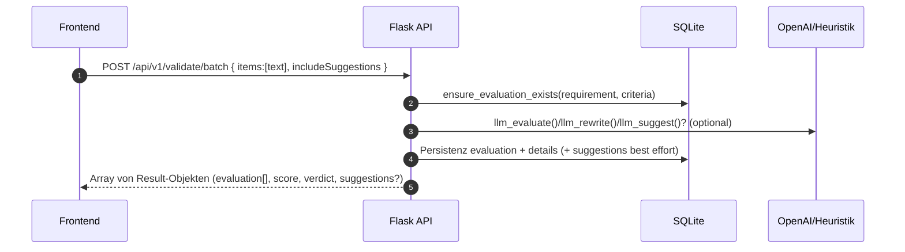
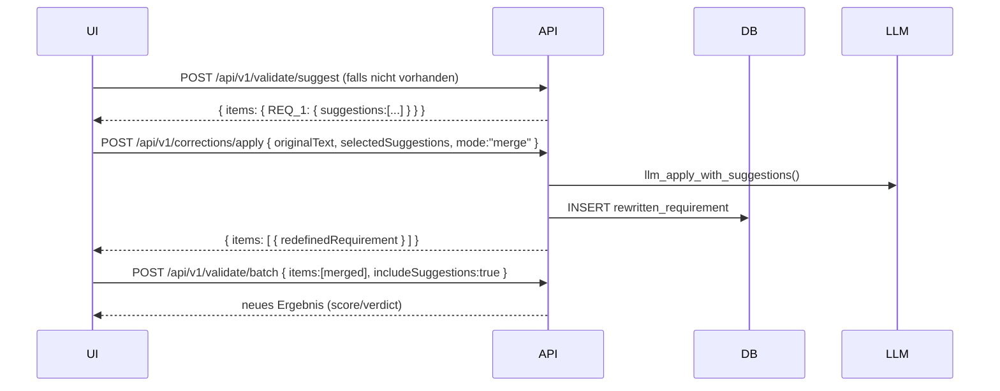
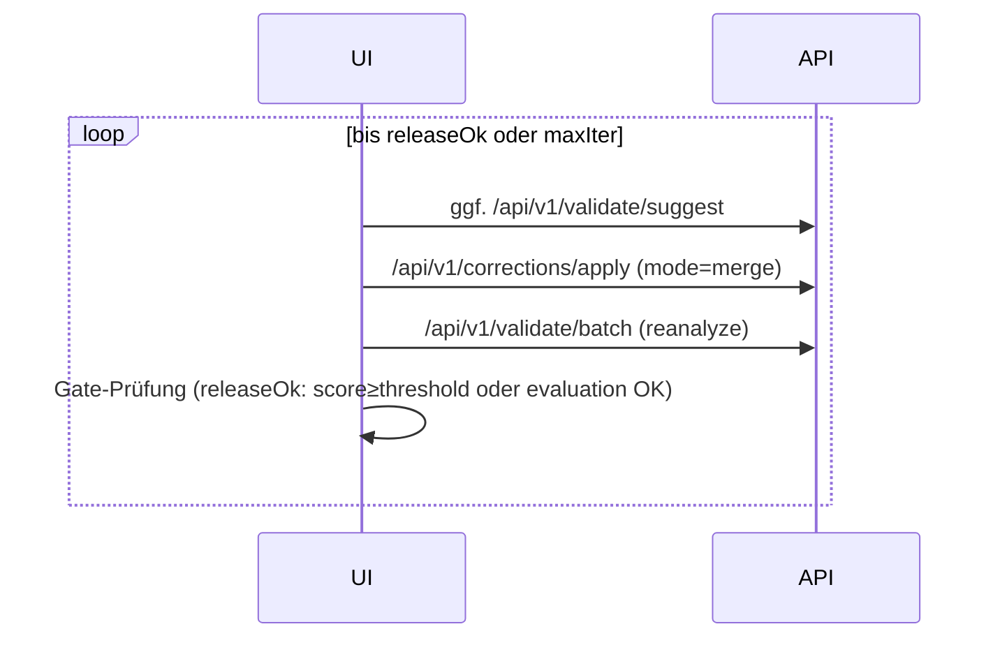
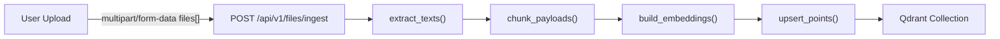
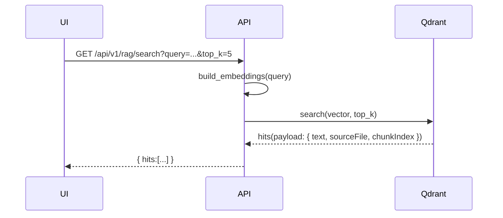
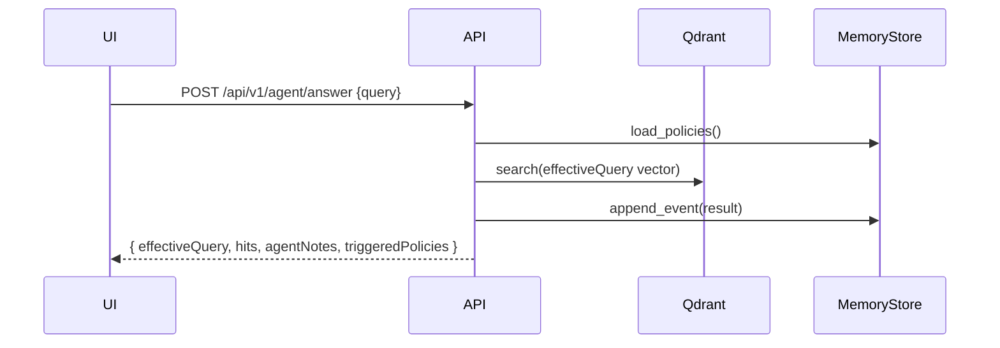

# Features, System-Diagramme und Technologie-Stacks

Ziel:

- Systemdiagramme je logischem Feature (Mermaid)
- Kompakte, aber vollständige Dokumentation pro Technologie-Stack
- 10 Showcase-Szenarien (verschiedene Länge, verschiedene Projektvarianten), alle aus diesem Template ableitbar
- Deep-Links in den Code mit klickbaren Sprachelementen (Datei/Zeile)

Verweis auf den Systemüberblick und Abhängigkeits-Matrix:

- [docs/architecture/SYSTEM_OVERVIEW.md](./SYSTEM_OVERVIEW.md)

Hinweis Link-Konvention:

- Dateien und Sprachelemente sind klickbar, z. B. [backend_app.__init__.create_app()](../../backend_app/__init__.py:13), [backend_app.api.validate_batch_optimized()](../../backend_app/api.py:599)

---

## 1) Feature-Diagramme

### 1.1 Validate Batch (Array-basierte Auswertung)



Hauptcode:

- [backend_app.api.validate_batch_optimized()](../../backend_app/api.py:599)
- [backend_app.batch.ensure_evaluation_exists()](../../backend_app/batch.py:28)
- [backend_app.llm.llm_evaluate()](../../backend_app/llm.py:102), [backend_app.llm.llm_rewrite()](../../backend_app/llm.py:253)

### 1.2 Suggestions + Apply (Merge) + Re-Analyze



Hauptcode:

- [backend_app.api.validate_suggest()](../../backend_app/api.py:571), [backend_app.batch.process_suggestions()](../../backend_app/batch.py:152)
- [backend_app.api.apply_corrections()](../../backend_app/api.py:255), [backend_app.llm.llm_apply_with_suggestions()](../../backend_app/llm.py:339)

### 1.3 Auto-Refine (UI-gesteuerte Schleife)



Hauptcode (Frontend):

- Gates/Heuristik: [frontend.app_optimized.computeOk()](../../frontend/app_optimized.js:25), [frontend.app_optimized.releaseOk()](../../frontend/app_optimized.js:53)
- Flow: [frontend.app_optimized.autoRefineIndex()](../../frontend/app_optimized.js:1947), [frontend.app_optimized.ensureSuggestions()](../../frontend/app_optimized.js:162), [frontend.app_optimized.mergeApply()](../../frontend/app_optimized.js:211), [frontend.app_optimized.reanalyzeIndex()](../../frontend/app_optimized.js:1834)

### 1.4 Datei-Ingest → Vektor-Index (Qdrant)



Hauptcode:

- [backend_app.api.files_ingest()](../../backend_app/api.py:1068)
- [backend_app.ingest.extract_texts()](../../backend_app/ingest.py:230), [backend_app.ingest.chunk_payloads()](../../backend_app/ingest.py:287)
- [backend_app.embeddings.build_embeddings()](../../backend_app/embeddings.py:59)
- [backend_app.vector_store.upsert_points()](../../backend_app/vector_store.py:109)

### 1.5 RAG-Suche (einfach)



Hauptcode:

- [backend_app.api.rag_search()](../../backend_app/api.py:1286)
- [backend_app.vector_store.search()](../../backend_app/vector_store.py:151)

### 1.6 Agent-/Memory-gestützte Antwort



Hauptcode:

- [backend_app.api.agent_answer()](../../backend_app/api.py:1512)
- [backend_app.memory.MemoryStore](../../backend_app/memory.py)

### 1.7 Vector-Reset (Admin)

```mermaid
flowchart LR
  UI-->API[/api/v1/vector/reset (POST/DELETE)/]
  API-->Q[reset_collection()]
  Q-->API
  API-->UI
```

Hauptcode:

- [backend_app.api.vector_reset()](../../backend_app/api.py:1158), [backend_app.api.vector_reset_get()](../../backend_app/api.py:1202)
- [backend_app.vector_store.reset_collection()](../../backend_app/vector_store.py:197)

---

## 2) Technologie-Stacks

### 2.1 Backend/Flask

- App-Fabrik und Static-Serving: [backend_app.__init__.create_app()](../../backend_app/__init__.py:13)
- Blueprints: [backend_app.api.api_bp](../../backend_app/api.py:35), [backend_app.batch.batch_bp](../../backend_app/batch.py:25)
- Logging/Middleware: [backend_app.logging_ext.register_request_logging()](../../backend_app/logging_ext.py:152), [backend_app.logging_ext.log_runtime_config_once()](../../backend_app/logging_ext.py:248)
- Konfiguration: [backend_app.settings.get_runtime_config()](../../backend_app/settings.py:108)
- Persistenz: [backend_app.db.init_db()](../../backend_app/db.py:125), [backend_app.db.DDL](../../backend_app/db.py:11)
- Utils: [backend_app.utils.*](../../backend_app/utils.py)

Laufzeit:

- WSGI Entry: Gunicorn (siehe [Dockerfile](../../Dockerfile))
- Ports: API (ENV) [backend_app.settings.API_PORT](../../backend_app/settings.py:11)

### 2.2 LLM/OpenAI

- Evaluate/Suggest/Rewrite/Apply: [backend_app.llm.*](../../backend_app/llm.py)
- Fallbacks (kein API-Key): Heuristiken / Originaltext
- Embeddings (REST): [backend_app.embeddings.build_embeddings()](../../backend_app/embeddings.py:59)
- Prompts aus Dateien: [backend_app.settings.get_system_prompt()](../../backend_app/settings.py:71); Pfade in [.env](../../.env)

Wichtige ENV:

- OPENAI_API_KEY, OPENAI_MODEL
- LLM_TEMPERATURE, LLM_TOP_P, LLM_MAX_TOKENS
- EMBEDDINGS_MODEL

### 2.3 Vector-DB/Qdrant

- Client/Abstraktion: [backend_app.vector_store.*](../../backend_app/vector_store.py)
- Port-Fallback: [backend_app.vector_store.get_qdrant_client()](../../backend_app/vector_store.py:41) prüft 6333/6401
- Compose-Beispiel: [docker-compose.qdrant.yml](../../docker-compose.qdrant.yml)

### 2.4 Frontend/UI

- Einstieg: [frontend/index.html](../../frontend/index.html)
- Logik/Flow: [frontend/app_optimized.js](../../frontend/app_optimized.js) (Batch-only UI, Auto-Refine, RAG, Upload)
- Styles: [frontend/styles.css](../../frontend/styles.css)
- Alternativ (legacy playground): [frontend/app.js](../../frontend/app.js), [frontend/react-app.jsx](../../frontend/react-app.jsx)

### 2.5 Tests/Playwright

- UI-Ende-zu-Ende: [tests/ui/auto-refine.spec.ts](../../tests/ui/auto-refine.spec.ts)
- Playwright Konfig: [playwright.config.ts](../../playwright.config.ts)
- Backend-Modell: [tests/backend/test_rag_models.py](../../tests/backend/test_rag_models.py)
- RAG Benchmark: [tests/rag_benchmark.py](../../tests/rag_benchmark.py)

### 2.6 Docker/Infra

- Backend Image: [Dockerfile](../../Dockerfile)
- Qdrant: [docker-compose.qdrant.yml](../../docker-compose.qdrant.yml)
- ENV Beispiele: [.env.example](../../.env.example), [.env.example.models](../../.env.example.models)

### 2.7 Agent-Worker (FastAPI, optional)

- Worker API: [agent_worker.app](../../agent_worker/app.py)
- Delegation an Backend: /api/v1/rag/search, /api/v1/vector/source/full
- Start: [agent_worker/Dockerfile](../../agent_worker/Dockerfile), [agent_worker/requirements.txt](../../agent_worker/requirements.txt)

---

## 3) 10 Showcases (aus diesem Template ableitbar)

Ziel: Vielfalt bei Länge/Scope, alle rein aus Bestandteilen dieses Repos.

1) Evaluate-Only API (ohne RAG)

- Ziel: Nur /api/v1/validate/batch konsumieren.
- Einstiegscode: [backend_app.api.validate_batch_optimized()](../../backend_app/api.py:599)
- Minimal-Call:
  ```
  curl -X POST "$API_BASE/api/v1/validate/batch" -H "Content-Type: application/json" \
       -d '{"items":["System shall respond within 200 ms."],"includeSuggestions":true}'
  ```

2) Suggestions-Apply Pipeline (Atom-Merge)

- Ziel: Vorschläge generieren und konsolidiert anwenden.
- Endpunkte: [backend_app.api.validate_suggest()](../../backend_app/api.py:571), [backend_app.api.apply_corrections()](../../backend_app/api.py:255)
- Schrittfolge: suggest → apply(merge) → validate/batch

3) Auto-Refine UI Loop

- Ziel: Automatisches Erreichen des Release-Gates.
- Codepfad (UI): [frontend.app_optimized.autoRefineIndex()](../../frontend/app_optimized.js:1947)
- Testabdeckung: [tests/ui/auto-refine.spec.ts](../../tests/ui/auto-refine.spec.ts)

4) Markdown-Batch Verarbeitung (Server-Quelle)

- Ziel: Serverseitig Markdown-Tabelle evaluieren.
- Endpunkte: [backend_app.batch.batch_evaluate()](../../backend_app/batch.py:282), [backend_app.utils.parse_requirements_md()](../../backend_app/utils.py:39)
- Ergebnis: mergedMarkdown (optional nach [.env OUTPUT_MD_PATH](../../.env))

5) RAG Suche (einfach)

- Ziel: Query → topK Treffer aus Qdrant.
- Endpunkt: [backend_app.api.rag_search()](../../backend_app/api.py:1286)
- Voraussetzung: Ingest via [files/ingest](../../backend_app/api.py:1068)

6) Agent/Memory Antwort (Policy-Boost)

- Ziel: Antwort mit Policy-Notizen und Source-Bias.
- Endpunkt: [backend_app.api.agent_answer()](../../backend_app/api.py:1512)
- Memory: [backend_app.memory.MemoryStore](../../backend_app/memory.py)

7) Vector-Index Admin (Reset, Health, Collections)

- Ziele: Reset, Health, List.
- Endpunkte: [vector/reset](../../backend_app/api.py:1158), [vector/health](../../backend_app/api.py:1149), [vector/collections](../../backend_app/api.py:1140)
- UI-Integration: [frontend.index reset-index-btn](../../frontend/index.html), Handler [frontend.app_optimized.resetIndex()](../../frontend/app_optimized.js:424)

8) Streaming-Validate (NDJSON)

- Ziel: Item-weise Ergebnisse streamen.
- Endpunkt: [backend_app.api.validate_batch_stream()](../../backend_app/api.py:828)
- Client: fetch ReadableStream (Browser) oder curl --no-buffer

9) Mock-Mode Offline Demo

- Ziel: Ohne OPENAI_API_KEY evaluieren.
- Heuristiken: [backend_app.llm._heuristic_mock_evaluation()](../../backend_app/llm.py:18)
- Steuerung: ENV MOCK_MODE / leerer Schlüssel

10) RAG Benchmark Suite

- Ziel: Einfaches Qualitäts-Benchmarking der RAG-Treffer.
- Script: [tests/rag_benchmark.py](../../tests/rag_benchmark.py)
- Ergebnisartefakte: tests/out/rag_report.json, tests/out/rag_report.md

---

## 4) Schnittstellen und Verträge (Kurzreferenz)

- Evaluate Batch

  - Request: `{ items: string[], includeSuggestions?: boolean }`
  - Response: `Array<{ id, originalText, correctedText, evaluation[], score, verdict, suggestions? }>`
  - Implementierung: [backend_app.api.validate_batch_optimized()](../../backend_app/api.py:599)
- Suggestions

  - Request: `string[]` oder `{ items: string[] }`
  - Response: `{ items: { REQ_n: { suggestions: Atom[] } } }` oder `Atom[]`
  - Implementierung: [backend_app.api.validate_suggest()](../../backend_app/api.py:571)
- Apply Corrections

  - Request: `{ originalText, selectedSuggestions: Atom[], mode: "merge"|"split", context? }`
  - Response: `{ evaluationId, items: [{ rewrittenId, redefinedRequirement }] }`
  - Implementierung: [backend_app.api.apply_corrections()](../../backend_app/api.py:255)
- Files Ingest

  - Multipart: `files[]` + optional `chunkMin`, `chunkMax`, `chunkOverlap`, `collection`
  - Implementierung: [backend_app.api.files_ingest()](../../backend_app/api.py:1068)

---

## 5) Betrieb & Sicherheit (praktische Hinweise)

- CORS/Preflight:

  - Globaler Intercept: [backend_app.__init__._global_api_preflight()](../../backend_app/__init__.py:37)
  - OPTIONS-Catches: [backend_app.api.options_cors_catch_all()](../../backend_app/api.py:45), [backend_app.api.options_vector_reset()](../../backend_app/api.py:59)
- Retention & Migrationen:

  - Retention: [backend_app.db.purge_old_evaluations()](../../backend_app/db.py:113)
  - Migrationen/Indices: [backend_app.db.ensure_schema_migrations()](../../backend_app/db.py:84)
- Konfig-Snapshot:

  - [backend_app.settings.log_runtime_config()](../../backend_app/settings.py:176) (via [backend_app.logging_ext.log_runtime_config_once()](../../backend_app/logging_ext.py:248))
  - Anonymisierung: nur boolean für API-Key-Präsenz

---

## 6) Nächste Schritte (Verlinkungen & Aufteilung)

- Diese Sammeldatei liefert alle Feature-Diagramme, Stack-Beschreibungen und 10 Showcases in einem Dokument.
- Optionale Aufteilung in dedizierte Dateien:
  - stacks/: backend-flask.md, llm-openai.md, vector-qdrant.md, frontend.md, testing-playwright.md, docker-infra.md
  - features/: validate-batch.md, suggestions-apply.md, auto-refine.md, files-ingest.md, rag-search.md, agent-answer.md, vector-reset.md
  - showcases/: 01-evaluate-only.md … 10-rag-benchmark.md

Index/Navigation:

- Zentral: [docs/architecture/SYSTEM_OVERVIEW.md](./SYSTEM_OVERVIEW.md)
- Diese Datei: Features & Stacks & Showcases (kompakt)
