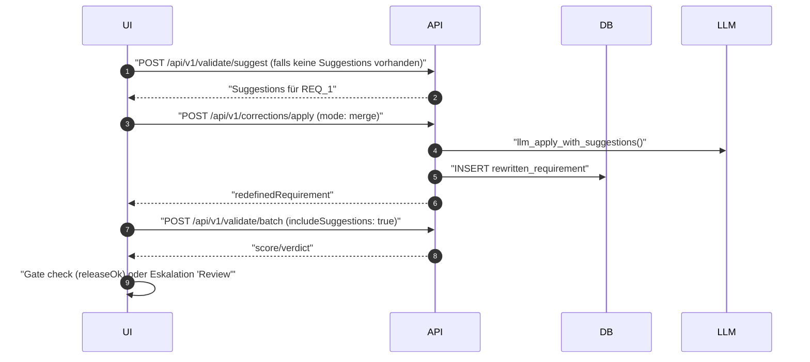
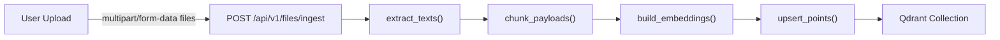
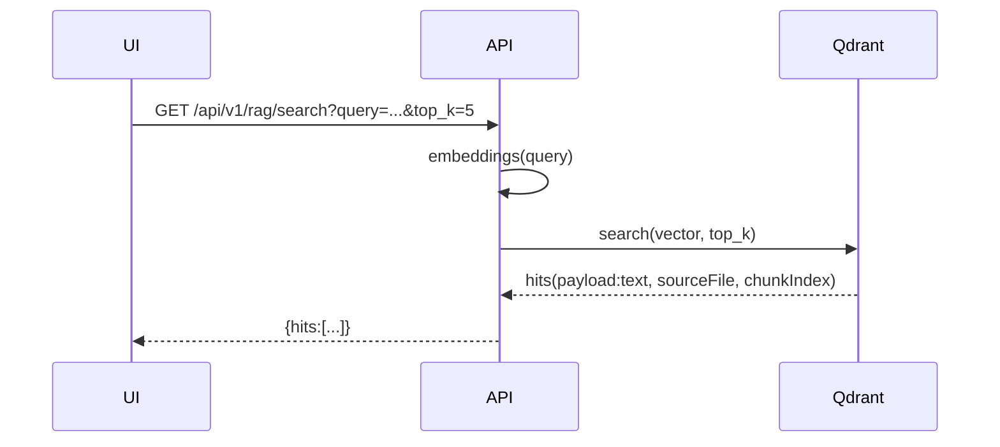
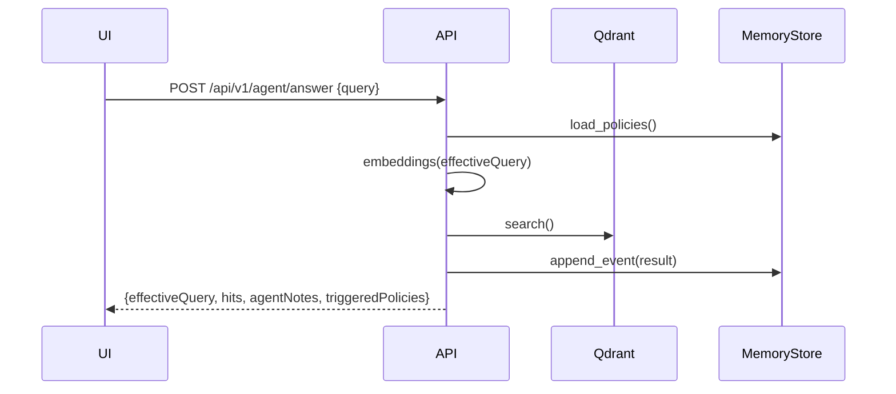
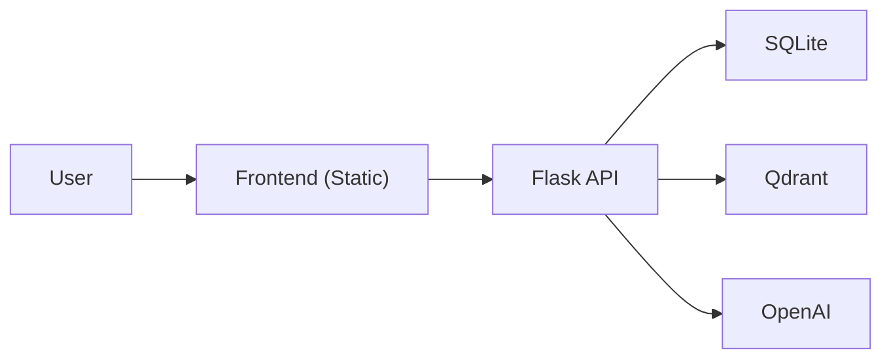
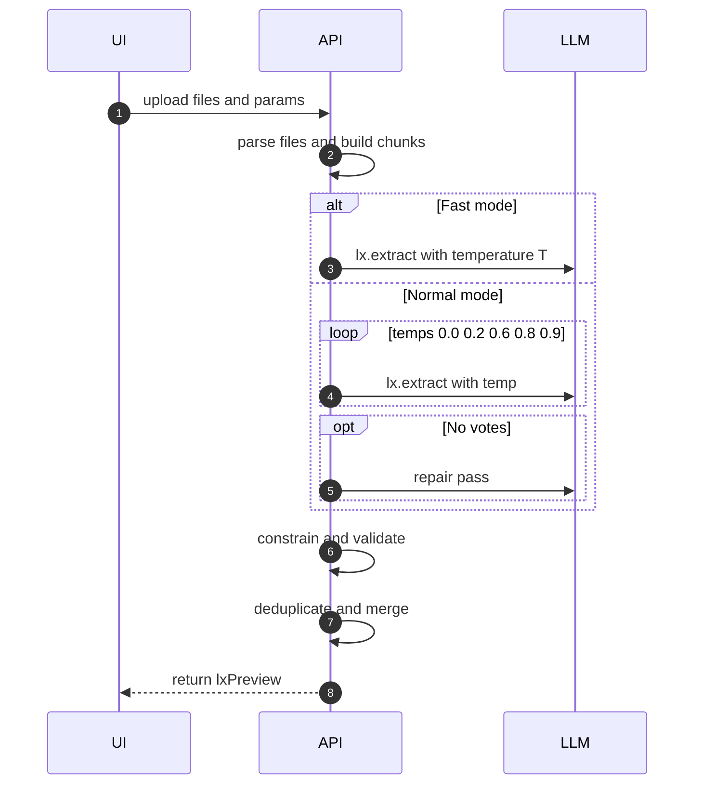
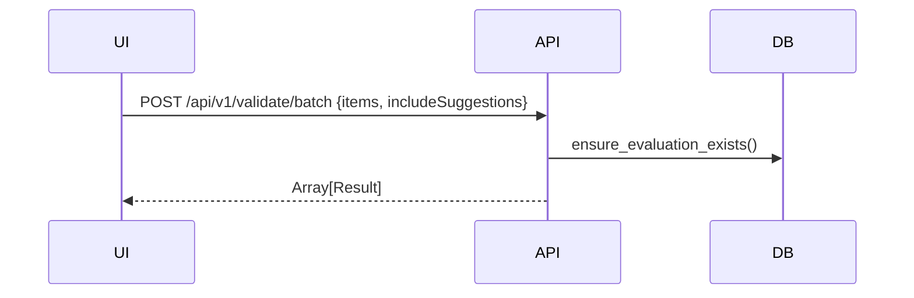
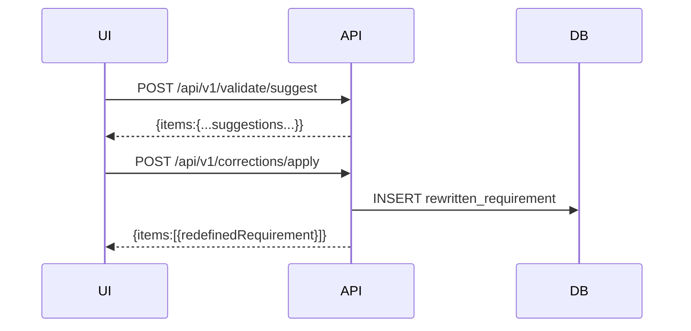
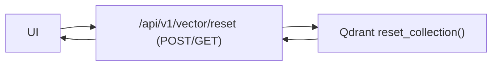

# Systemüberblick, Funktionslogik und Abhängigkeits-Matrix

Ziel dieses Dokuments:

- Vollständige Beschreibung der Anwendungslogik (End-to-End)
- Abhängigkeits-Matrix (Module, Skripte, Services)
- System- und Feature-Diagramme (Mermaid)
- Verlinkungen in den Code (klickbar bis auf Funktions-/Zeilenebene)

Hinweis zur Link-Konvention:

- Dateien und Sprachelemente sind klickbar, z. B. [backend_app.__init__.create_app()](../../backend_app/__init__.py:13) oder [backend_app/api.py](../../backend_app/api.py).
- Für Sprachelemente wird eine Zeilennummer angegeben, für Dateinamen ist sie optional.

---

## 1) Komponentenlandschaft

- Backend (Flask/Gunicorn)

  - App-Fabrik: [backend_app.__init__.create_app()](../../backend_app/__init__.py:13)
  - Blueprints: [backend_app/api.py](../../backend_app/api.py), [backend_app/batch.py](../../backend_app/batch.py)
  - LLM-Adapter/Heuristiken: [backend_app.llm.*](../../backend_app/llm.py)
  - Vektor-/RAG-Infrastruktur: [backend_app.ingest.*](../../backend_app/ingest.py), [backend_app.embeddings.*](../../backend_app/embeddings.py), [backend_app.vector_store.*](../../backend_app/vector_store.py)
  - Persistenz/SQLite: [backend_app.db.*](../../backend_app/db.py), Konfiguration: [backend_app.settings.*](../../backend_app/settings.py:108)
  - Logging/Middleware: [backend_app.logging_ext.*](../../backend_app/logging_ext.py)
- Frontend (statisch, Single-Page)

  - Einstieg: [frontend/index.html](../../frontend/index.html)
  - UI/Logik: [frontend/app_optimized.js](../../frontend/app_optimized.js) – u. a. [ensureSuggestions()](../../frontend/app_optimized.js:162), [mergeApply()](../../frontend/app_optimized.js:211), [reanalyzeIndex()](../../frontend/app_optimized.js:1834), [autoRefineIndex()](../../frontend/app_optimized.js:1947), [autoRefineMany()](../../frontend/app_optimized.js:2017)
  - Styles: [frontend/styles.css](../../frontend/styles.css)
- Agent-Worker (FastAPI, optional)

  - Endpunkte: [agent_worker.app.mine()](../../agent_worker/app.py:261), [agent_worker.app.mine_team()](../../agent_worker/app.py:721), [agent_worker.app.prep_parser_doc()](../../agent_worker/app.py:750)
- Externe Dienste

  - OpenAI: [backend_app.llm.llm_evaluate()](../../backend_app/llm.py:102), [backend_app.llm.llm_suggest()](../../backend_app/llm.py:158), [backend_app.llm.llm_rewrite()](../../backend_app/llm.py:253), [backend_app.llm.llm_apply_with_suggestions()](../../backend_app/llm.py:339)
  - Qdrant (Vektor-DB): [backend_app.vector_store.get_qdrant_client()](../../backend_app/vector_store.py:41), [backend_app.vector_store.search()](../../backend_app/vector_store.py:151), [backend_app.vector_store.upsert_points()](../../backend_app/vector_store.py:109), [backend_app.vector_store.reset_collection()](../../backend_app/vector_store.py:197)
- Tests

  - Playwright UI-Tests: [tests/ui/auto-refine.spec.ts](../../tests/ui/auto-refine.spec.ts)
  - Modell-Tests: [tests/backend/test_rag_models.py](../../tests/backend/test_rag_models.py)
  - RAG-Benchmark: [tests/rag_benchmark.py](../../tests/rag_benchmark.py)

---

## 2) Haupt-Endpunkte (Backend)

- Health/Runtime

  - GET /health → [backend_app.api.health()](../../backend_app/api.py:72)
  - GET /api/runtime-config → [backend_app.api.runtime_config()](../../backend_app/api.py:76), Quelle: [backend_app.settings.get_runtime_config()](../../backend_app/settings.py:108)
- Kriterien/Evaluation

  - GET /api/v1/criteria → [backend_app.api.list_criteria()](../../backend_app/api.py:88)
  - POST /api/v1/evaluations → [backend_app.api.create_evaluation()](../../backend_app/api.py:98)
    - nutzt [backend_app.llm.llm_evaluate()](../../backend_app/llm.py:102), Score mittels [backend_app.utils.weighted_score()](../../backend_app/utils.py:14), Decision via [backend_app.utils.compute_verdict()](../../backend_app/utils.py:25)
- Corrections

  - POST /api/v1/corrections/text → [backend_app.api.save_correction_text()](../../backend_app/api.py:220)
  - POST /api/v1/corrections/decision → [backend_app.api.set_correction_decision()](../../backend_app/api.py:176)
  - POST /api/v1/corrections/decision/batch → [backend_app.api.set_correction_decision_batch()](../../backend_app/api.py:320)
  - POST /api/v1/corrections/apply → [backend_app.api.apply_corrections()](../../backend_app/api.py:255) → [backend_app.llm.llm_apply_with_suggestions()](../../backend_app/llm.py:339)
- Batch (aus Markdown-Quelle)

  - POST /api/v1/batch/evaluate → [backend_app.batch.batch_evaluate()](../../backend_app/batch.py:282)
  - POST /api/v1/batch/suggest → [backend_app.batch.batch_suggest()](../../backend_app/batch.py:301)
  - POST /api/v1/batch/rewrite → [backend_app.batch.batch_rewrite()](../../backend_app/batch.py:319)
- Validierung (Array-basierte UI-Verwendung)

  - POST /api/v1/validate/suggest → [backend_app.api.validate_suggest()](../../backend_app/api.py:571) → [backend_app.batch.process_suggestions()](../../backend_app/batch.py:152)
  - POST /api/v1/validate/batch → [backend_app.api.validate_batch_optimized()](../../backend_app/api.py:599)
  - Streaming-Varianten:
    - POST /api/v1/validate/batch/stream → [backend_app.api.validate_batch_stream()](../../backend_app/api.py:828)
    - POST /api/v1/validate/suggest/stream → [backend_app.api.validate_suggest_stream()](../../backend_app/api.py:967)
  - Strukturierte Antwort:
    - POST /api/v1/validate/batch/structured → [backend_app.api.validate_batch_structured()](../../backend_app/api.py:1591) → [backend_app.rag.StructuredRequirement](../../backend_app/rag.py:57)
- RAG/Vector

  - Upload/Indexierung: POST /api/v1/files/ingest → [backend_app.api.files_ingest()](../../backend_app/api.py:1068) → [backend_app.ingest.extract_texts()](../../backend_app/ingest.py:230), [backend_app.ingest.chunk_payloads()](../../backend_app/ingest.py:287), [backend_app.embeddings.build_embeddings()](../../backend_app/embeddings.py:59), [backend_app.vector_store.upsert_points()](../../backend_app/vector_store.py:109)
  - Verwaltung:
    - GET /api/v1/vector/collections → [backend_app.api.vector_collections()](../../backend_app/api.py:1140)
    - GET /api/v1/vector/health → [backend_app.api.vector_health()](../../backend_app/api.py:1149)
    - POST/DELETE /api/v1/vector/reset → [backend_app.api.vector_reset()](../../backend_app/api.py:1158)
    - GET /api/v1/vector/reset?confirm=1 → [backend_app.api.vector_reset_get()](../../backend_app/api.py:1202)
    - GET /api/v1/vector/source/full → [backend_app.api.vector_source_full()](../../backend_app/api.py:1233)
  - Suche:
    - GET /api/v1/rag/search → [backend_app.api.rag_search()](../../backend_app/api.py:1286)
- Agent/Memory

  - POST /api/v1/agent/answer → [backend_app.api.agent_answer()](../../backend_app/api.py:1512)
  - POST /api/v1/agent/mine_requirements → [backend_app.api.agent_mine_requirements()](../../backend_app/api.py:1675)
  - Agent-Worker (optional extern):
    - [agent_worker.app.mine()](../../agent_worker/app.py:261), [agent_worker.app.mine_team()](../../agent_worker/app.py:721), [agent_worker.app.prep_parser_doc()](../../agent_worker/app.py:750)
- CORS/Preflight-Handling

  - Globales Preflight: [backend_app.__init__._global_api_preflight()](../../backend_app/__init__.py:37) und [backend_app.api.options_cors_catch_all()](../../backend_app/api.py:45)
  - Spezifische OPTIONS: [backend_app.api.options_validate_suggest()](../../backend_app/api.py:41), [backend_app.api.options_vector_reset()](../../backend_app/api.py:59)

---

## 3) End-to-End Flows (Systemlogik)

### 3.1 „Demo laden und verarbeiten“ (Inkrementell)

Relevante Funktionen:

- UI: [processIncremental()](../../frontend/app_optimized.js:611), [displayResults()](../../frontend/app_optimized.js:839)
- Backend: [validate_batch_optimized()](../../backend_app/api.py:599), [ensure_evaluation_exists()](../../backend_app/batch.py:28)

### 3.2 Auto-Refine (Einzel-Item)

Relevante Funktionen:

- UI: [autoRefineIndex()](../../frontend/app_optimized.js:1947), [ensureSuggestions()](../../frontend/app_optimized.js:162), [mergeApply()](../../frontend/app_optimized.js:211), [reanalyzeIndex()](../../frontend/app_optimized.js:1834)
- Backend: [apply_corrections()](../../backend_app/api.py:255), [llm_apply_with_suggestions()](../../backend_app/llm.py:339)

### 3.3 Datei-Ingest → Vektor-Index

Relevante Funktionen:

- [backend_app.api.files_ingest()](../../backend_app/api.py:1068)
- [backend_app.ingest.extract_texts()](../../backend_app/ingest.py:230), [backend_app.ingest.chunk_payloads()](../../backend_app/ingest.py:287)
- [backend_app.embeddings.build_embeddings()](../../backend_app/embeddings.py:59)
- [backend_app.vector_store.upsert_points()](../../backend_app/vector_store.py:109)

### 3.4 RAG-Suche (einfach)

Relevante Funktionen: [backend_app.api.rag_search()](../../backend_app/api.py:1286)

### 3.5 Agent-/Memory-gestützte Antwort

Relevante Funktionen:

- [backend_app.api.agent_answer()](../../backend_app/api.py:1512)
- [backend_app.memory.MemoryStore](../../backend_app/memory.py)

---

## 4) Abhängigkeits-Matrix (Skripte, Module, Services)

| Ebene/Modul       | Abhängigkeiten                                                                                                                                                                                                        | Genutzt von                      | Verantwortung                                                 | Schlüsselfunktionen                                                                                                                                                                                                    |
| ----------------- | ---------------------------------------------------------------------------------------------------------------------------------------------------------------------------------------------------------------------- | -------------------------------- | ------------------------------------------------------------- | ----------------------------------------------------------------------------------------------------------------------------------------------------------------------------------------------------------------------- |
| App/WSGI          | [backend_app.__init__.create_app()](../../backend_app/__init__.py:13), [backend_app.logging_ext.*](../../backend_app/logging_ext.py)                                                                                   | Gunicorn, alle Blueprints        | App-Setup, CORS, Logging, Static-Serving                      | [log_runtime_config_once()](../../backend_app/logging_ext.py:248)                                                                                                                                                          |
| API (Core)        | [backend_app.api](../../backend_app/api.py), [backend_app.batch](../../backend_app/batch.py), [backend_app.utils](../../backend_app/utils.py), [backend_app.db](../../backend_app/db.py), [backend_app.llm](../../backend_app/llm.py) | Frontend, Tests, Agent           | Endpunkt-Implementierungen, Orchestrierung                    | [validate_batch_optimized()](../../backend_app/api.py:599), [files_ingest()](../../backend_app/api.py:1068)                                                                                                                   |
| Batch             | [backend_app.batch](../../backend_app/batch.py) → utils/db/llm                                                                                                                                                           | API                              | Batch über Markdown, Persistenz von Eval/Rewrite/Suggestions | [ensure_evaluation_exists()](../../backend_app/batch.py:28), [process_evaluations()](../../backend_app/batch.py:100), [process_suggestions()](../../backend_app/batch.py:152), [process_rewrites()](../../backend_app/batch.py:217) |
| LLM               | OpenAI SDK (optional), Settings                                                                                                                                                                                        | API/Batch                        | Evaluate/Suggest/Rewrite/Apply mit robustem Fallback          | [llm_evaluate()](../../backend_app/llm.py:102), [llm_suggest()](../../backend_app/llm.py:158), [llm_rewrite()](../../backend_app/llm.py:253), [llm_apply_with_suggestions()](../../backend_app/llm.py:339)                          |
| Ingest/Embeddings | requests, tenacity, tiktoken (optional)                                                                                                                                                                                | API (files/ingest), Vector-Store | Extraktion, Chunking, Embeddings                              | [extract_texts()](../../backend_app/ingest.py:230), [chunk_payloads()](../../backend_app/ingest.py:287), [build_embeddings()](../../backend_app/embeddings.py:59)                                                                |
| Vektor-Store      | qdrant-client                                                                                                                                                                                                          | API                              | Upsert/Search/Reset der Collection                            | [get_qdrant_client()](../../backend_app/vector_store.py:41), [search()](../../backend_app/vector_store.py:151), [reset_collection()](../../backend_app/vector_store.py:197)                                                      |
| Persistenz        | sqlite3                                                                                                                                                                                                                | API/Batch                        | DDL, Migrationen, CRUD                                        | [init_db()](../../backend_app/db.py:125), [ensure_schema_migrations()](../../backend_app/db.py:84)                                                                                                                            |
| Settings          | dotenv, os env                                                                                                                                                                                                         | App/API/LLM                      | Laufzeitkonfiguration                                         | [get_runtime_config()](../../backend_app/settings.py:108)                                                                                                                                                                  |
| Frontend          | fetch API                                                                                                                                                                                                              | Nutzer                           | UI, Inkrementelle Verarbeitung, Auto-Refine                   | [processIncremental()](../../frontend/app_optimized.js:611), [autoRefineIndex()](../../frontend/app_optimized.js:1947)                                                                                                        |
| Agent-Worker      | requests → Backend                                                                                                                                                                                                    | Nutzer/Automationen              | Requirements-Mining aus Vektor-Quelle                         | [mine()](../../agent_worker/app.py:261), [mine_team()](../../agent_worker/app.py:721)                                                                                                                                         |

---

## 5) Datenmodell (SQLite)

DDL-Definition: [backend_app.db.DDL](../../backend_app/db.py:11)

- Tabellen: criterion, evaluation, evaluation_detail, suggestion, rewritten_requirement, correction_decision
- Einzigartigkeit:
  - evaluation_detail: UNIQUE(evaluation_id, criterion_key)
  - correction_decision: UNIQUE(evaluation_id) (per Migration, s. [ensure_schema_migrations()](../../backend_app/db.py:84))
- Lebenszyklus:
  - Initialbefüllung Kriterien: [init_db()](../../backend_app/db.py:125) → [load_criteria()](../../backend_app/db.py:152)
  - Retention/Housekeeping: [purge_old_evaluations()](../../backend_app/db.py:113)

---

## 6) Konfiguration

Quellen:

- Env/Dateien: [.env](../../.env), [.env.example](../../.env.example)
- Laufzeit-Snapshot: [backend_app.settings.get_runtime_config()](../../backend_app/settings.py:108)
- Prompts: [config/prompts/evaluate.system.txt](../../config/prompts/evaluate.system.txt), [config/prompts/suggest.system.txt](../../config/prompts/suggest.system.txt), [config/prompts/rewrite.system.txt](../../config/prompts/rewrite.system.txt)
- Kriterien-JSON: [config/criteria.json](../../config/criteria.json)

Wichtige Schlüssel:

- OPENAI_MODEL, OPENAI_API_KEY, MOCK_MODE
- VERDICT_THRESHOLD, SUGGEST_MAX, BATCH_SIZE, MAX_PARALLEL
- REQUIREMENTS_MD_PATH, OUTPUT_MD_PATH
- QDRANT_URL, QDRANT_PORT, QDRANT_COLLECTION
- EMBEDDINGS_MODEL, CHUNK_TOKENS_MIN/MAX/OVERLAP

---

## 7) CORS/Preflight

- Globaler Intercept vor Routing: [backend_app.__init__._global_api_preflight()](../../backend_app/__init__.py:37)
- OPTIONS-Catch-All / spezifische OPTIONS:
  - [backend_app.api.options_cors_catch_all()](../../backend_app/api.py:45)
  - [backend_app.api.options_validate_suggest()](../../backend_app/api.py:41)
  - [backend_app.api.options_vector_reset()](../../backend_app/api.py:59)

Ziel: 204-Antworten inkl. Access-Control-* für alle /api/* Preflights, kein 404.

---

## 8) System-/Feature-Diagramme

### 8.1 System-Kontext (Mermaid)

### 8.5 v2 Requirements-Extraction (LangExtract) – Ablauf

Parameter (Auszug):

- chunkMode: `token|paragraph`
- chunkMin/chunkMax/chunkOverlap
- neighbor_refs: `0|1` (±1 Nachbarschaft in Evidence)
- fast: `0|1` (nur 1 Temperatur, kein Repair)
- temperature: `0.0..1.0`
- configId: aktive LX-Konfiguration (Prompt + Beispiele)
- goldId/useGoldAsFewshot/autoGold: Guided Mining / Auto‑Gold

Ergebnis-Normalisierung:

- `AlignmentStatus` → String
- `char_interval` → {start_pos,end_pos}, Quelle: Datei/ChunkIndex
- Evidence-Option: Nachbarn ±1 Chunk

Guided Mining:

- `useGoldAsFewshot` mischt Gold-Items als zusätzliche Beispiele
- `autoGold` erzeugt Gold aus Tabellen oder Heuristik (Listen/Absätze)

Evaluation:

- `/api/v1/lx/evaluate`: Robust-Similarity=max(Jaccard, Token‑Containment, Char‑Ratio; optional Embeddings‑Cosine)
- `/api/v1/lx/evaluate/auto`: One‑Click aus Datei (Extract→Auto‑Gold→Evaluate)

Fast Mode:

- ersetzt Self‑Consistency durch einen Lauf (konfigurierbare `temperature`), überspringt Repair

### 8.2 Feature: Validate Batch

### 8.3 Feature: Suggestions/Apply

### 8.4 Feature: Vector Reset

---

## 9) Test-Integration

- UI/Flow: [tests/ui/auto-refine.spec.ts](../../tests/ui/auto-refine.spec.ts) deckt:
  - Einzel-Auto-Refine (Erreichen Release-Gate)
  - „Use modified“-Scope
  - Eskalation auf „Review“ bei max Iterationen
- Daten-/Modell-Serialisierung: [tests/backend/test_rag_models.py](../../tests/backend/test_rag_models.py)
- RAG Qualitäts-Benchmark: [tests/rag_benchmark.py](../../tests/rag_benchmark.py)

---

## 10) Navigations-Index (geplante/empfohlene Dokus)

Dieser Überblick ist die Zentrale. Ergänzende Detail-MDs (werden sukzessive erstellt):

- Technologie-Stacks

  - Backend/Flask: docs/stack/backend-flask.md (geplant) – Referenzen u. a. [create_app()](../../backend_app/__init__.py:13), [api.py](../../backend_app/api.py)
  - Vektor/Qdrant: docs/stack/vector-qdrant.md (geplant) – Referenzen u. a. [vector_store.py](../../backend_app/vector_store.py), Compose: [docker-compose.qdrant.yml](../../docker-compose.qdrant.yml)
  - OpenAI/LLM: docs/stack/llm-openai.md (geplant) – Referenzen u. a. [llm.py](../../backend_app/llm.py)
  - Frontend/UI: docs/stack/frontend.md (geplant) – Referenzen u. a. [app_optimized.js](../../frontend/app_optimized.js)
  - Tests/Playwright: docs/stack/testing-playwright.md (geplant) – Referenzen u. a. [playwright.config.ts](../../playwright.config.ts), [tests/ui/*](../../tests/ui)
  - Docker/Infra: docs/stack/docker-infra.md (geplant) – Referenzen u. a. [Dockerfile](../../Dockerfile), [docker-compose.qdrant.yml](../../docker-compose.qdrant.yml)
- Feature-Diagramme (pro Logik-Baustein, als eigene MDs)

  - validate-batch.md, suggestions-apply.md, auto-refine.md, files-ingest.md, rag-search.md, agent-answer.md, vector-reset.md
- 10 Markdown-Showcases (Template-Varianten aus diesem Projekt ableitbar)

  - docs/showcases/showcase-01.md … showcase-10.md (geplant)
  - Beispiele: „API-only Evaluator“, „RAG-Suche ohne Agent“, „Nur Suggest/Apply“, „Streaming-Validate im CLI“, „Agent-Mining für Pflichtenheft“ usw.

---

## 11) Wichtige Code-Bezüge (Deep Links)

- App-Bootstrap: [backend_app.__init__.create_app()](../../backend_app/__init__.py:13)
- Evaluation sichern/ermitteln: [backend_app.batch.ensure_evaluation_exists()](../../backend_app/batch.py:28)
- Validate Batch orchestration: [backend_app.api.validate_batch_optimized()](../../backend_app/api.py:599)
- Suggest/Apply: [backend_app.api.validate_suggest()](../../backend_app/api.py:571), [backend_app.api.apply_corrections()](../../backend_app/api.py:255)
- Streaming: [backend_app.api.validate_batch_stream()](../../backend_app/api.py:828)
- RAG: [backend_app.api.files_ingest()](../../backend_app/api.py:1068), [backend_app.api.rag_search()](../../backend_app/api.py:1286)
- Agent/Memory: [backend_app.api.agent_answer()](../../backend_app/api.py:1512)
- Frontend Kern: [frontend/app_optimized.js](../../frontend/app_optimized.js), u. a. [autoRefineIndex()](../../frontend/app_optimized.js:1947), [reanalyzeIndex()](../../frontend/app_optimized.js:1834)

---

## 12) Qualitäts-/Betriebshinweise

- Fallback-Verhalten ohne OPENAI_API_KEY:
  - Evaluate/Rewrite liefern Heuristik oder Originaltext (s. [llm_evaluate()](../../backend_app/llm.py:102), [llm_rewrite()](../../backend_app/llm.py:253))
  - Suggest kann leer bleiben (wenn nicht MOCK_MODE)
- CORS-Preflight explizit implementiert, um 204/Headers für /api/* sicherzustellen ([__init__.py](../../backend_app/__init__.py:37), [api.py](../../backend_app/api.py))
- RAG-Port-Fallback: [backend_app.vector_store.get_qdrant_client()](../../backend_app/vector_store.py:41) prüft 6333/6401
- Retention: Alte Evaluations via [purge_old_evaluations()](../../backend_app/db.py:113)
- Runtime-Konfiguration bei Start geloggt: [log_runtime_config_once()](../../backend_app/logging_ext.py:248)

---

Version: Autogeneriert aus Codebasis (Stand: aktuelle Arbeitskopie)
