# Systemüberblick, Funktionslogik und Abhängigkeits-Matrix

Ziel dieses Dokuments:

- Vollständige Beschreibung der Anwendungslogik (End-to-End)
- Abhängigkeits-Matrix (Module, Skripte, Services)
- System- und Feature-Diagramme (Mermaid)
- Verlinkungen in den Code (klickbar bis auf Funktions-/Zeilenebene)

Hinweis zur Link-Konvention:

- Dateien und Sprachelemente sind klickbar, z. B. [backend.core.__init__.create_app()](../../backend/core/__init__.py:13) oder [backend/core/api.py](../../backend/core/api.py).
- Für Sprachelemente wird eine Zeilennummer angegeben, für Dateinamen ist sie optional.

**Wichtig**: Detaillierte englische Architekturdokumentation siehe [ARCHITECTURE_OVERVIEW.md](../ARCHITECTURE_OVERVIEW.md)

---

## 1) Komponentenlandschaft

### Backend (Konsolidiert - FastAPI, Port 8087)

**Hauptstruktur:**
- Entry Point: [backend/main.py](../../backend/main.py) - FastAPI App
- FastAPI Routers: [backend/routers/](../../backend/routers/)
- Shared Business Logic: [backend/core/](../../backend/core/)
- Service Layer: [backend/services/](../../backend/services/)
**Core Module:**
- App-Fabrik: [backend.core.__init__.create_app()](../../backend/core/__init__.py:13)
- LLM-Adapter: [backend.core.llm.*](../../backend/core/llm.py) - [llm_evaluate()](../../backend/core/llm.py:102), [llm_suggest()](../../backend/core/llm.py:158), [llm_rewrite()](../../backend/core/llm.py:253)
- AutoGen Agents: [backend.core.agents.*](../../backend/core/agents.py) - RequirementsEvaluatorAgent, RequirementsSuggestionAgent, RequirementsRewriteAgent, RequirementsOrchestratorAgent
- Vektor-/RAG: [backend.core.ingest.*](../../backend/core/ingest.py), [backend.core.embeddings.*](../../backend/core/embeddings.py), [backend.core.vector_store.*](../../backend/core/vector_store.py), [backend.core.rag.*](../../backend/core/rag.py)
- Persistenz/SQLite: [backend.core.db.*](../../backend/core/db.py), Konfiguration: [backend.core.settings.*](../../backend/core/settings.py)
- Logging/Middleware: [backend.core.logging_ext.*](../../backend/core/logging_ext.py)

**Service Layer (Port-Adapter Pattern):**
- Ports: [backend.services.ports.*](../../backend/services/ports.py) - LLMPort, EmbeddingsPort, VectorStorePort, PersistencePort
- Adapters: [backend.services.adapters.*](../../backend/services/adapters.py)
- Services:
  - [backend.services.evaluation_service.*](../../backend/services/evaluation_service.py)
  - [backend.services.batch_service.*](../../backend/services/batch_service.py)
  - [backend.services.corrections_service.*](../../backend/services/corrections_service.py)
  - [backend.services.vector_service.*](../../backend/services/vector_service.py)
  - [backend.services.rag_service.*](../../backend/services/rag_service.py)

**FastAPI Routers:**
- LangExtract: [backend.routers.lx_router.*](../../backend/routers/lx_router.py)
- Validation: [backend.routers.validate_router.*](../../backend/routers/validate_router.py)
- Vector Store: [backend.routers.vector_router.*](../../backend/routers/vector_router.py)
- Batch: [backend.routers.batch_router.*](../../backend/routers/batch_router.py)
- Corrections: [backend.routers.corrections_router.*](../../backend/routers/corrections_router.py)
- Gold Examples: [backend.routers.gold_router.*](../../backend/routers/gold_router.py)
- Structure Analysis: [backend.routers.structure_router.*](../../backend/routers/structure_router.py)

### Arch Team (Society of Mind Multi-Agent System, Port 8000)

**Purpose**: Requirements mining, Knowledge Graph construction, validation

**Main Service:**
- Entry: [arch_team/service.py](../../arch_team/service.py) - FastAPI app mit SSE streaming

**Society of Mind Agents:**
- Master Agent: [arch_team.agents.master_agent.*](../../arch_team/agents/master_agent.py) - [create_master_agent()](../../arch_team/agents/master_agent.py:150), [run_master_workflow()](../../arch_team/agents/master_agent.py:305)
- ChunkMiner: [arch_team.agents.chunk_miner.*](../../arch_team/agents/chunk_miner.py) - Requirements-Extraktion aus Dokumenten
- KG Agent: [arch_team.agents.kg_agent.*](../../arch_team/agents/kg_agent.py) - Knowledge Graph Konstruktion
- Requirements Agent: [arch_team.agents.requirements_agent.*](../../arch_team/agents/requirements_agent.py) - Society of Mind Validation
- Planner: [arch_team.agents.planner.*](../../arch_team/agents/planner.py) - Ausführungsplanung
- Solver: [arch_team.agents.solver.*](../../arch_team/agents/solver.py) - RAG-gestütztes Problem Solving
- Verifier: [arch_team.agents.verifier.*](../../arch_team/agents/verifier.py) - Coverage-Validierung

**Tools:**
- Mining Tools: [arch_team.tools.mining_tools.*](../../arch_team/tools/mining_tools.py)
- KG Tools: [arch_team.tools.kg_tools.*](../../arch_team/tools/kg_tools.py)
- Validation Tools: [arch_team.tools.validation_tools.*](../../arch_team/tools/validation_tools.py)
- RAG Tools: [arch_team.tools.rag_tools.*](../../arch_team/tools/rag_tools.py)

**Memory & Persistence:**
- Qdrant KG: [arch_team.memory.qdrant_kg.*](../../arch_team/memory/qdrant_kg.py) - QdrantKGClient
- Retrieval: [arch_team.memory.retrieval.*](../../arch_team/memory/retrieval.py)
- Trace Sink: [arch_team.memory.qdrant_trace_sink.*](../../arch_team/memory/qdrant_trace_sink.py)

**Pipeline:**
- Upload/Ingest: [arch_team.pipeline.upload_ingest.*](../../arch_team/pipeline/upload_ingest.py)
- Store Requirements: [arch_team.pipeline.store_requirements.*](../../arch_team/pipeline/store_requirements.py)

**Runtime:**
- CoT Postprocessor: [arch_team.runtime.cot_postprocessor.*](../../arch_team/runtime/cot_postprocessor.py) - Chain-of-Thought parsing
- Logging: [arch_team.runtime.logging.*](../../arch_team/runtime/logging.py)

### Frontend

**React App (Vite):**
- Entry: [src/App.jsx](../../src/App.jsx)
- Configuration: [src/components/Configuration.jsx](../../src/components/Configuration.jsx)
- Knowledge Graph: [src/components/KnowledgeGraph.jsx](../../src/components/KnowledgeGraph.jsx)
- Requirements: [src/components/Requirements.jsx](../../src/components/Requirements.jsx)
- Agent Status: [src/components/AgentStatus.jsx](../../src/components/AgentStatus.jsx)
- Chat Interface: [src/components/ChatInterface.jsx](../../src/components/ChatInterface.jsx)
- Clarification Modal: [src/components/ClarificationModal.jsx](../../src/components/ClarificationModal.jsx)
- Validation Test: [src/components/ValidationTest.jsx](../../src/components/ValidationTest.jsx)

**Static HTML/JS:**
- Einstieg: [frontend/index.html](../../frontend/index.html)
- Mining Demo: [frontend/mining_demo.html](../../frontend/mining_demo.html)
- KG View: [frontend/kg_view.html](../../frontend/kg_view.html)
- Reports: [frontend/reports.html](../../frontend/reports.html)
- TAG View: [frontend/tag_view.html](../../frontend/tag_view.html)
- UI/Logik: [frontend/app_optimized.js](../../frontend/app_optimized.js) – u. a. [ensureSuggestions()](../../frontend/app_optimized.js:162), [mergeApply()](../../frontend/app_optimized.js:211), [reanalyzeIndex()](../../frontend/app_optimized.js:1834), [autoRefineIndex()](../../frontend/app_optimized.js:1947), [autoRefineMany()](../../frontend/app_optimized.js:2017)
- Styles: [frontend/styles.css](../../frontend/styles.css)

### Externe Dienste

- **OpenAI**: [backend.core.llm.llm_evaluate()](../../backend/core/llm.py:102), [backend.core.llm.llm_suggest()](../../backend/core/llm.py:158), [backend.core.llm.llm_rewrite()](../../backend/core/llm.py:253), [backend.core.llm.llm_apply_with_suggestions()](../../backend/core/llm.py:339)
- **Qdrant** (Vektor-DB): [backend.core.vector_store.get_qdrant_client()](../../backend/core/vector_store.py:41), [backend.core.vector_store.search()](../../backend/core/vector_store.py:151), [backend.core.vector_store.upsert_points()](../../backend/core/vector_store.py:109), [backend.core.vector_store.reset_collection()](../../backend/core/vector_store.py:197)
- **Qdrant KG** (Knowledge Graph): [arch_team.memory.qdrant_kg.QdrantKGClient](../../arch_team/memory/qdrant_kg.py) - kg_nodes_v1, kg_edges_v1 collections

### Tests

- Playwright UI-Tests: [tests/ui/auto-refine.spec.ts](../../tests/ui/auto-refine.spec.ts), [tests/e2e/](../../tests/e2e/)
- Backend Tests: [tests/backend/test_rag_models.py](../../tests/backend/test_rag_models.py), [tests/backend/test_lx_extract_v2.py](../../tests/backend/test_lx_extract_v2.py)
- Service Tests: [tests/services/test_evaluation_service.py](../../tests/services/test_evaluation_service.py)
- Parity Tests: [tests/parity/test_parity_core.py](../../tests/parity/test_parity_core.py)
- Arch Team Tests: [tests/arch_team/test_autogen_rac_smoke.py](../../tests/arch_team/test_autogen_rac_smoke.py), [tests/arch_team/test_e2e_pipeline.py](../../tests/arch_team/test_e2e_pipeline.py)
- RAG-Benchmark: [tests/rag_benchmark.py](../../tests/rag_benchmark.py)

---

## 2) Haupt-Endpunkte

### Backend (Port 8087)

**Health/Runtime:**
- GET /health → [backend/main.py](../../backend/main.py) (FastAPI)
- GET /ready → [backend/main.py](../../backend/main.py) (FastAPI)
- GET /livez → [backend/main.py](../../backend/main.py) (FastAPI)
- GET /api/runtime-config → [backend/main.py](../../backend/main.py), Quelle: [backend.core.settings.get_runtime_config()](../../backend/core/settings.py)

**Validation & Evaluation:**
- POST /api/v1/validate/batch → [backend.routers.validate_router.*](../../backend/routers/validate_router.py)
- POST /api/v1/validate/suggest → [backend.routers.validate_router.*](../../backend/routers/validate_router.py)
- POST /api/v1/validate/batch/stream → [backend.routers.validate_router.*](../../backend/routers/validate_router.py)
- POST /api/v1/validate/suggest/stream → [backend.routers.validate_router.*](../../backend/routers/validate_router.py)
- POST /api/v2/evaluate/single → [backend.routers.validate_router.*](../../backend/routers/validate_router.py)
- POST /api/v2/evaluate/batch → [backend.routers.validate_router.*](../../backend/routers/validate_router.py)

**LangExtract (Requirements Mining):**
- POST /api/v1/lx/extract → [backend.routers.lx_router.*](../../backend/routers/lx_router.py)
- GET /api/v1/lx/mine → [backend.routers.lx_router.*](../../backend/routers/lx_router.py)
- POST /api/v1/lx/evaluate → [backend.routers.gold_router.*](../../backend/routers/gold_router.py)
- GET /api/v1/lx/config/list → [backend.routers.lx_router.*](../../backend/routers/lx_router.py)
- POST /api/v1/lx/config/save → [backend.routers.lx_router.*](../../backend/routers/lx_router.py)
- GET /api/v1/lx/gold/list → [backend.routers.gold_router.*](../../backend/routers/gold_router.py)
- POST /api/v1/lx/gold/save → [backend.routers.gold_router.*](../../backend/routers/gold_router.py)

**Corrections:**
- POST /api/v1/corrections/apply → [backend.routers.corrections_router.*](../../backend/routers/corrections_router.py)
- POST /api/v1/corrections/decision → [backend.routers.corrections_router.*](../../backend/routers/corrections_router.py)
- POST /api/v1/corrections/decision/batch → [backend.routers.corrections_router.*](../../backend/routers/corrections_router.py)
- POST /api/v1/corrections/text → [backend.routers.corrections_router.*](../../backend/routers/corrections_router.py)

**Batch:**
- POST /api/v1/batch/evaluate → [backend.routers.batch_router.*](../../backend/routers/batch_router.py)
- POST /api/v1/batch/suggest → [backend.routers.batch_router.*](../../backend/routers/batch_router.py)
- POST /api/v1/batch/rewrite → [backend.routers.batch_router.*](../../backend/routers/batch_router.py)

**RAG/Vector:**
- POST /api/v1/files/ingest → [backend.routers.vector_router.*](../../backend/routers/vector_router.py)
- GET /api/v1/vector/collections → [backend.routers.vector_router.*](../../backend/routers/vector_router.py)
- GET /api/v1/vector/health → [backend.routers.vector_router.*](../../backend/routers/vector_router.py)
- POST /api/v1/vector/reset → [backend.routers.vector_router.*](../../backend/routers/vector_router.py)
- GET /api/v1/vector/source/full → [backend.routers.vector_router.*](../../backend/routers/vector_router.py)
- GET /api/v1/rag/search → [backend.routers.vector_router.*](../../backend/routers/vector_router.py)

**Structure Analysis:**
- POST /api/v1/structure/analyze → [backend.routers.structure_router.*](../../backend/routers/structure_router.py)
- POST /api/v1/structure/graph_export → [backend.routers.structure_router.*](../../backend/routers/structure_router.py)

### Arch Team (Port 8000)

**Requirements Mining:**
- POST /api/mining/upload → [arch_team.service.mining_upload()](../../arch_team/service.py:93)
- POST /api/mining/report → [arch_team.service.mining_report()](../../arch_team/service.py:164)

**Knowledge Graph:**
- POST /api/kg/build → [arch_team.service.kg_build()](../../arch_team/service.py:214)
- GET /api/kg/search/nodes → [arch_team.service.kg_search_nodes()](../../arch_team/service.py:292)
- GET /api/kg/search/edges → [arch_team.service.kg_search_edges()](../../arch_team/service.py:313)
- GET /api/kg/neighbors → [arch_team.service.kg_neighbors()](../../arch_team/service.py:334)
- POST /api/kg/search/semantic → [arch_team.service.kg_search_semantic()](../../arch_team/service.py:571)

**Validation & RAG:**
- POST /api/v2/evaluate/single → [arch_team.service.evaluate_single()](../../arch_team/service.py:367)
- POST /api/v2/evaluate/batch → [arch_team.service.evaluate_batch()](../../arch_team/service.py:414)
- POST /api/v1/validate/batch → [arch_team.service.validate_batch_rewrite()](../../arch_team/service.py:465)
- POST /api/v1/validate/suggest → [arch_team.service.validate_suggest()](../../arch_team/service.py:527)
- POST /api/rag/duplicates → [arch_team.service.rag_find_duplicates()](../../arch_team/service.py:653)
- POST /api/rag/search → [arch_team.service.rag_semantic_search()](../../arch_team/service.py:833)
- POST /api/rag/related → [arch_team.service.rag_get_related()](../../arch_team/service.py:941)
- POST /api/rag/coverage → [arch_team.service.rag_analyze_coverage()](../../arch_team/service.py:1044)

**Society of Mind Workflow:**
- POST /api/arch_team/process → [arch_team.service.arch_team_process()](../../arch_team/service.py:1358) - Master workflow mit ChunkMiner, KG, Validator
- POST /api/validation/run → [arch_team.service.validation_run()](../../arch_team/service.py:1258) - Society of Mind validation
- GET /api/clarification/stream → [arch_team.service.clarification_stream()](../../arch_team/service.py:1172) - SSE für User Clarifications
- POST /api/clarification/answer → [arch_team.service.clarification_answer()](../../arch_team/service.py:1315) - User Antwort senden
- GET /api/workflow/stream → [arch_team.service.workflow_stream()](../../arch_team/service.py:1214) - SSE für Agent Messages

**Frontend:**
- GET / → [arch_team.service.index()](../../arch_team/service.py:1461)
- GET /frontend/<path> → [arch_team.service.serve_frontend()](../../arch_team/service.py:1470)
- GET /health → [arch_team.service.health_check()](../../arch_team/service.py:87)

---

## 3) End-to-End Flows (Systemlogik)

### 3.1 „Demo laden und verarbeiten" (Inkrementell)

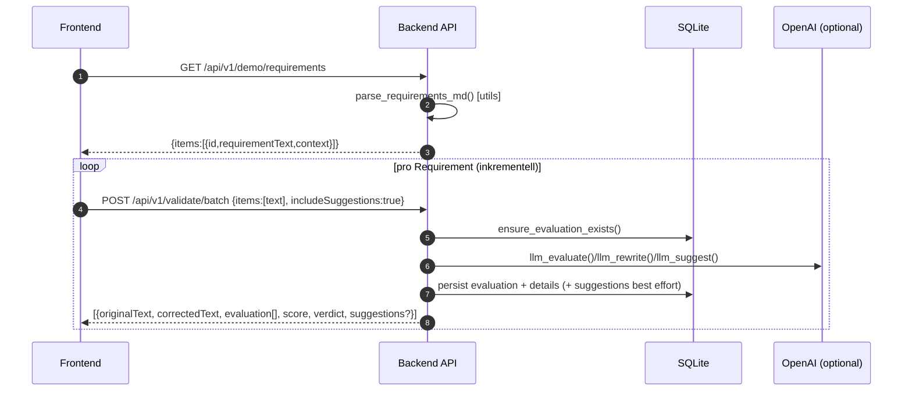

Relevante Funktionen:

- UI: [processIncremental()](../../frontend/app_optimized.js:611), [displayResults()](../../frontend/app_optimized.js:839)
- Backend: validate_batch via [backend.routers.validate_router](../../backend/routers/validate_router.py)
- Service: [backend.services.evaluation_service.evaluate_batch()](../../backend/services/evaluation_service.py)

### 3.2 Auto-Refine (Einzel-Item)

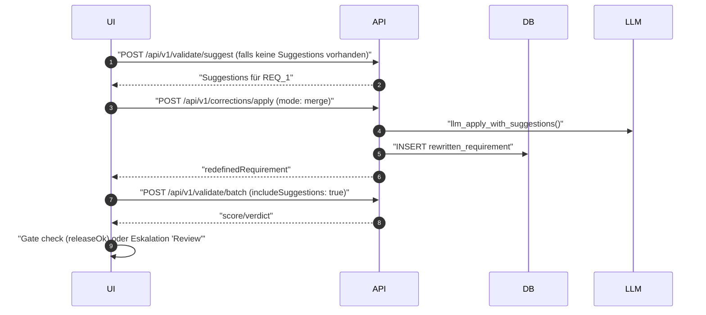

Relevante Funktionen:

- UI: [autoRefineIndex()](../../frontend/app_optimized.js:1947), [ensureSuggestions()](../../frontend/app_optimized.js:162), [mergeApply()](../../frontend/app_optimized.js:211), [reanalyzeIndex()](../../frontend/app_optimized.js:1834)
- Backend: [backend.routers.corrections_router.*](../../backend/routers/corrections_router.py), [backend.core.llm.llm_apply_with_suggestions()](../../backend/core/llm.py:339)

### 3.3 Datei-Ingest → Vektor-Index

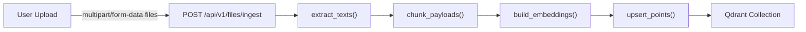

Relevante Funktionen:

- [backend.routers.vector_router.files_ingest()](../../backend/routers/vector_router.py)
- [backend.core.ingest.extract_texts()](../../backend/core/ingest.py:230), [backend.core.ingest.chunk_payloads()](../../backend/core/ingest.py:287)
- [backend.core.embeddings.build_embeddings()](../../backend/core/embeddings.py:59)
- [backend.core.vector_store.upsert_points()](../../backend/core/vector_store.py:109)

### 3.4 RAG-Suche (einfach)

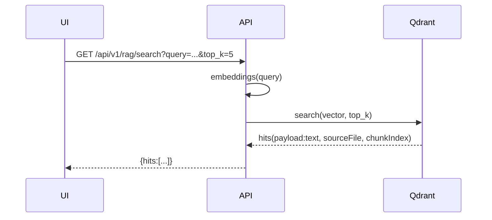

Relevante Funktionen: [backend.routers.vector_router.*](../../backend/routers/vector_router.py)

### 3.5 Society of Mind Workflow (Master Agent)

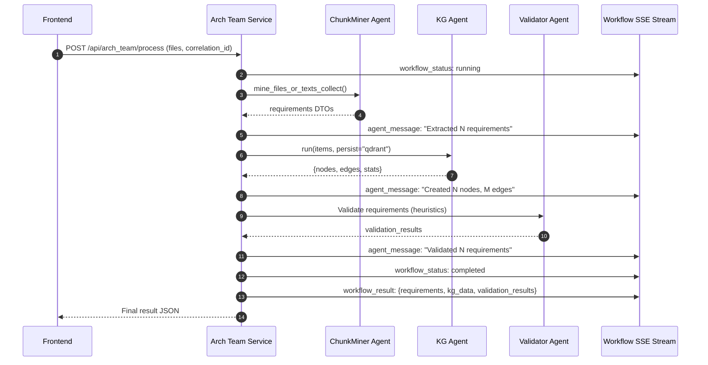

Relevante Funktionen:

- [arch_team.service.arch_team_process()](../../arch_team/service.py:1358)
- [arch_team.agents.master_agent.run_master_workflow()](../../arch_team/agents/master_agent.py:305)
- [arch_team.agents.chunk_miner.mine_files_or_texts_collect()](../../arch_team/agents/chunk_miner.py)
- [arch_team.agents.kg_agent.run()](../../arch_team/agents/kg_agent.py)

### 3.6 Knowledge Graph Construction

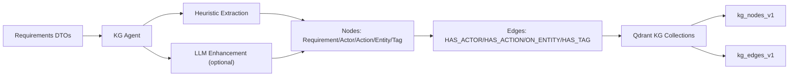

Relevante Funktionen:

- [arch_team.agents.kg_agent.run()](../../arch_team/agents/kg_agent.py)
- [arch_team.memory.qdrant_kg.QdrantKGClient](../../arch_team/memory/qdrant_kg.py)

---

## 4) Abhängigkeits-Matrix (Skripte, Module, Services)

| Ebene/Modul                     | Abhängigkeiten                                                                                                                                                                          | Genutzt von                       | Verantwortung                                                          | Schlüsselfunktionen                                                                                                                                                          |
| ------------------------------- | --------------------------------------------------------------------------------------------------------------------------------------------------------------------------------------- | --------------------------------- | ---------------------------------------------------------------------- | ---------------------------------------------------------------------------------------------------------------------------------------------------------------------------- |
| **Backend: FastAPI**            | [backend/main.py](../../backend/main.py), [backend.core.*](../../backend/core/), [backend.routers.*](../../backend/routers/), [backend.services.*](../../backend/services/)             | Frontend, Tests                   | FastAPI API                                                            | [fastapi_app](../../backend/main.py), [create_app()](../../backend/core/__init__.py:13)                                                                                      |
| **Backend: Core**               | [backend.core.llm](../../backend/core/llm.py), [backend.core.db](../../backend/core/db.py), [backend.core.embeddings](../../backend/core/embeddings.py), [backend.core.vector_store](../../backend/core/vector_store.py) | Services, Routers                 | Shared business logic                                                  | [llm_evaluate()](../../backend/core/llm.py:102), [init_db()](../../backend/core/db.py)                                                                                       |
| **Backend: Services**           | [backend.services.ports](../../backend/services/ports.py), [backend.services.adapters](../../backend/services/adapters.py)                                                               | Routers                           | Port-Adapter pattern, business logic orchestration                     | [EvaluationService](../../backend/services/evaluation_service.py), [BatchService](../../backend/services/batch_service.py)                                                   |
| **Backend: Routers**            | [backend.routers.*](../../backend/routers/)                                                                                                                                             | Frontend via HTTP                 | FastAPI endpoint implementations                                       | [lx_router](../../backend/routers/lx_router.py), [validate_router](../../backend/routers/validate_router.py)                                                                 |
| **Arch Team: Service**          | [arch_team.service](../../arch_team/service.py), FastAPI                                                                                                                               | Frontend via HTTP, SSE            | Society of Mind web service, SSE streaming                             | [arch_team_process()](../../arch_team/service.py:1358), [workflow_stream()](../../arch_team/service.py:1214)                                                                 |
| **Arch Team: Agents**           | [arch_team.agents.*](../../arch_team/agents/), AutoGen 0.4+                                                                                                                             | Master Agent                      | Specialized agents (ChunkMiner, KG, Validator, etc.)                   | [create_master_agent()](../../arch_team/agents/master_agent.py:150), [ChunkMinerAgent](../../arch_team/agents/chunk_miner.py)                                                |
| **Arch Team: Memory**           | [arch_team.memory.*](../../arch_team/memory/), Qdrant                                                                                                                                  | Agents                            | Knowledge graph storage, RAG retrieval, trace persistence              | [QdrantKGClient](../../arch_team/memory/qdrant_kg.py), [Retriever](../../arch_team/memory/retrieval.py)                                                                      |
| **Arch Team: Tools**            | [arch_team.tools.*](../../arch_team/tools/), AutoGen FunctionTool                                                                                                                       | Agents                            | Agent tool implementations                                             | [mining_tools](../../arch_team/tools/mining_tools.py), [kg_tools](../../arch_team/tools/kg_tools.py)                                                                         |
| **Frontend: React**             | [src/*](../../src/), Vite, React                                                                                                                                                        | User browser                      | Modern UI with SSE, KG visualization                                   | [App.jsx](../../src/App.jsx), [KnowledgeGraph.jsx](../../src/components/KnowledgeGraph.jsx)                                                                                  |
| **Frontend: Static**            | [frontend/*](../../frontend/)                                                                                                                                                           | User browser                      | Static HTML/JS UI, Auto-Refine loop                                    | [app_optimized.js](../../frontend/app_optimized.js), [autoRefineIndex()](../../frontend/app_optimized.js:1947)                                                               |
| **LLM**                         | OpenAI SDK, Settings                                                                                                                                                                    | Core, Services                    | Evaluate/Suggest/Rewrite/Apply mit robustem Fallback                   | [llm_evaluate()](../../backend/core/llm.py:102), [llm_suggest()](../../backend/core/llm.py:158), [llm_rewrite()](../../backend/core/llm.py:253)                              |
| **Ingest/Embeddings**           | requests, tenacity, tiktoken                                                                                                                                                            | Core, Routers                     | Extraktion, Chunking, Embeddings                                       | [extract_texts()](../../backend/core/ingest.py:230), [chunk_payloads()](../../backend/core/ingest.py:287), [build_embeddings()](../../backend/core/embeddings.py:59)         |
| **Vektor-Store**                | qdrant-client                                                                                                                                                                           | Core, Services                    | Upsert/Search/Reset der Collection                                     | [get_qdrant_client()](../../backend/core/vector_store.py:41), [search()](../../backend/core/vector_store.py:151), [reset_collection()](../../backend/core/vector_store.py:197) |
| **Persistenz**                  | sqlite3                                                                                                                                                                                 | Core, Services                    | DDL, Migrationen, CRUD                                                 | [init_db()](../../backend/core/db.py), [ensure_schema_migrations()](../../backend/core/db.py)                                                                                |
| **Settings**                    | dotenv, os env                                                                                                                                                                          | Core, Services                    | Laufzeitkonfiguration                                                  | [get_runtime_config()](../../backend/core/settings.py)                                                                                                                       |

---

## 5) Datenmodell

### SQLite (backend/core/db.py)

DDL-Definition: [backend.core.db.DDL](../../backend/core/db.py)

- Tabellen: criterion, evaluation, evaluation_detail, suggestion, rewritten_requirement, correction_decision, lx_config, gold_example
- Einzigartigkeit:
  - evaluation_detail: UNIQUE(evaluation_id, criterion_key)
  - correction_decision: UNIQUE(evaluation_id)
- Lebenszyklus:
  - Initialbefüllung Kriterien: [init_db()](../../backend/core/db.py) → [load_criteria()](../../backend/core/db.py)
  - Retention/Housekeeping: [purge_old_evaluations()](../../backend/core/db.py)

### Qdrant Collections

**Backend Collections:**
- `requirements_v2`: RAG document chunks mit embeddings
- Struktur: {text, sourceFile, chunkIndex, payload}

**Arch Team Collections:**
- `kg_nodes_v1`: Knowledge Graph Knoten (Requirement, Actor, Action, Entity, Tag)
- `kg_edges_v1`: Knowledge Graph Kanten (HAS_ACTOR, HAS_ACTION, ON_ENTITY, HAS_TAG)
- `arch_trace`: Agent conversation traces
- Struktur: siehe [QdrantKGClient](../../arch_team/memory/qdrant_kg.py)

---

## 6) Konfiguration

Quellen:

- Env/Dateien: [.env](../../.env), [.env.example](../../.env.example)
- Laufzeit-Snapshot: [backend.core.settings.get_runtime_config()](../../backend/core/settings.py)
- Prompts: [config/prompts/evaluate.system.txt](../../config/prompts/evaluate.system.txt), [config/prompts/suggest.system.txt](../../config/prompts/suggest.system.txt), [config/prompts/rewrite.system.txt](../../config/prompts/rewrite.system.txt)
- Kriterien-JSON: [config/criteria.json](../../config/criteria.json)
- Agent Prompts: [arch_team/agents/prompts/](../../arch_team/agents/prompts/)

Wichtige Schlüssel:

**Backend:**
- OPENAI_MODEL, OPENAI_API_KEY, MOCK_MODE
- VERDICT_THRESHOLD, SUGGEST_MAX, BATCH_SIZE, MAX_PARALLEL
- REQUIREMENTS_MD_PATH, OUTPUT_MD_PATH
- QDRANT_URL, QDRANT_PORT, QDRANT_COLLECTION
- EMBEDDINGS_MODEL, CHUNK_TOKENS_MIN/MAX/OVERLAP
- FEATURE_FLAG_USE_V2, CANARY_PERCENT
- API_HOST, API_PORT (default: 8087)

**Arch Team:**
- MODEL_NAME (default: gpt-4o-mini)
- APP_PORT (default: 8000)
- ARCH_REFLECTION_ROUNDS, ARCH_MODEL_CONTEXT_MAX
- CHUNK_MINER_NEIGHBORS

---

## 7) CORS/Preflight

**Backend (FastAPI):**
- Global CORS Middleware: [backend/main.py](../../backend/main.py) - CORSMiddleware with allow_origins=["*"]

**Arch Team:**
- CORS Middleware: [arch_team/service.py](../../arch_team/service.py) - CORS(app)

Ziel: 204-Antworten inkl. Access-Control-* für alle /api/* Preflights, kein 404.

---

## 8) System-/Feature-Diagramme

### 8.1 System-Kontext (Mermaid)

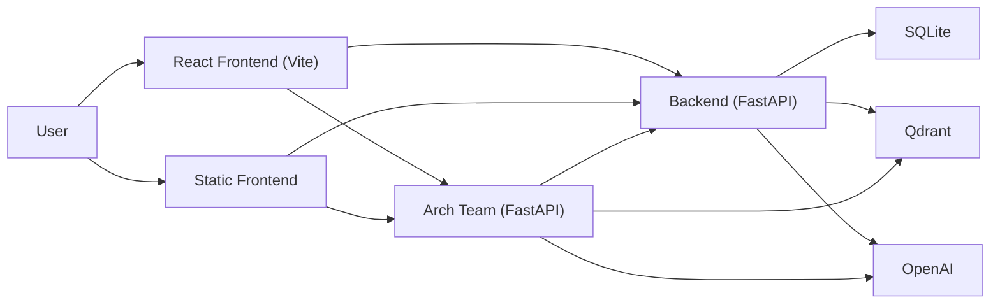

### 8.2 Container-Diagramm (Docker Compose)

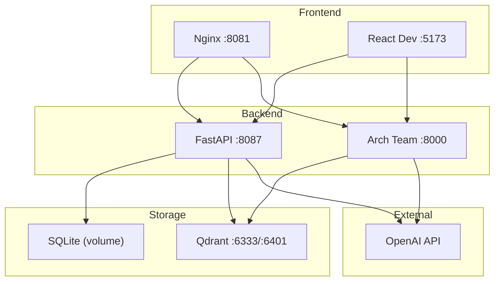

### 8.3 Component-Diagramm (Backend)

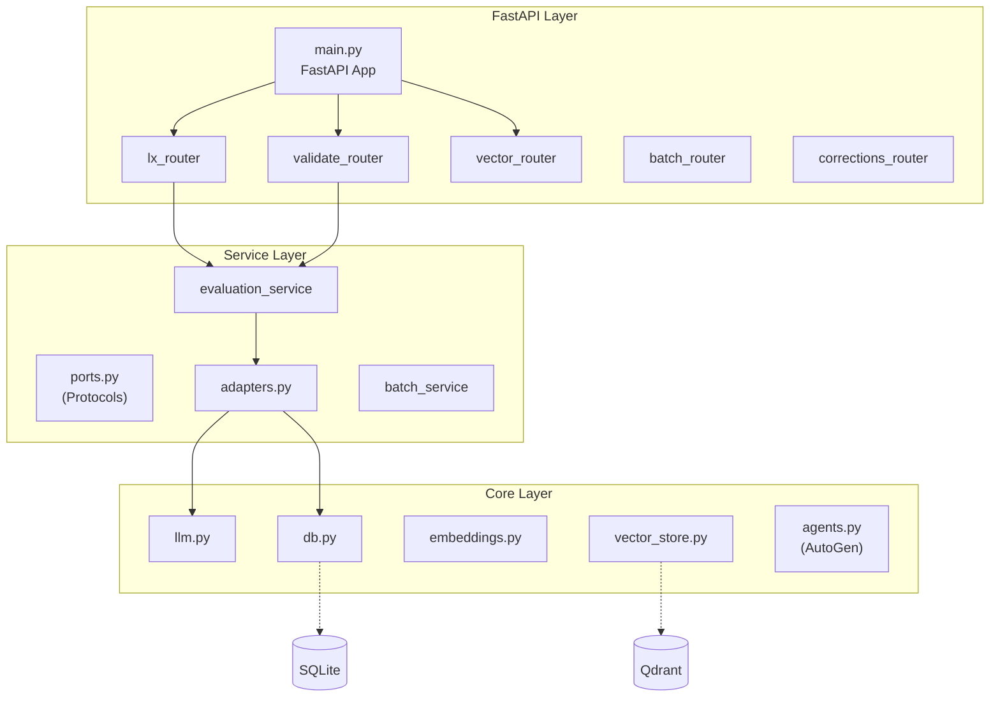

### 8.4 Society of Mind Agents

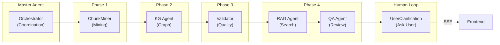

### 8.5 v2 Requirements-Extraction (LangExtract) – Ablauf

Parameter (Auszug):

- chunkMode: `token|paragraph`
- chunkMin/chunkMax/chunkOverlap
- neighbor_refs: `0|1` (±1 Nachbarschaft in Evidence)
- fast: `0|1` (nur 1 Temperatur, kein Repair)
- temperature: `0.0..1.0`
- configId: aktive LX-Konfiguration (Prompt + Beispiele)
- goldId/useGoldAsFewshot/autoGold: Guided Mining / Auto‑Gold

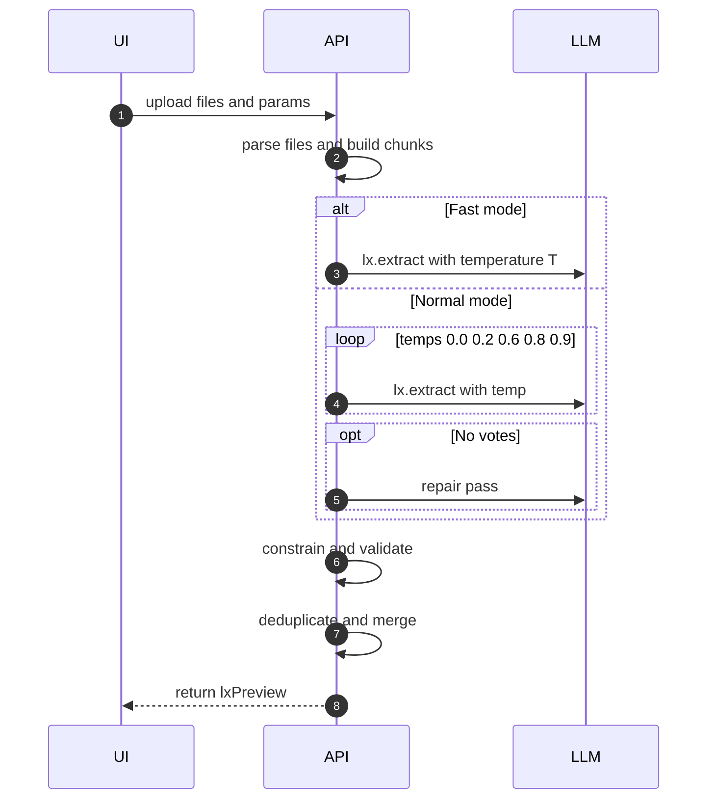

Ergebnis-Normalisierung:

- `AlignmentStatus` → String
- `char_interval` → {start_pos,end_pos}, Quelle: Datei/ChunkIndex
- Evidence-Option: Nachbarn ±1 Chunk

Guided Mining:

- `useGoldAsFewshot` mischt Gold-Items als zusätzliche Beispiele
- `autoGold` erzeugt Gold aus Tabellen oder Heuristik (Listen/Absätze)

Evaluation:

- `/api/v1/lx/evaluate`: Robust-Similarity=max(Jaccard, Token‑Containment, Char‑Ratio; optional Embeddings‑Cosine)

Fast Mode:

- ersetzt Self‑Consistency durch einen Lauf (konfigurierbare `temperature`), überspringt Repair

### 8.6 Feature: Validate Batch

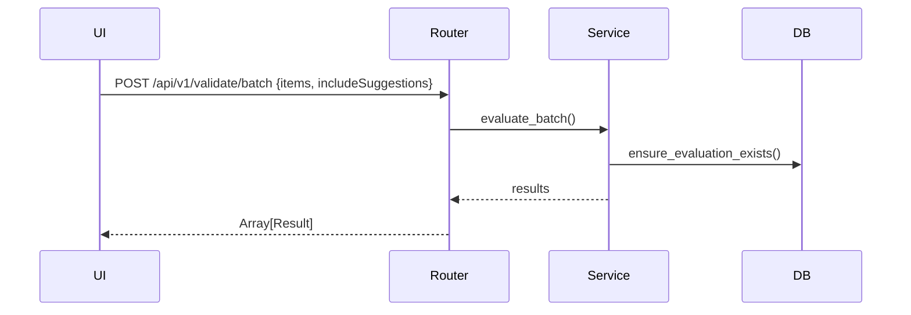

### 8.7 Feature: Suggestions/Apply

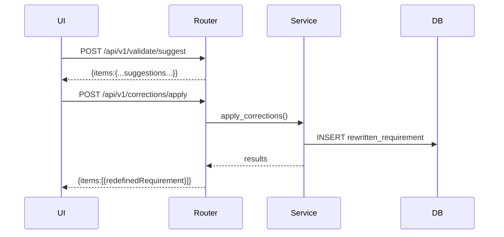

### 8.8 Feature: Vector Reset

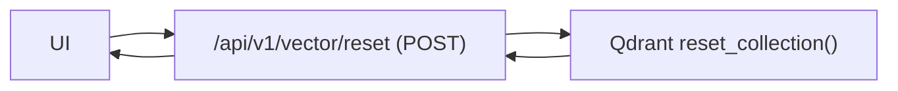

### 8.9 Feature: SSE Streaming (Workflow)

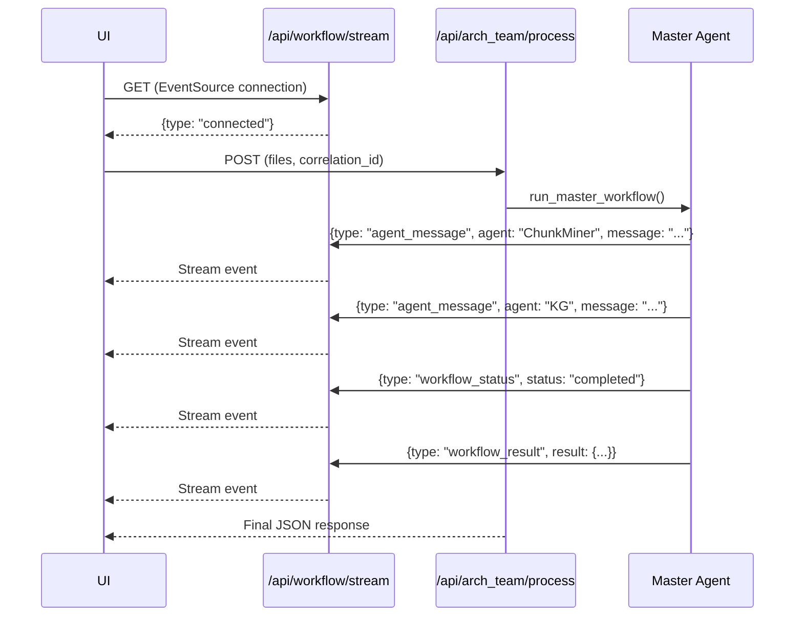

---

## 9) Test-Integration

- **UI/Flow**: [tests/ui/auto-refine.spec.ts](../../tests/ui/auto-refine.spec.ts), [tests/e2e/](../../tests/e2e/)
  - Einzel-Auto-Refine (Erreichen Release-Gate)
  - „Use modified"-Scope
  - Eskalation auf „Review" bei max Iterationen
- **Backend Tests**: [tests/backend/test_rag_models.py](../../tests/backend/test_rag_models.py), [tests/backend/test_lx_extract_v2.py](../../tests/backend/test_lx_extract_v2.py)
- **Service Tests**: [tests/services/test_evaluation_service.py](../../tests/services/test_evaluation_service.py)
- **Parity Tests** (v1 vs v2): [tests/parity/test_parity_core.py](../../tests/parity/test_parity_core.py) - MOCK_MODE=true
- **Arch Team Tests**:
  - [tests/arch_team/test_autogen_rac_smoke.py](../../tests/arch_team/test_autogen_rac_smoke.py) - AutoGen smoke tests
  - [tests/arch_team/test_e2e_pipeline.py](../../tests/arch_team/test_e2e_pipeline.py) - E2E pipeline
  - [tests/arch_team/test_chunk_miner_cli.py](../../tests/arch_team/test_chunk_miner_cli.py) - ChunkMiner CLI
  - [tests/arch_team/test_autogen_rag_tool.py](../../tests/arch_team/test_autogen_rag_tool.py) - RAG tool
- **RAG Qualitäts-Benchmark**: [tests/rag_benchmark.py](../../tests/rag_benchmark.py)

**Test Ausführung:**

```bash
# Alle Tests
pytest

# Backend Tests
pytest tests/backend/

# Service Layer Tests
pytest tests/services/

# Parity Tests (MOCK_MODE=true)
pytest tests/parity/test_parity_core.py

# Arch Team Tests
pytest tests/arch_team/

# E2E UI Tests (Playwright)
npx playwright test
```

---

## 10) Navigations-Index

Dieser Überblick ist zentral. Ergänzende Dokumente:

**Architecture:**
- **[ARCHITECTURE_OVERVIEW.md](../ARCHITECTURE_OVERVIEW.md)** (Englisch) - Detaillierte Architekturdokumentation mit allen Workflows und Patterns
- [FEATURES_AND_STACKS.md](./FEATURES_AND_STACKS.md) - Feature-Diagramme und Technology Stacks
- [C4.md](./C4.md) - C4-Modell Visualisierung
- [README.md](./README.md) - Navigation und Index

**Backend:**
- [docs/backend/README.md](../backend/README.md) - Backend Übersicht
- [docs/backend/ROUTES.md](../backend/ROUTES.md) - Vollständige Endpoint-Referenz
- [docs/backend/CONFIG.md](../backend/CONFIG.md) - LLM Konfiguration
- Weitere: TESTS.md, DEPLOYMENT.md, DIAGRAMS.md, DEMO.md, MODELS.md, LLM-SPEC.md

**Showcases:**
- [docs/showcases/ALL_SHOWCASES.md](../showcases/ALL_SHOWCASES.md) - 10 praktische Szenarien

**Source Code:**
- Backend Core: [backend/core/](../../backend/core/)
- Backend Services: [backend/services/](../../backend/services/)
- Backend Routers: [backend/routers/](../../backend/routers/)
- Arch Team: [arch_team/](../../arch_team/)
- React Frontend: [src/](../../src/)
- Static Frontend: [frontend/](../../frontend/)

---

## 11) Wichtige Code-Bezüge (Deep Links)

**Backend (Consolidated):**
- App-Bootstrap: [backend/main.py:32](../../backend/main.py:32)
- Validate Batch: [backend.routers.validate_router.*](../../backend/routers/validate_router.py)
- Service Layer: [backend.services.evaluation_service.evaluate_batch()](../../backend/services/evaluation_service.py)
- LLM Calls: [backend.core.llm.llm_evaluate()](../../backend/core/llm.py:102), [backend.core.llm.llm_suggest()](../../backend/core/llm.py:158), [backend.core.llm.llm_rewrite()](../../backend/core/llm.py:253)
- AutoGen Agents: [backend.core.agents.*](../../backend/core/agents.py)

**Arch Team:**
- Master Workflow: [arch_team.agents.master_agent.run_master_workflow()](../../arch_team/agents/master_agent.py:305)
- ChunkMiner: [arch_team.agents.chunk_miner.mine_files_or_texts_collect()](../../arch_team/agents/chunk_miner.py)
- KG Agent: [arch_team.agents.kg_agent.run()](../../arch_team/agents/kg_agent.py)
- Service Entry: [arch_team.service.arch_team_process()](../../arch_team/service.py:1358)
- SSE Streaming: [arch_team.service.workflow_stream()](../../arch_team/service.py:1214)

**Frontend:**
- React App: [src/App.jsx](../../src/App.jsx)
- Auto-Refine: [frontend/app_optimized.js:1947](../../frontend/app_optimized.js:1947)
- Knowledge Graph: [src/components/KnowledgeGraph.jsx](../../src/components/KnowledgeGraph.jsx)

---

## 12) Qualitäts-/Betriebshinweise

- **Fallback-Verhalten ohne OPENAI_API_KEY:**
  - Evaluate/Rewrite liefern Heuristik oder Originaltext (s. [llm_evaluate()](../../backend/core/llm.py:102), [llm_rewrite()](../../backend/core/llm.py:253))
  - Suggest kann leer bleiben (wenn nicht MOCK_MODE)
  - MOCK_MODE: Set `MOCK_MODE=true` für heuristische Evaluation ohne API

- **CORS-Preflight:**
  - FastAPI: Global CORSMiddleware in [backend/main.py](../../backend/main.py)
  - Arch Team: CORS Middleware in [arch_team/service.py](../../arch_team/service.py)

- **RAG-Port-Fallback:**
  - [backend.core.vector_store.get_qdrant_client()](../../backend/core/vector_store.py:41) prüft 6333/6401
  - Docker Compose: Host 6401, Container 6333

- **Retention:**
  - Alte Evaluations via [purge_old_evaluations()](../../backend/core/db.py)

- **Runtime-Konfiguration:**
  - Bei Start geloggt: [log_runtime_config_once()](../../backend/core/logging_ext.py)
  - Abrufbar via GET /api/runtime-config

- **Request Tracing:**
  - Jeder Request erhält UUID (X-Request-Id Header)
  - Strukturiertes JSON Logging mit Request-ID
  - Middleware: [backend/main.py:47](../../backend/main.py:47)

- **Feature Flags:**
  - FEATURE_FLAG_USE_V2: v2 Routing (default: true)
  - CANARY_PERCENT: Sticky Canary % (0-100)
  - Variant Header: X-Variant, X-Variant-Reason

- **Health Checks:**
  - Backend: GET /health, /ready, /livez
  - Arch Team: GET /health
  - Qdrant: GET /api/v1/vector/health

---

**Version:** Aktualisiert für konsolidierte Backend-Struktur + Arch Team Society of Mind (Stand: 2025-11-10)
