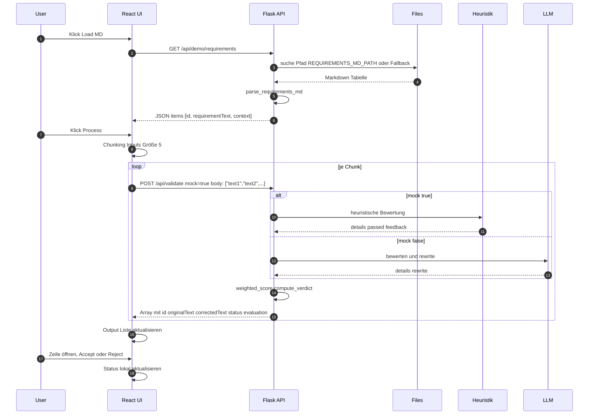

# Demo Ablauf und Architektur

Verweise
- Demo Endpoint laden aus MD: [demo_requirements()](backend_app/api.py:206)
- Validierung Endpoint: [validate_batch()](backend_app/api.py:232)
- Markdown Parser: [parse_requirements_md()](backend_app/utils.py:39)
- Verdict und Scoring: [compute_verdict()](backend_app/utils.py:25), [weighted_score()](backend_app/utils.py:14)
- React Frontend Haupt-App: [react-app.jsx](frontend/react-app.jsx:1)

Hinweis Pfade
- REQUIREMENTS_MD_PATH Standard: /data/requirements.md
- Fallbacks: /data/docs/requirements.md, /app/docs/requirements.md
- Konfiguration: [settings.py](backend_app/settings.py:26)

## Komponenten Überblick

```mermaid
graph LR
  subgraph Browser
    UI[React App]
  end

  subgraph Frontend
    NGINX[NGINX Static Host]
  end

  subgraph Backend
    API[Flask API]
    LLM[LLM Heuristik oder Upstream]
    UTIL[Utils Scoring]
  end

  subgraph Volumes
    DOCS[/data docs requirements.md]
    DATA[/data requirements.md]
  end

  UI --> NGINX
  UI -- GET /api/demo/requirements --> API
  UI -- POST /api/validate mock=true --> API

  API -- lesen --> DOCS
  API -- lesen --> DATA
  API -- parse md --> UTIL
  API -- score verdict --> UTIL
  API -- rewrite optional --> LLM
```

## Sequenzdiagramm Demo Flow



## Hinweise zur Nutzung

- React UI Buttons
  - Load MD lädt die Requirements aus der Markdown Tabelle
  - Process bewertet in Batches und nutzt mock=true für schnelle Heuristik
- Fehlervermeidung
  - Große Eingabelisten werden clientseitig in Chunks gesendet
  - Server Timeout erhöht über Gunicorn Parameter
- Testaufrufe
  - GET /api/demo/requirements
  - POST /api/validate?mock=true mit JSON Array

```