# Backend Diagramme

Diese Datei bündelt Komponenten-, Dataflow- und ER-Diagramm für das Backend.

## Komponenten-Diagramm

## Dataflow-Diagramm

## ER-Diagramm

```mermaid
erDiagram
  EVALUATION ||--o{ EVALUATION_DETAIL : has
  EVALUATION ||--o{ SUGGESTION : has
  EVALUATION ||--o{ REWRITTEN_REQUIREMENT : has
  CRITERION ||--o{ EVALUATION_DETAIL : defines

  EVALUATION {
    TEXT id
    TEXT requirement_checksum
    TEXT model
    INTEGER latency_ms
    REAL score
    TEXT verdict
    DATETIME created_at
  }

  EVALUATION_DETAIL {
    INTEGER id
    TEXT evaluation_id
    TEXT criterion_key
    REAL score
    BOOLEAN passed
    TEXT feedback
  }

  SUGGESTION {
    INTEGER id
    TEXT evaluation_id
    TEXT text
    TEXT priority
  }

  REWRITTEN_REQUIREMENT {
    INTEGER id
    TEXT evaluation_id
    TEXT text
  }

  CRITERION {
    TEXT key
    TEXT name
    TEXT description
    REAL weight
    BOOLEAN active
  }
```

Referenz: Details und DDL siehe [docs/backend/README.md](docs/backend/README.md).