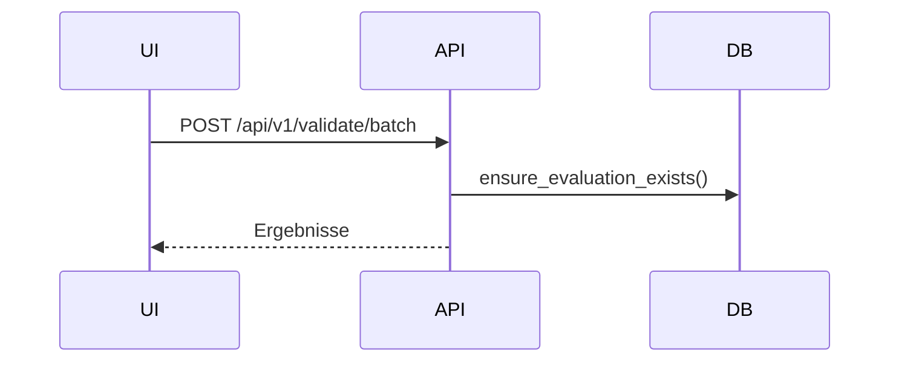

# Showcases (10 Varianten aus diesem Template ableitbar)

Diese Sammlung enthält 10 praxisnahe, unterschiedlich lange Showcase-Szenarien. Alle Flows basieren ausschließlich auf dieser Codebasis. Verlinkungen führen direkt in die Implementierung (klickbar bis auf Funktionen/Zeilen).

Weitere Systemübersicht:
- [docs/architecture/SYSTEM_OVERVIEW.md](../architecture/SYSTEM_OVERVIEW.md)
- Feature-/Stack-Übersichten: [docs/architecture/FEATURES_AND_STACKS.md](../architecture/FEATURES_AND_STACKS.md)

Hinweis Link-Konvention:
- Sprachelement: z. B. [backend_app.api.validate_batch_optimized()](../../backend_app/api.py:599)
- Datei: z. B. [frontend/app_optimized.js](../../frontend/app_optimized.js)


----------------------------------------------------------------

## 1) Evaluate-Only API (Kurz, API-fokussiert)

Ziel
- Ein einzelnes Requirement (oder Array) gegen die Bewertungslogik prüfen.

Primärer Endpunkt
- [backend_app.api.validate_batch_optimized()](../../backend_app/api.py:599)

Beispiel
```
curl -s -X POST "$API_BASE/api/v1/validate/batch" \
  -H "Content-Type: application/json" \
  -d '{"items":["System shall respond within 200 ms (p95)."],"includeSuggestions":true}' | jq .
```

Was passiert intern
- Sicherung oder Erstellung der Evaluation: [backend_app.batch.ensure_evaluation_exists()](../../backend_app/batch.py:28)
- LLM-/Heuristikbewertung: [backend_app.llm.llm_evaluate()](../../backend_app/llm.py:102)
- Aggregation/Decision: [backend_app.utils.weighted_score()](../../backend_app/utils.py:14), [backend_app.utils.compute_verdict()](../../backend_app/utils.py:25)


----------------------------------------------------------------

## 2) Suggestions → Apply (merge) → Re-Analyze (Mittel, Editing-Flow)

Ziel
- Zu einem Text atomare Vorschläge abrufen, konsolidieren und neu bewerten.

Endpunkte
- Vorschläge: [backend_app.api.validate_suggest()](../../backend_app/api.py:571)
- Anwenden: [backend_app.api.apply_corrections()](../../backend_app/api.py:255) → [backend_app.llm.llm_apply_with_suggestions()](../../backend_app/llm.py:339)
- Re-Analyse: [backend_app.api.validate_batch_optimized()](../../backend_app/api.py:599)

Ablauf (vereinfacht)
1. POST /api/v1/validate/suggest mit `[originalText]`
2. POST /api/v1/corrections/apply mit `selectedSuggestions` und `mode:"merge"`
3. POST /api/v1/validate/batch mit dem zusammengeführten Text

UI-Referenzen
- [frontend.app_optimized.ensureSuggestions()](../../frontend/app_optimized.js:162)
- [frontend.app_optimized.mergeApply()](../../frontend/app_optimized.js:211)
- [frontend.app_optimized.reanalyzeIndex()](../../frontend/app_optimized.js:1834)


----------------------------------------------------------------

## 3) Auto-Refine (Loop bis Release-Gate) (Lang, UI-automatisiert)

Ziel
- Vollautomatisches Erreichen des Release-Gates (OK oder Score ≥ Threshold), ansonsten Eskalation auf Review.

Kernlogik (Frontend)
- Gate/Heuristik: [frontend.app_optimized.computeOk()](../../frontend/app_optimized.js:25), [frontend.app_optimized.releaseOk()](../../frontend/app_optimized.js:53)
- Loop: [frontend.app_optimized.autoRefineIndex()](../../frontend/app_optimized.js:1947), [frontend.app_optimized.autoRefineMany()](../../frontend/app_optimized.js:2017)

Backend-Aufrufe
- Suggest → Apply → Validate Batch (siehe Showcase 2)

Testabdeckung (Playwright)
- [tests/ui/auto-refine.spec.ts](../../tests/ui/auto-refine.spec.ts)


----------------------------------------------------------------

## 4) Markdown-Batch Verarbeitung (Server-Quelle, „Merge-Report“) (Mittel)

Ziel
- Markdown-Datei (Tabelle) serverseitig verarbeiten und Merge-Report erzeugen.

Endpunkte
- Evaluate/Suggest/Rewrite Batch: [backend_app.batch.batch_evaluate()](../../backend_app/batch.py:282), [backend_app.batch.batch_suggest()](../../backend_app/batch.py:301), [backend_app.batch.batch_rewrite()](../../backend_app/batch.py:319)

Wichtige Helfer
- Parser: [backend_app.utils.parse_requirements_md()](../../backend_app/utils.py:39)
- Merge-Tabelle: [backend_app.batch.merged_markdown()](../../backend_app/batch.py:66)

Konfiguration
- Pfad: [.env REQUIREMENTS_MD_PATH](../../.env), Ausgabe optional [.env OUTPUT_MD_PATH](../../.env)


----------------------------------------------------------------

## 5) RAG Suche (einfach, ohne Agent) (Kurz)

Ziel
- Eine Query in Vektorraum suchen und Treffer mit Quelle/Chunk anzeigen.

Endpunkt
- [backend_app.api.rag_search()](../../backend_app/api.py:1286)

Voraussetzung
- Ingest/Indexierung vorgenommen (siehe Showcase 6)

Beispiel
```
curl -s "$API_BASE/api/v1/rag/search?query=health endpoint&top_k=5" | jq .
```


----------------------------------------------------------------

## 6) Datei-Ingest → Qdrant-Index (Mittel, Admin/Operator)

Ziel
- Dokumente hochladen, extrahieren, chunken, embedden und in Qdrant upserten.

Endpunkt
- [backend_app.api.files_ingest()](../../backend_app/api.py:1068)

Pipeline
- Extraktion/Chunking: [backend_app.ingest.extract_texts()](../../backend_app/ingest.py:230), [backend_app.ingest.chunk_payloads()](../../backend_app/ingest.py:287)
- Embeddings: [backend_app.embeddings.build_embeddings()](../../backend_app/embeddings.py:59)
- Upsert: [backend_app.vector_store.upsert_points()](../../backend_app/vector_store.py:109)

Hinweise
- Chunk-Parameter: `chunkMin`, `chunkMax`, `chunkOverlap`
- Collection/Dim: ENV in [backend_app.settings](../../backend_app/settings.py:26)


----------------------------------------------------------------

## 7) Agent-/Memory Antwort (Policy-Bias, Re-Ranking) (Lang)

Ziel
- Agent-/Policy-gestütztes Antwortformat, inkl. prefer_sources, topK-Anpassung, agentNotes.

Endpunkt
- [backend_app.api.agent_answer()](../../backend_app/api.py:1512)

Policies & Memory
- Regeln/Defaults: [backend_app.memory.MemoryStore.load_policies()](../../backend_app/memory.py:71)
- Ereignisprotokoll: [backend_app.memory.MemoryStore.append_event()](../../backend_app/memory.py:37)

Ranking/Context
- Re-Ranking: [backend_app.api._re_rank_hits()](../../backend_app/api.py:1389)
- Kontextfenster: [backend_app.api._build_context_from_hit()](../../backend_app/api.py:1412)

Optionaler externer Worker
- [agent_worker.app.mine()](../../agent_worker/app.py:261)


----------------------------------------------------------------

## 8) Vector-Index Admin (Reset, Health, Collections) (Kurz)

Ziel
- Collection neu aufsetzen, Status prüfen, Collections listen.

Endpunkte
- Reset (POST/DELETE/GET confirm=1): [backend_app.api.vector_reset()](../../backend_app/api.py:1158), [backend_app.api.vector_reset_get()](../../backend_app/api.py:1202)
- Health/List: [backend_app.api.vector_health()](../../backend_app/api.py:1149), [backend_app.api.vector_collections()](../../backend_app/api.py:1140)

Qdrant-Client
- [backend_app.vector_store.get_qdrant_client()](../../backend_app/vector_store.py:41) mit Port-Fallback (6333/6401)


----------------------------------------------------------------

## 9) NDJSON Streaming-Validate (Fortgeschritten, Streaming-Clients) (Mittel)

Ziel
- Ergebnisse pro Item streamen (schnelle Sichtbarkeit), kompatibel mit Browser-Streams.

Endpunkt
- [backend_app.api.validate_batch_stream()](../../backend_app/api.py:828)
- Suggestions-Stream: [backend_app.api.validate_suggest_stream()](../../backend_app/api.py:967)

Client-Hinweise
- Browser: fetch + ReadableStream + Zeilenweise JSON parse
- CLI: `curl --no-buffer ...`


----------------------------------------------------------------

## 10) RAG Benchmark Suite (Lang, Auswertung/Reporting)

Ziel
- Einfache Heuristik-Bewertung der RAG-Qualität über Promptliste.

Script
- [tests/rag_benchmark.py](../../tests/rag_benchmark.py)

Ergebnisse
- JSON/Markdown: tests/out/rag_report.json, tests/out/rag_report.md

Bewertungsheuristiken
- Keyword-Overlap: [tests/rag_benchmark.keyword_overlap()](../../tests/rag_benchmark.py:38)
- Referenz-Ähnlichkeit: [tests/rag_benchmark.ref_similarity()](../../tests/rag_benchmark.py:50)


----------------------------------------------------------------

## Anhang: Mini-Diagramme (Mermaid)

Validate Batch (sequenziell, komprimiert)


Ingest (komprimiert)
```mermaid
flowchart LR
  U-->API[/files/ingest/]
  API-->EX
  EX-->CH
  CH-->EM
  EM-->UP
  UP-->Q[Qdrant]