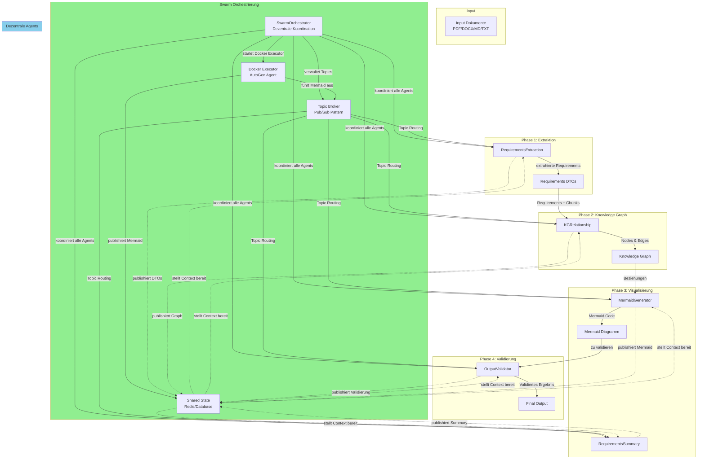
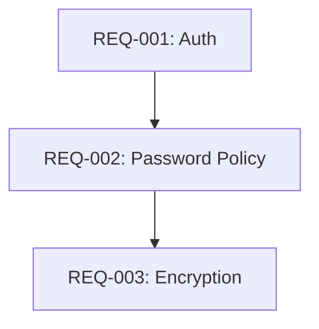
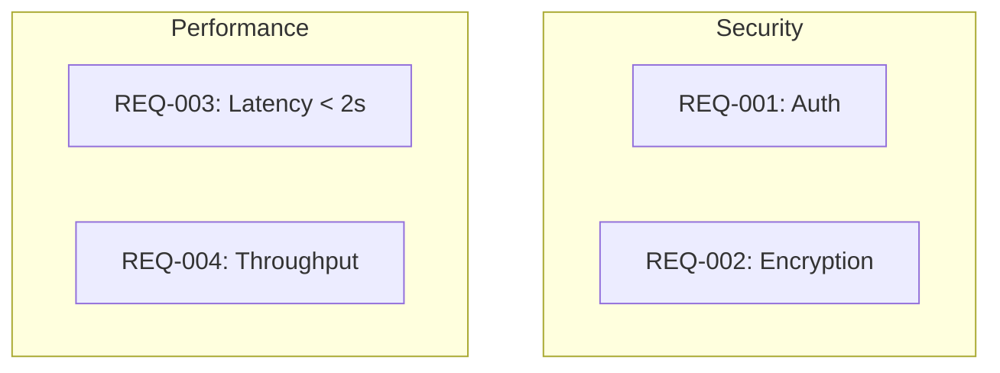
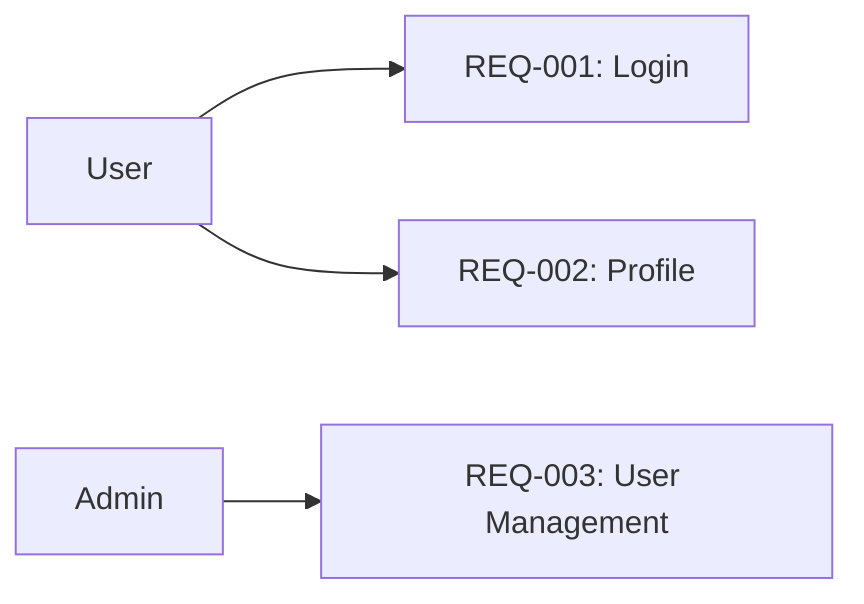
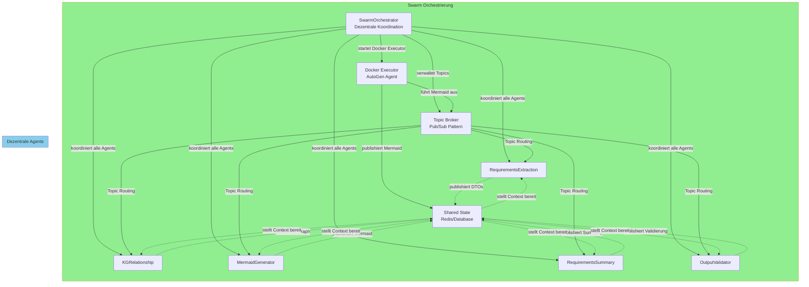
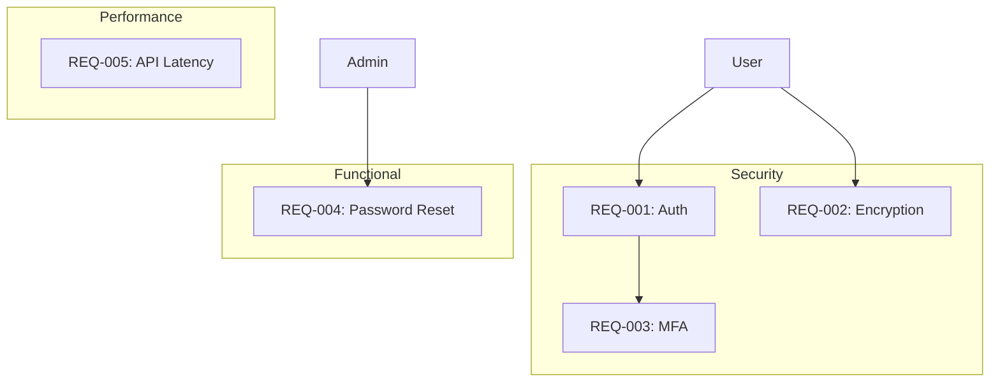

# Requirements Mermaid & KG System - Architektur-Design

## Überblick

Ein System zur automatischen Extraktion, Analyse und Visualisierung von Requirements als Mermaid-Diagramm mit detailliertem Knowledge Graph.

## Architektur



## Komponenten

### 1. RequirementsExtractionAgent (Verbessert)

**Zweck:** Extrahiert Requirements aus Dokumenten mit Cross-Chunk Kontext und Deduplizierung

**Verbesserungen gegenüber bestehendem ChunkMinerAgent:**

| Feature | Status | Beschreibung |
|---------|--------|-------------|
| Cross-Chunk Kontext | Neu | Nachbar-Chunks werden im Prompt berücksichtigt |
| Deduplizierung | Neu | Semantische Duplikate über Chunks werden erkannt |
| Validierung | Neu | Extrahierte Requirements werden gegen Regeln geprüft |

**Input:**
- Dokumente (PDF, DOCX, MD, TXT)
- Chunking-Parameter (max_tokens, overlap_tokens)

**Output:**
- Requirements DTOs mit Metadaten
- Evidence-Refs (inkl. Neighbor-Chunks)

### 2. KGRelationshipAgent

**Zweck:** Baut detaillierten Knowledge Graph via LLM auf

**Erkannte Beziehungen:**

| Beziehungstyp | Beschreibung | Beispiel |
|---------------|-------------|--------|
| **DEPENDS_ON** | Requirement A hängt von Requirement B ab | REQ-001 → REQ-002 |
| **CONFLICTS_WITH** | Requirement A widerspricht Requirement B | REQ-003 ⊗ REQ-004 |
| **GROUPED_WITH** | Requirements gehören zu einer Gruppe | REQ-005, REQ-006 → Security-Gruppe |
| **ACTOR_RELATION** | Actor interagiert mit Requirement | User → REQ-007 |
| **DATA_FLOW** | Datenfluss zwischen Requirements | REQ-008 → REQ-009 |
| **IMPLEMENTED_BY** | Requirement implementiert Feature | REQ-010 → REQ-011 |

**Node-Typen:**
- Requirement
- Actor (User, Admin, System, etc.)
- Entity (Datenbank, API, etc.)
- Tag (Functional, Security, etc.)
- Group (Feature-Gruppe, etc.)

**Edge-Typen:**
- DEPENDS_ON (Pfeil: →)
- CONFLICTS_WITH (Pfeil: ⊗)
- GROUPED_WITH (Pfeil: → mit Label)
- ACTOR_RELATION (Pfeil: →)
- DATA_FLOW (Pfeil: →)
- IMPLEMENTED_BY (Pfeil: →)

**Input:**
- Requirements DTOs
- Zugehörige Chunks (als Context)

**Output:**
- Nodes (Liste aller Entitäten)
- Edges (Liste aller Beziehungen)
- Gruppen (Requirements nach Tags/Prioritäten)

### 3. MermaidGeneratorAgent

**Zweck:** Generiert automatisch Mermaid-Diagramm aus Knowledge Graph

**Diagramm-Typen:**

1. **Dependency Graph** (Abhängigkeiten)


2. **Conflict Graph** (Konflikte)
```mermaid
graph LR
    REQ003[REQ-003: AES-256] -.x. CONFLICTS_WITH .-> REQ004[REQ-004: RSA-2048]
```

3. **Grouped Graph** (Gruppierungen)


4. **Actor-Requirement Graph** (Actor-Beziehungen)


**Input:**
- Knowledge Graph (Nodes + Edges)
- Diagramm-Typ (Dependency/Conflict/Grouped/Actor)

**Output:**
- Mermaid-Code (Syntax-korrektes Diagramm)
- Metadaten (Anzahl Nodes/Edges, Diagramm-Typ)

### 4. RequirementsSummaryAgent

**Zweck:** Fasst Ergebnisse des Requirements-Teams zusammen

**Zusammenfassungsinhalte:**
- Gesamtanzahl Requirements
- Verteilung nach Tags (Functional, Security, Performance, etc.)
- Verteilung nach Prioritäten (Must, Should, May)
- Identifizierte Konflikte
- Identifizierte Abhängigkeiten
- Quality-Score (Durchschnitt aller Requirements)

**Input:**
- Requirements DTOs
- Knowledge Graph
- Mermaid-Diagramm

**Output:**
- Strukturierte Zusammenfassung (JSON/Markdown)
- Statistiken
- Empfehlungen

### 5. OutputValidator

**Zweck:** Validiert den Output auf Syntax, Konsistenz und Vollständigkeit

**Validierungs-Checks:**

| Check-Typ | Beschreibung | Beispiel |
|-----------|-------------|--------|
| **Syntax-Check** | Mermaid-Diagramm ist syntaktisch korrekt | Keine ungültigen Knoten/Edges |
| **Konsistenz-Check** | Alle Requirements im KG sind im Diagramm enthalten | Keine fehlenden Requirements |
| **Vollständigkeits-Check** | Alle Beziehungen sind erfasst | Keine unverbundenen Nodes |
| **Semantik-Check** | Beziehungen sind logisch korrekt | Keine Zyklen in Abhängigkeiten |
| **Cross-Reference-Check** | Chunks sind korrekt referenziert | Evidence-Refs sind gültig |

**Input:**
- Mermaid-Diagramm
- Knowledge Graph
- Requirements DTOs

**Output:**
- Validierungs-Ergebnis (Success/Failed)
- Liste der gefundenen Probleme
- Korrigierte Version (falls möglich)

### 6. SwarmOrchestrator

**Zweck:** Dezentrale Koordination aller Agents mit gemeinsamer State und Topic-basierter Subscription (Swarm Pattern)

**Swarm-Architektur:**



**Swarm-Koordinations-Aufgaben:**
- Paralleles Starten aller Agents
- Gemeinsamer State für Context-Sharing (Redis/Database)
- Topic-basierte Kommunikation (Pub/Sub Pattern)
- Docker-Executor für Mermaid-Diagramm-Generierung (AutoGen Agent)
- Event-basierte Subscription auf relevante Topics
- Fehlerbehandlung bei Timeouts
- Aggregation der Ergebnisse
- Status-Tracking pro Agent

**Input:**
- Input-Dokumente
- Konfiguration (Chunking-Parameter, etc.)

**Output:**
- Aggregiertes Ergebnis aller Agents
- Status-Report (Success/Failed/Warnungen)
- Validiertes Mermaid-Diagramm
- Zusammenfassung

## Datenfluss (Swarm Pattern mit Topic Subscription)

```mermaid
sequenceDiagram
    participant User
    participant SwarmOrchestrator
    participant TopicBroker
    participant SharedState
    participant Extraction
    participant KG
    participant Mermaid
    participant Summary
    participant Validator
    
    User->>SwarmOrchestrator: Upload Dokument
    SwarmOrchestrator->>TopicBroker: Initialisiere Topics
    SwarmOrchestrator->>SharedState: Initialisiere Workflow
    
    par Alle Agents parallel mit Topic Subscription
        SwarmOrchestrator->>Extraction: Start Extraktion
        Extraction->>TopicBroker: Subscribe zu requirements.topic
        Extraction->>Extraction: Cross-Chunk Kontext
        Extraction->>Extraction: Deduplizierung
        Extraction->>SharedState: Publish DTOs
        Extraction-->>SwarmOrchestrator: Fertig
    and
    
        SwarmOrchestrator->>KG: Start KG-Aufbau
        KG->>TopicBroker: Subscribe zu kg.topic
        KG->>KG: LLM-Analyse
        KG->>KG: Beziehungen erkennen
        KG->>SharedState: Publish Graph
        KG-->>SwarmOrchestrator: Fertig
    and
    
        SwarmOrchestrator->>Mermaid: Start Mermaid-Generierung
        Mermaid->>TopicBroker: Subscribe zu mermaid.topic
        Mermaid->>Mermaid: Diagramm erstellen
        Mermaid->>Mermaid: Syntax-Check
        Mermaid->>SharedState: Publish Mermaid
        Mermaid-->>SwarmOrchestrator: Fertig
    and
    
        SwarmOrchestrator->>Summary: Start Zusammenfassung
        Summary->>TopicBroker: Subscribe zu summary.topic
        Summary->>Summary: Statistiken berechnen
        Summary->>SharedState: Publish Summary
        Summary-->>SwarmOrchestrator: Fertig
    and
    
        SwarmOrchestrator->>Validator: Start Validierung
        Validator->>TopicBroker: Subscribe zu validation.topic
        Validator->>Validator: Syntax-Check
        Validator->>Validator: Konsistenz-Check
        Validator->>Validator: Vollständigkeits-Check
        Validator->>Validator: Semantik-Check
        Validator->>SharedState: Publish Validierung
        Validator-->>SwarmOrchestrator: Fertig
    and
    
    SwarmOrchestrator->>SharedState: Aggregiere Ergebnisse
    SharedState-->>SwarmOrchestrator: Alle Agents fertig
    
    SwarmOrchestrator-->>User: Final Output
```

## API-Endpunkte

### POST /api/workflow/start

Startet den kompletten Workflow.

**Request:**
```json
{
  "files": [...],
  "options": {
    "chunk_size": 800,
    "chunk_overlap": 200,
    "neighbor_refs": true,
    "diagram_type": "dependency"
  }
}
```

**Response:**
```json
{
  "workflow_id": "wf-abc123",
  "status": "running",
  "stages": {
    "extraction": "running",
    "kg_build": "pending",
    "mermaid_gen": "pending",
    "validation": "pending"
  }
}
```

### GET /api/workflow/status/{workflow_id}

Status-Abfrage für laufenden Workflow.

**Response:**
```json
{
  "workflow_id": "wf-abc123",
  "status": "completed",
  "stages": {
    "extraction": "completed",
    "kg_build": "completed",
    "mermaid_gen": "completed",
    "validation": "completed"
  },
  "results": {
    "requirements_count": 42,
    "nodes_count": 87,
    "edges_count": 143,
    "conflicts_count": 3,
    "dependencies_count": 28
  }
}
```

### GET /api/workflow/result/{workflow_id}

Lädt das finale Ergebnis ab.

**Response:**
```json
{
  "workflow_id": "wf-abc123",
  "requirements": [...],
  "knowledge_graph": {
    "nodes": [...],
    "edges": [...]
  },
  "mermaid_diagram": "graph TD\n  REQ001[...] --> REQ002[...]\n...",
  "summary": {
    "total_requirements": 42,
    "by_tag": {
      "functional": 25,
      "security": 8,
      "performance": 5,
      "usability": 4
    },
    "by_priority": {
      "must": 30,
      "should": 8,
      "may": 4
    },
    "conflicts": [...],
    "dependencies": [...]
  },
  "validation": {
    "syntax_valid": true,
    "consistency_valid": true,
    "completeness_valid": true,
    "semantic_valid": true,
    "issues": []
  }
}
```

## Test-Szenario

### Test-Input

```python
test_document = """
# Authentication System Requirements

The system must authenticate users within 2 seconds.
User passwords must be encrypted using AES-256.
The system shall support multi-factor authentication.
Admin users can reset user passwords.
The API must respond within 500 milliseconds.
"""
```

### Erwartetes Ergebnis

**Requirements:**
- REQ-001: "The system must authenticate users within 2 seconds" (Security, Must)
- REQ-002: "User passwords must be encrypted using AES-256" (Security, Must)
- REQ-003: "The system shall support multi-factor authentication" (Security, Must)
- REQ-004: "Admin users can reset user passwords" (Functional, Should)
- REQ-005: "The API must respond within 500 milliseconds" (Performance, Must)

**Knowledge Graph:**
- Nodes: REQ-001, REQ-002, REQ-003, REQ-004, REQ-005, User, Admin, API, Security, Functional, Performance
- Edges:
  - REQ-001 → Security (HAS_TAG)
  - REQ-002 → Security (HAS_TAG)
  - REQ-003 → Security (HAS_TAG)
  - REQ-004 → Functional (HAS_TAG)
  - REQ-005 → Performance (HAS_TAG)
  - User → REQ-001 (ACTOR_RELATION)
  - User → REQ-002 (ACTOR_RELATION)
  - Admin → REQ-004 (ACTOR_RELATION)
  - REQ-001 → REQ-003 (DEPENDS_ON)

**Mermaid-Diagramm:**


## Implementierungs-Prioritäten

1. **RequirementsExtractionAgent verbessern** (Höchste Priorität)
   - Cross-Chunk Kontext implementieren
   - Deduplizierung implementieren
   - Validierung hinzufügen

2. **KGRelationshipAgent erstellen** (Höchste Priorität)
   - LLM-basierte Beziehungserkennung
   - Alle Beziehungstypen unterstützen
   - Context aus Chunks nutzen

3. **MermaidGeneratorAgent erstellen** (Mittlere Priorität)
   - Automatische Diagramm-Generierung
   - Mehrere Diagramm-Typen unterstützen
   - Syntax-Validierung

4. **RequirementsSummaryAgent erstellen** (Mittlere Priorität)
   - Zusammenfassung aller Ergebnisse
   - Statistiken berechnen
   - Empfehlungen generieren

5. **OutputValidator erstellen** (Mittlere Priorität)
   - Syntax-Check
   - Konsistenz-Check
   - Vollständigkeits-Check
   - Semantik-Check

6. **SwarmOrchestrator erstellen** (Höchste Priorität)
   - Parallele Koordination
   - Fehlerbehandlung
   - Status-Tracking

7. **Test-Skript erstellen** (Niedrige Priorität)
   - Systemverhalten prüfen
   - Performance messen

8. **Integration implementieren** (Mittlere Priorität)
   - API-Endpunkte erstellen
   - Mit existierendem System verbinden

9. **Frontend erstellen** (Niedrige Priorität)
   - Visualisierung der Ergebnisse
   - Interaktive Diagramme

10. **Dokumentation aktualisieren** (Niedrige Priorität)
    - README schreiben
    - API-Dokumentation

## Antworten auf Benutzerfragen

### Wie wird der Context realisiert?

**Shared State**: Redis oder PostgreSQL für dezentrale Speicherung. Alle Agents publishieren ihre Ergebnisse in den Shared State, der dann als Context für andere Agents bereitgestellt wird.

### Die Model-Auswahl soll über .env verfügbar gemacht werden?

**Ja**, die Model-Auswahl soll über Environment Variables konfigurierbar sein:

```bash
# .env
MERMAID_MODEL=gpt-4o
MERMAID_EXECUTOR=docker  # oder direct
```

Die Environment Variable `MERMAID_EXECUTOR` bestimmt, ob:
- `docker` = Docker-Executor mit AutoGen (robuster, für komplexe Diagramme)
- `direct` = Direkter LLM-Aufruf (schneller, einfacher)

### Die Mermaid-Diagramme sollen mit dem Docker-Execution-Agent von AutoGen ausgeführt werden?

**Ja**, der Docker-Executor führt AutoGen aus und generiert die Mermaid-Diagramme. Dies bietet folgende Vorteile:

1. **Robusterheit**: AutoGen ist speziell für komplexe Aufgaben optimiert
2. **Konsistenz**: Ein zentraler Executor für alle Mermaid-Diagramme
3. **Skalierbarkeit**: Docker-Container können parallel gestartet werden
4. **Isolation**: Fehlertolerante Mermaid-Generierung isoliert den Rest des Systems

**Empfehlung**: Für einfache Diagramme kann auch der direkte LLM-Aufruf verwendet werden (Option 1), für komplexe Diagramme der Docker-Executor (Option 2).
