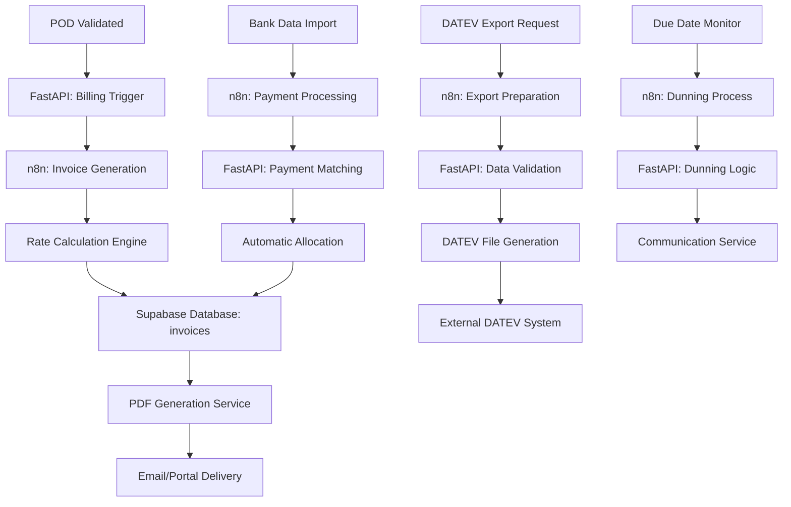

# Abrechnung Service

## Service-Überblick

**Service Name**: Abrechnung Service  
**Verantwortlichkeit**: Automatisierte Rechnungserstellung, DATEV-Integration und Abrechnungsmanagement  
**Architektur**: Eigenständiger FastAPI-Service mit n8n-Integration für Billing-Workflows

## Funktionen

### Rechnungserstellung
- **Automatische Fakturierung**: Nach POD-Validierung automatische Rechnungsgenerierung
- **Flexible Abrechnungsmodelle**: Ausgangsrechnung vs. Eingangsgutschrift
- **Kundenspezifische Formate**: Anpassbare Rechnungslayouts und -formate
- **Zusatzleistungen**: Automatische Erfassung von Wartezeiten, Be-/Entladung
- **Mautberechnung**: Integration von Mautkosten in die Abrechnung

### DATEV-Integration
- **Export-Funktionalität**: Automatischer Export für Buchhaltungssoftware
- **Buchungsvorschläge**: Generierung von Buchungsvorschlägen
- **Steuerberechnung**: Automatische MwSt.-Berechnung und Reverse Charge
- **Kontenrahmen**: Flexible Zuordnung zu Buchungskonten
- **Periodenabschluss**: Unterstützung für monatliche/quartalsweise Abschlüsse

### Zahlungsmanagement
- **Zahlungsüberwachung**: Monitoring offener Posten
- **Mahnwesen**: Automatisierte Mahnläufe
- **Zahlungszuordnung**: Automatische Zuordnung eingehender Zahlungen
- **Skonto-Verwaltung**: Skontoberechnung und -überwachung
- **Factoring-Integration**: Anbindung an Factoring-Dienstleister

## API Endpoints Design

### Rechnungsmanagement Endpoints
- **Invoice CRUD**: Vollständige Rechnungsverwaltung
- **Automatic Generation**: Automatische Rechnungserstellung nach POD
- **Template Management**: Verwaltung von Rechnungsvorlagen
- **Status Tracking**: Rechnungsstatus-Verfolgung
- **// TODO**: Integration mit externen Billing-Systemen

### DATEV Export Endpoints
- **Export Generation**: DATEV-konforme Datenexporte
- **Booking Proposals**: Buchungsvorschlag-Generierung
- **Tax Calculation**: Steuerberechnung und -validierung
- **Period Management**: Periodenabschluss-Funktionen
- **// TODO**: Real-time DATEV-Synchronisation

### Payment Management Endpoints
- **Payment Tracking**: Zahlungsüberwachung und -zuordnung
- **Dunning Process**: Mahnwesen-Verwaltung
- **Discount Management**: Skonto-Berechnung und -verwaltung
- **Factoring Integration**: Factoring-Prozess-Unterstützung
- **// TODO**: Banking API Integration

### Analytics & Reporting Endpoints
- **Financial Reports**: Finanzberichte und Auswertungen
- **Revenue Analytics**: Umsatzanalyse und Forecasting
- **Customer Profitability**: Kundenprofitabilitätsanalyse
- **Cost Analysis**: Kostenanalyse und -optimierung
- **// TODO**: Predictive Financial Analytics

## Datenmodell Design

### Invoice Entity
- **Identifikation**: Rechnungsnummer, Auftragsbezug, Kundenzuordnung
- **Financial Data**: Nettobetrag, Steuern, Gesamtbetrag, Währung
- **Billing Details**: Rechnungsdatum, Fälligkeitsdatum, Zahlungsziel
- **Line Items**: Einzelpositionen mit Mengen, Preisen, Steuersätzen
- **Status Information**: Rechnungsstatus, Zahlungsstatus, Mahnstatus
- **// TODO**: Multi-Currency Support

### Payment Structure
- **Payment Information**: Zahlungsbetrag, -datum, -methode
- **Bank Details**: Kontoverbindung, Referenznummern
- **Allocation Data**: Zuordnung zu Rechnungen und Teilzahlungen
- **Processing Status**: Verarbeitungsstatus, Validierung
- **Reconciliation**: Abstimmungsinformationen
- **// TODO**: Blockchain-basierte Payment Verification

### DATEV Export Structure
- **Export Metadata**: Exportdatum, Periode, Buchungskreis
- **Booking Entries**: Buchungssätze mit Konten und Beträgen
- **Tax Information**: Steuerschlüssel, Steuerbeträge, USt-ID
- **Document References**: Belegnummern, externe Referenzen
- **Validation Data**: Prüfsummen, Konsistenzprüfungen
- **// TODO**: Real-time DATEV API Integration

### Billing Configuration
- **Customer Settings**: Kundenspezifische Abrechnungsregeln
- **Rate Tables**: Tarif- und Preistabellen
- **Tax Configuration**: Steuerkonfiguration und -sätze
- **Template Settings**: Rechnungsvorlagen und -layouts
- **Workflow Rules**: Automatisierungsregeln für Billing-Prozesse
- **// TODO**: AI-basierte Pricing Optimization

### Dunning Process Structure
- **Dunning Levels**: Mahnstufen und -eskalation
- **Communication**: Mahnschreiben und Kommunikationshistorie
- **Fee Calculation**: Mahngebühren und Verzugszinsen
- **Legal Process**: Rechtliche Schritte und Inkasso
- **Settlement Options**: Ratenzahlung und Vergleichsangebote
- **// TODO**: AI-basierte Dunning Optimization

## Service-Architektur Design

### FastAPI Service Konzept
- **Billing Engine**: Zentrale Abrechnungslogik und -verarbeitung
- **Tax Calculation**: Steuerberechnung und -validierung
- **Export Generation**: DATEV und andere Export-Formate
- **Payment Processing**: Zahlungsverarbeitung und -zuordnung
- **// TODO**: Microservice-basierte Architektur

### Core Service Functions
- **Invoice Generator**: Automatische Rechnungsgenerierung
- **Payment Processor**: Zahlungsverarbeitung und -überwachung
- **Export Engine**: Export-Funktionalität für verschiedene Formate
- **Dunning Manager**: Mahnwesen und Forderungsmanagement
- **// TODO**: Machine Learning für Zahlungsvorhersage

### Integration Components
- **DATEV Connector**: Direkte DATEV-Integration
- **Banking Interface**: Bankdaten-Import und -verarbeitung
- **PDF Generator**: Rechnungs- und Dokumentenerstellung
- **Email Service**: Automatischer E-Mail-Versand
- **// TODO**: Multi-Banking API Integration

### n8n Workflow Design

#### Invoice Generation Workflow
- **POD Trigger**: Automatische Auslösung nach POD-Validierung
- **Data Collection**: Sammlung aller abrechnungsrelevanten Daten
- **Calculation Engine**: Berechnung von Fracht, Zusatzleistungen, Steuern
- **Template Processing**: Anwendung kundenspezifischer Vorlagen
- **// TODO**: AI-basierte Rechnungsoptimierung

#### DATEV Export Workflow
- **Data Preparation**: Aufbereitung der Buchungsdaten
- **Validation Process**: Validierung gegen DATEV-Standards
- **Export Generation**: Erstellung der DATEV-Exportdateien
- **Transfer Process**: Übertragung an DATEV-System
- **// TODO**: Real-time DATEV Synchronisation

#### Payment Processing Workflow
- **Bank Data Import**: Import von Kontoauszugsdaten
- **Payment Matching**: Automatische Zahlungszuordnung
- **Reconciliation**: Abstimmung und Differenzanalyse
- **Notification**: Benachrichtigung bei Zahlungseingang
- **// TODO**: AI-basierte Payment Matching

#### Dunning Process Workflow
- **Due Date Monitoring**: Überwachung von Fälligkeitsterminen
- **Dunning Level Escalation**: Automatische Mahnstufenerhöhung
- **Communication**: Automatischer Versand von Mahnschreiben
- **Fee Calculation**: Berechnung von Mahngebühren
- **// TODO**: Predictive Dunning Optimization

## Datenfluss

## Integration Points

### Inbound
- **Transport Service**: POD-Daten für Rechnungsauslösung
- **Order Management**: Auftragsdaten und Preisvereinbarungen
- **Business Partner Service**: Kundenstammdaten und Abrechnungsregeln
- **Banking APIs**: Kontoauszugsdaten und Zahlungsinformationen

### Outbound
- **DATEV System**: Buchungsdaten und Exportfiles
- **Customer Portal**: Rechnungen und Zahlungsstatus
- **Email Service**: Rechnungsversand und Kommunikation
- **Factoring Partners**: Forderungsverkauf und -management

## Rechnungsverarbeitung

### Automatische Generierung
- **Trigger Events**: POD-Validierung, manuelle Auslösung
- **Data Aggregation**: Sammlung aller abrechnungsrelevanten Daten
- **Rate Calculation**: Berechnung basierend auf Tarifvereinbarungen
- **Template Application**: Anwendung kundenspezifischer Layouts
- **// TODO**: AI-basierte Rechnungsoptimierung

### Validierung und Freigabe
- **Completeness Check**: Vollständigkeitsprüfung der Rechnungsdaten
- **Business Rules**: Anwendung von Geschäftsregeln
- **Approval Workflow**: Freigabeprozess für kritische Rechnungen
- **Quality Assurance**: Qualitätsprüfung vor Versand
- **// TODO**: Machine Learning für Anomalieerkennung

## DATEV-Integration

### Export-Funktionalität
- **Standard Formats**: DATEV-konforme Exportformate
- **Mapping Configuration**: Flexible Kontenzuordnung
- **Validation Rules**: Prüfung gegen DATEV-Standards
- **Batch Processing**: Stapelverarbeitung für Periodenexporte
- **// TODO**: Real-time DATEV API Integration

### Buchungslogik
- **Account Assignment**: Automatische Kontenzuordnung
- **Tax Handling**: Steuerbehandlung und USt-Verarbeitung
- **Cost Center**: Kostenstellen- und Kostenträgerzuordnung
- **Document Linking**: Verknüpfung mit Originalbelegen
- **// TODO**: AI-basierte Buchungsvorschläge

## Zahlungsmanagement

### Zahlungsüberwachung
- **Open Items**: Verwaltung offener Posten
- **Payment Tracking**: Verfolgung von Zahlungseingängen
- **Aging Analysis**: Fälligkeitsanalyse und Reporting
- **Cash Flow**: Liquiditätsplanung und -überwachung
- **// TODO**: Predictive Payment Analytics

### Mahnwesen
- **Automated Dunning**: Automatisierte Mahnläufe
- **Escalation Rules**: Eskalationsregeln und -stufen
- **Communication**: Multi-Channel Kommunikation
- **Legal Integration**: Anbindung an Inkasso-Dienstleister
- **// TODO**: AI-basierte Mahnoptimierung

## Monitoring und KPIs

### Financial KPIs
- **Revenue Metrics**: Umsatzkennzahlen und -entwicklung
- **Collection Rate**: Zahlungseingangsquote
- **Days Sales Outstanding**: Durchschnittliche Zahlungsdauer
- **Bad Debt Rate**: Ausfallquote und Risikobewertung
- **// TODO**: Predictive Financial KPIs

### Process KPIs
- **Invoice Processing Time**: Rechnungsverarbeitungszeit
- **Automation Rate**: Automatisierungsgrad der Prozesse
- **Error Rate**: Fehlerquote in der Rechnungsstellung
- **Customer Satisfaction**: Kundenzufriedenheit mit Billing
- **// TODO**: Real-time Process Analytics

### Compliance Monitoring
- **Tax Compliance**: Steuerrechtliche Compliance
- **DATEV Validation**: DATEV-Konformität der Exporte
- **Audit Trail**: Vollständige Nachverfolgbarkeit
- **Regulatory Reporting**: Regulatorische Berichterstattung
- **// TODO**: Automated Compliance Monitoring

## Testing

### Unit Tests
- **Calculation Logic**: Tests für Berechnungslogik
- **Tax Processing**: Tests für Steuerberechnung
- **DATEV Export**: Tests für Export-Funktionalität
- **Payment Matching**: Tests für Zahlungszuordnung
- **// TODO**: Comprehensive Test Coverage

### Integration Tests
- **API Endpoints**: Tests für alle API-Endpunkte
- **DATEV Integration**: Tests für DATEV-Schnittstelle
- **Banking Integration**: Tests für Bank-APIs
- **Workflow Testing**: Tests für n8n-Workflows
- **// TODO**: End-to-End Testing Framework

### Performance Tests
- **High Volume Processing**: Tests mit hohem Rechnungsvolumen
- **Concurrent Operations**: Tests mit parallelen Operationen
- **Export Performance**: Performance-Tests für große Exporte
- **Database Load**: Tests für Datenbankperformance
- **// TODO**: Load Testing und Scalability Tests