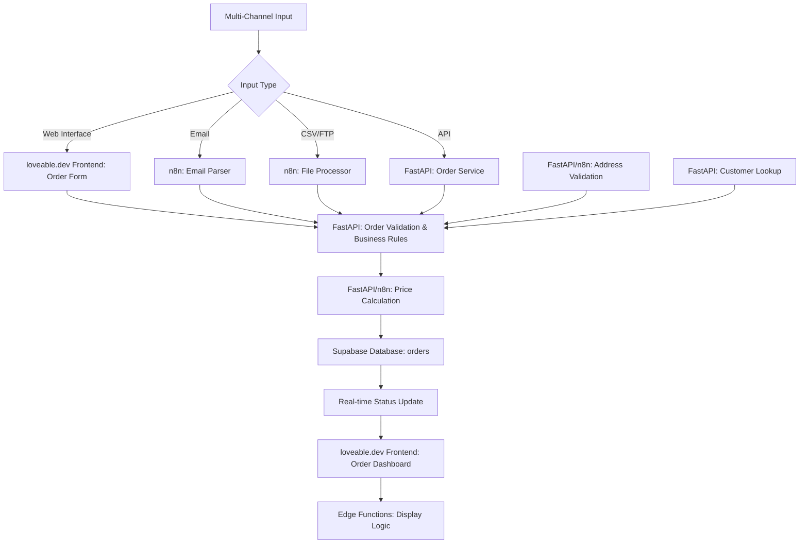

# Auftragsmanagement Service

## Service-Überblick

**Service Name**: Order Management Service  
**Verantwortlichkeit**: Flexible Auftragserfassung über multiple Kanäle mit automatischer Validierung und Weiterverarbeitung  
**Architektur**: Eigenständiger FastAPI-Service mit n8n-Integration für Multi-Channel-Processing

## Funktionen

### Multi-Channel Auftragserfassung
- **Web-Interface**: Direkte Eingabe über loveable.dev Frontend
- **Email-Import**: Automatische Verarbeitung von E-Mail-Aufträgen
- **CSV/FTP-Import**: Batch-Verarbeitung von Auftragsdateien
- **API-Integration**: RESTful API für externe Systeme
- **EDI-Integration**: Elektronischer Datenaustausch (geplant)

### Auftragsvalidierung
- **Datenvalidierung**: Automatische Prüfung aller Eingabedaten
- **Adressvalidierung**: Verifikation von Abhol-/Lieferadressen
- **Kapazitätsprüfung**: Verfügbarkeit von Fahrzeugen und Fahrern
- **Zeitfenster-Validierung**: Prüfung der Machbarkeit von Terminen
- **Preiskalkulation**: Automatische Kostenberechnung

### Auftragsverwaltung
- **Statusverfolgung**: Vollständige Nachverfolgung des Auftragsstatus
- **Änderungsmanagement**: Verwaltung von Auftragsänderungen
- **Stornierungen**: Strukturierte Stornierungsabwicklung
- **Dokumentenmanagement**: CMR, Lieferscheine, Rechnungen
- **Kommunikation**: Automatische Benachrichtigungen an alle Beteiligten

## API Endpoints Design

### Auftragsmanagement Endpoints
- **CRUD Operations**: Vollständige Auftragsverwaltung (Create, Read, Update, Delete)
- **Bulk Operations**: Massenoperationen für mehrere Aufträge
- **Search & Filter**: Erweiterte Suchfunktionen mit Filteroptionen
- **Pagination**: Effiziente Datenübertragung bei großen Datenmengen
- **// TODO**: REST API Spezifikation mit OpenAPI Schema

### Status & Tracking Endpoints
- **Status Management**: Statusaktualisierungen mit Validierung
- **History Tracking**: Vollständige Nachverfolgung aller Änderungen
- **Real-time Updates**: WebSocket-Integration für Live-Updates
- **Event Notifications**: Automatische Benachrichtigungen bei Statusänderungen
- **// TODO**: Event-driven Architecture Implementation

### Import & Export Endpoints
- **Multi-Format Support**: CSV, Excel, XML, JSON Import/Export
- **Batch Processing**: Asynchrone Verarbeitung großer Dateien
- **Validation Pipeline**: Mehrstufige Datenvalidierung
- **Error Handling**: Detaillierte Fehlerberichterstattung
- **// TODO**: File Processing Service Integration

### Preiskalkulation Endpoints
- **Dynamic Pricing**: Echtzeitberechnung basierend auf aktuellen Parametern
- **Rule Engine**: Flexible Preisregelkonfiguration
- **Quote Management**: Angebotserstellung und -verwaltung
- **Price History**: Nachverfolgung von Preisänderungen
- **// TODO**: ML-basierte Preisoptimierung

## Datenmodell Design

### Order Entity
- **Identifikation**: Eindeutige ID, Mandant, Auftragsnummer, externe Referenz
- **Auftraggeber**: Kundenreferenz und interne Kundennummer
- **Abholdaten**: Adresse, Datum, Zeitfenster, Kontaktinformationen
- **Lieferdaten**: Adresse, Datum, Zeitfenster, Kontaktinformationen
- **Warenbeschreibung**: Beschreibung, Typ, Gefahrgut-Klassifizierung
- **Mengenangaben**: Anzahl, Gewicht, Volumen, Lademeter
- **Transportanforderungen**: Temperaturführung, Ausrüstungstyp
- **Preisstruktur**: Kundenpreis, Subunternehmerpreis, Währung
- **Status & Priorität**: Aktueller Status, Prioritätsstufe
- **Audit Trail**: Erstellungs- und Änderungsdaten
- **// TODO**: Detaillierte Feldspezifikationen und Validierungsregeln

### Order Status Lifecycle
- **Draft**: Entwurfsstatus für unvollständige Aufträge
- **Confirmed**: Bestätigte und validierte Aufträge
- **Planned**: Aufträge in der Tourenplanung
- **In Transit**: Aufträge in der Durchführung
- **Delivered**: Erfolgreich abgeschlossene Aufträge
- **Cancelled**: Stornierte Aufträge
- **Invoiced**: Abgerechnete Aufträge
- **// TODO**: Statusübergangsregeln und Validierung

### Order Item Structure
- **Artikelidentifikation**: Artikelnummer, Beschreibung, Einheit
- **Quantität**: Anzahl und Mengeneinheit
- **Physische Eigenschaften**: Abmessungen, Gewicht
- **Handling-Eigenschaften**: Stapelbarkeit, Zerbrechlichkeit, Gefahrgut
- **Tracking**: Erstellungsdatum und Änderungshistorie
- **// TODO**: Erweiterte Artikelklassifizierung und Handling-Regeln

## Service-Architektur

### FastAPI Service Design
- **Service Layer**: Zentrale Geschäftslogik für Auftragsverwaltung
- **Dependency Injection**: Lose Kopplung zwischen Service-Komponenten
- **Async Processing**: Asynchrone Verarbeitung für bessere Performance
- **Error Handling**: Strukturierte Fehlerbehandlung mit Custom Exceptions
- **Validation Pipeline**: Mehrstufige Datenvalidierung
- **// TODO**: Service-Implementierung mit Repository Pattern

### Core Service Functions
- **Order Management**: CRUD-Operationen mit Business Rules
- **Import Processing**: Multi-Format Datenimport mit Validierung
- **Price Calculation**: Dynamische Preisberechnung mit Rule Engine
- **Status Management**: Statusübergänge mit Validierung
- **Notification System**: Event-basierte Benachrichtigungen
- **// TODO**: Detaillierte Business Logic Implementation

### n8n Workflow Design

#### Email Order Processing Workflow
- **Trigger**: Eingehende E-Mail mit Auftragsinhalt
- **Content Extraction**: Intelligente Textanalyse und Datenextraktion
- **Attachment Processing**: PDF/Excel-Verarbeitung mit OCR
- **Validation**: Automatische Datenvalidierung und Plausibilitätsprüfung
- **// TODO**: ML-basierte E-Mail-Klassifizierung

#### CSV/FTP Import Processing Workflow
- **File Monitoring**: Automatische Überwachung von FTP/SFTP-Verzeichnissen
- **Format Detection**: Automatische Erkennung von Dateiformaten
- **Data Transformation**: Mapping auf interne Datenstrukturen
- **Batch Processing**: Effiziente Massenverarbeitung
- **// TODO**: Error Recovery und Retry-Mechanismen

#### Price Calculation Workflow
- **Distance Calculation**: Integration mit Routing-APIs
- **Tariff Engine**: Flexible Tarifberechnung basierend auf Regeln
- **Additional Services**: Berechnung von Zusatzleistungen
- **Dynamic Pricing**: Echtzeitanpassung basierend auf Marktbedingungen
- **// TODO**: ML-basierte Preisoptimierung

#### Order Status Updates Workflow
- **Event Processing**: Verarbeitung von Statusänderungs-Events
- **Validation Rules**: Prüfung gültiger Statusübergänge
- **Multi-Channel Notifications**: Benachrichtigungen über verschiedene Kanäle
- **Integration Sync**: Synchronisation mit externen Systemen
- **// TODO**: Real-time Event Streaming

## Datenfluss



## Integration Points

### Inbound
- **Business Partner Service**: Kunden- und Lieferantendaten
- **Pricing Service**: Tarifberechnung und Preisregeln
- **Address Service**: Adressvalidierung und Geocoding
- **External APIs**: E-Mail, FTP, EDI-Systeme

### Outbound
- **Disposition Service**: Aufträge für Tourenplanung
- **Transport Service**: Transportaufträge
- **Billing Service**: Abrechnungsrelevante Daten
- **Notification Service**: Benachrichtigungen

## Preiskalkulation

### Preiskomponenten
```python
class PriceCalculation(BaseModel):
    # Grundfracht
    base_price: Decimal
    distance_km: Decimal
    rate_per_km: Decimal
    
    # Zusatzleistungen
    loading_fee: Decimal
    unloading_fee: Decimal
    waiting_time_fee: Decimal
    express_surcharge: Decimal
    
    # Besondere Anforderungen
    dangerous_goods_surcharge: Decimal
    temperature_controlled_surcharge: Decimal
    oversized_surcharge: Decimal
    
    # Rabatte/Aufschläge
    customer_discount: Decimal
    fuel_surcharge: Decimal
    toll_costs: Decimal
    
    # Gesamtpreis
    subtotal: Decimal
    tax_rate: Decimal
    tax_amount: Decimal
    total_price: Decimal
```

### Preisregeln
```python
class PricingRule(BaseModel):
    id: UUID
    tenant_id: UUID
    name: str
    rule_type: PricingRuleType  # DISTANCE, WEIGHT, VOLUME, FIXED
    
    # Anwendungsbedingungen
    customer_id: Optional[UUID]
    equipment_type: Optional[EquipmentType]
    goods_type: Optional[GoodsType]
    min_distance: Optional[Decimal]
    max_distance: Optional[Decimal]
    
    # Preisberechnung
    base_rate: Decimal
    rate_per_unit: Decimal
    minimum_charge: Decimal
    
    # Gültigkeit
    valid_from: date
    valid_to: Optional[date]
    active: bool = True
```

## Validierung & Qualitätssicherung

### Datenvalidierung
- **Pflichtfelder**: Vollständigkeitsprüfung
- **Datentypen**: Typsichere Validierung
- **Geschäftsregeln**: Fachliche Plausibilitätsprüfung
- **Referenzintegrität**: Verknüpfungen zu anderen Entitäten

### Adressvalidierung
- **Geocoding**: Koordinatenbestimmung
- **Standardisierung**: Einheitliche Adressformate
- **Erreichbarkeit**: LKW-Zugänglichkeit prüfen
- **Zeitfenster**: Öffnungszeiten validieren

## Monitoring & Observability

### Metriken
- **Order Volume**: Anzahl Aufträge pro Zeitraum
- **Processing Time**: Verarbeitungszeit pro Kanal
- **Error Rate**: Fehlerquote bei Import/Validierung
- **Price Accuracy**: Genauigkeit der Preiskalkulation

### Alerts
- **Failed Imports**: Fehlgeschlagene Datenimporte
- **Validation Errors**: Häufige Validierungsfehler
- **Price Deviations**: Ungewöhnliche Preisabweichungen
- **System Overload**: Hohe Systemlast

## Testing

### Unit Tests
- Order CRUD Operations
- Price Calculation Logic
- Validation Rules
- Data Import/Export

### Integration Tests
- Multi-Channel Import
- API Endpoint Testing
- Database Operations
- External Service Integration

### Performance Tests
- Bulk Order Processing
- Concurrent API Requests
- Large File Import
- Price Calculation Performance