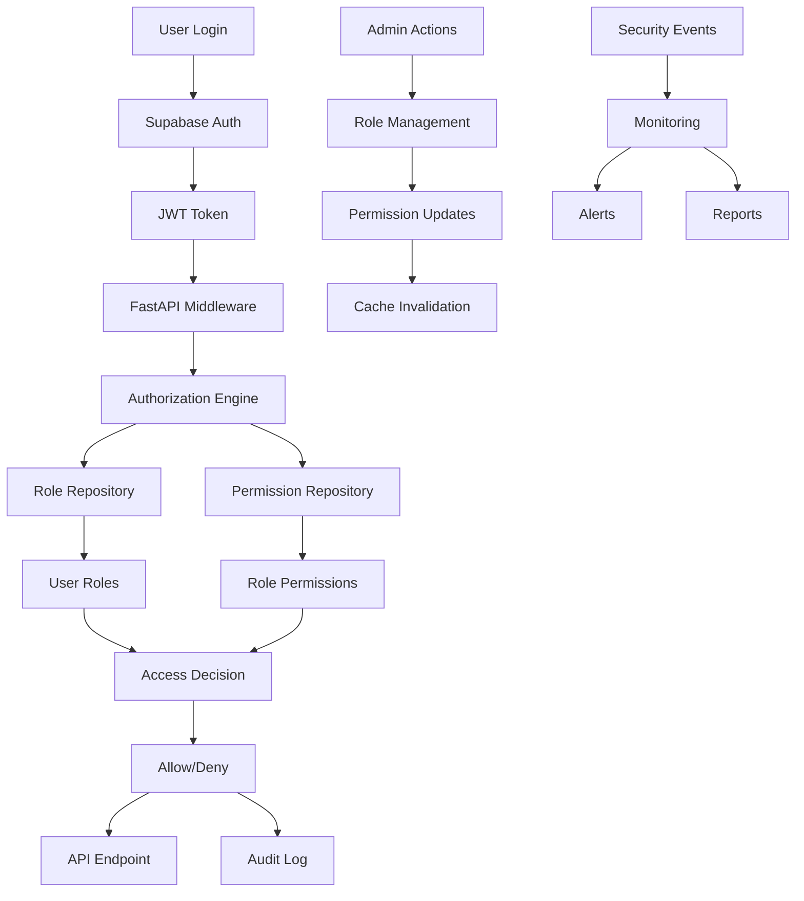

# Benutzer & Rollenverwaltung Service - Authentication & Authorization

## Service Overview

Der Benutzer & Rollenverwaltung Service ist verantwortlich für die sichere Authentifizierung und Autorisierung aller Systembenutzer. Er implementiert ein rollenbasiertes Zugriffskontrollsystem (RBAC) und integriert sich nahtlos mit Supabase Auth für moderne, sichere Benutzerverwaltung.

### Hauptfunktionen
- **Benutzerauthentifizierung**: Sichere Anmeldung und Session-Management
- **Rollenverwaltung**: Flexible, hierarchische Rollendefinition
- **Zugriffskontrolle**: Granulare Berechtigungen auf Ressourcenebene
- **Audit-Trail**: Vollständige Nachverfolgung aller Benutzeraktionen
- **Multi-Tenant Support**: Mandantenfähige Benutzerverwaltung

## Functions

### Authentifizierung
- **Multi-Factor Authentication**: 2FA/MFA für erhöhte Sicherheit
- **Single Sign-On (SSO)**: Integration mit externen Identity Providern
- **Session Management**: Sichere Session-Verwaltung mit JWT
- **Password Policies**: Durchsetzung starker Passwort-Richtlinien
- **Account Lockout**: Schutz vor Brute-Force-Angriffen

### Rollenverwaltung
- **Hierarchische Rollen**: Vererbung von Berechtigungen
- **Dynamische Rollen**: Zeitbasierte und kontextuelle Rollenzuweisung
- **Rollenvorlagen**: Vordefinierte Rollen für verschiedene Benutzertypen
- **Rollendelegation**: Temporäre Rechtevergabe
- **Rollenaudit**: Überwachung von Rollenänderungen

### Zugriffskontrolle
- **Resource-based Access Control**: Granulare Ressourcenberechtigungen
- **Attribute-based Access Control**: Kontextuelle Zugriffsentscheidungen
- **Row Level Security**: Datenbankebenen-Sicherheit
- **API-Level Authorization**: Schutz aller API-Endpoints
- **Field-Level Security**: Schutz sensibler Datenfelder

## API Endpoints Design

### Authentication Endpoints
- **User Registration**: Benutzerregistrierung mit Validierung
- **User Login**: Sichere Anmeldung mit verschiedenen Methoden
- **Password Reset**: Sicherer Passwort-Reset-Prozess
- **Token Refresh**: JWT-Token-Erneuerung
- **Logout**: Sichere Abmeldung und Session-Invalidierung

### User Management
- **User CRUD**: Vollständige Benutzerverwaltung
- **Profile Management**: Benutzerprofil-Verwaltung
- **Account Status**: Aktivierung, Deaktivierung, Sperrung
- **User Search**: Erweiterte Benutzersuche und -filterung
- **Bulk Operations**: Massenoperationen für Benutzer

### Role Management
- **Role CRUD**: Rollen erstellen, bearbeiten, löschen
- **Permission Assignment**: Zuordnung von Berechtigungen zu Rollen
- **Role Hierarchy**: Verwaltung von Rollenhierarchien
- **Role Templates**: Vorlagen für häufige Rollenkombinationen
- **Role Analytics**: Analyse der Rollennutzung

### Authorization Endpoints
- **Permission Check**: Überprüfung von Benutzerberechtigungen
- **Resource Access**: Zugriffskontrolle für spezifische Ressourcen
- **Bulk Authorization**: Massenprüfung von Berechtigungen
- **Context-based Access**: Kontextuelle Zugriffsentscheidungen
- **Delegation Management**: Verwaltung delegierter Berechtigungen

### Audit & Monitoring
- **Audit Log**: Vollständige Protokollierung aller Aktionen
- **Login History**: Anmeldeverlauf und -statistiken
- **Permission Changes**: Nachverfolgung von Berechtigungsänderungen
- **Security Events**: Überwachung sicherheitsrelevanter Ereignisse
- **Compliance Reports**: Berichte für Compliance-Anforderungen

**// TODO**: Implementierung der FastAPI-Endpoints mit Supabase Auth Integration
**// TODO**: OAuth2/OpenID Connect Integration für SSO
**// TODO**: Advanced Security Features (Rate Limiting, Anomaly Detection)

## Data Model Design

### User Entity
- **Grunddaten**: User-ID, E-Mail, Name, Status, Erstellungsdatum
- **Authentifizierung**: Passwort-Hash, MFA-Settings, Login-Versuche
- **Profil**: Persönliche Daten, Präferenzen, Avatar
- **Mandant**: Zuordnung zu Organisationseinheiten
- **Metadaten**: Letzte Anmeldung, IP-Adresse, User-Agent
- **Sicherheit**: Account-Status, Sperrungen, Sicherheitsereignisse

### Role Entity
- **Grunddaten**: Role-ID, Name, Beschreibung, Typ
- **Hierarchie**: Parent-Role, Child-Roles, Vererbungsregeln
- **Gültigkeit**: Zeitbasierte Gültigkeit, Aktivierungsbedingungen
- **Kontext**: Anwendungsbereich, Mandantenzuordnung
- **Metadaten**: Ersteller, Änderungsverlauf, Nutzungsstatistiken

### Permission Entity
- **Grunddaten**: Permission-ID, Name, Beschreibung, Kategorie
- **Ressource**: Zielressource, Aktionstyp, Scope
- **Bedingungen**: Kontextuelle Bedingungen, Zeitbeschränkungen
- **Priorität**: Gewichtung bei Konfliktauflösung
- **Vererbung**: Vererbungsregeln und -ausnahmen

### Audit Entities
- **Audit Log**: Vollständige Aktionsprotokolle
- **Login History**: Anmeldeverlauf mit Details
- **Permission Changes**: Änderungen an Berechtigungen
- **Security Events**: Sicherheitsrelevante Ereignisse
- **Compliance Records**: Compliance-relevante Aufzeichnungen

**// TODO**: Supabase RLS Policies für Multi-Tenant Security
**// TODO**: Optimierte Indizierung für Performance
**// TODO**: GDPR-konforme Datenmodellierung

## Service Architecture Design

### Core Components
- **Authentication Service**: Zentrale Authentifizierungslogik
- **Authorization Engine**: Rollenbasierte Zugriffskontrolle
- **User Management**: Benutzerverwaltung und -profile
- **Role Engine**: Rollenverwaltung und -hierarchien
- **Audit Service**: Protokollierung und Compliance

### Security Layer
- **JWT Handler**: Token-Generierung und -Validierung
- **Password Manager**: Sichere Passwort-Verarbeitung
- **MFA Provider**: Multi-Factor Authentication
- **Session Manager**: Session-Verwaltung und -sicherheit
- **Rate Limiter**: Schutz vor Missbrauch

### Integration Layer
- **Supabase Auth Integration**: Native Supabase-Integration
- **External Identity Providers**: LDAP, Active Directory, OAuth
- **Service-to-Service Auth**: Inter-Service-Authentifizierung
- **API Gateway Integration**: Zentrale Authentifizierung
- **Notification Service**: Sicherheitsbenachrichtigungen

### Data Access Layer
- **User Repository**: Datenzugriff für Benutzerdaten
- **Role Repository**: Datenzugriff für Rollendaten
- **Permission Repository**: Datenzugriff für Berechtigungen
- **Audit Repository**: Datenzugriff für Audit-Logs
- **Cache Layer**: Performance-Optimierung durch Caching

**// TODO**: FastAPI Dependency Injection für Auth
**// TODO**: Middleware für automatische Authorization
**// TODO**: Microservice-Security-Pattern Implementation

## n8n Workflow Design

### User Onboarding
- **Trigger**: Neue Benutzerregistrierung
- **Validation**: E-Mail-Validierung und Datenprüfung
- **Role Assignment**: Automatische Rollenzuweisung
- **Welcome Process**: Willkommens-E-Mail und Setup-Guide
- **Compliance Check**: Überprüfung von Compliance-Anforderungen

### Security Monitoring
- **Trigger**: Sicherheitsrelevante Ereignisse
- **Threat Detection**: Erkennung verdächtiger Aktivitäten
- **Alert Generation**: Automatische Sicherheitswarnungen
- **Incident Response**: Automatisierte Reaktion auf Sicherheitsvorfälle
- **Reporting**: Sicherheitsberichte und Dashboards

### Access Review
- **Trigger**: Periodische Zugriffsüberprüfung
- **Permission Audit**: Überprüfung aller Benutzerberechtigungen
- **Role Validation**: Validierung der Rollenzuweisungen
- **Cleanup Process**: Entfernung nicht mehr benötigter Berechtigungen
- **Compliance Report**: Erstellung von Compliance-Berichten

### Password Policy Enforcement
- **Trigger**: Passwort-bezogene Ereignisse
- **Policy Check**: Überprüfung der Passwort-Richtlinien
- **Expiration Handling**: Behandlung abgelaufener Passwörter
- **Reset Process**: Automatisierter Passwort-Reset
- **Notification**: Benachrichtigung über Passwort-Ereignisse

**// TODO**: Integration mit SIEM-Systemen
**// TODO**: Automated Compliance Workflows
**// TODO**: Advanced Threat Detection mit Machine Learning

## Data Flow

## Integration Points

### Internal Service Integration
- **All Services**: Authentifizierung und Autorisierung für alle Services
- **Audit Service**: Zentrale Protokollierung aller Systemaktionen
- **Notification Service**: Sicherheitsbenachrichtigungen
- **Configuration Service**: Dynamische Sicherheitskonfiguration
- **Monitoring Service**: Sicherheitsmetriken und -dashboards

### External Identity Providers
- **Active Directory**: Enterprise-Integration für große Organisationen
- **LDAP**: Integration mit bestehenden Verzeichnisdiensten
- **OAuth Providers**: Google, Microsoft, GitHub für SSO
- **SAML Providers**: Enterprise SSO-Integration
- **Social Logins**: Facebook, LinkedIn für Kundenportale

### Security Services
- **SIEM Systems**: Integration mit Security Information and Event Management
- **Vulnerability Scanners**: Automatische Sicherheitsprüfungen
- **Threat Intelligence**: Integration von Bedrohungsdaten
- **Compliance Tools**: Automatisierte Compliance-Prüfungen
- **Backup Services**: Sichere Sicherung von Benutzerdaten

**// TODO**: OAuth2/OpenID Connect Provider Implementation
**// TODO**: SAML 2.0 Integration für Enterprise SSO
**// TODO**: API Rate Limiting und DDoS Protection

## Security Features

### Authentication Security
- **Multi-Factor Authentication**: TOTP, SMS, Hardware-Token
- **Adaptive Authentication**: Risikobasierte Authentifizierung
- **Biometric Authentication**: Fingerprint, Face ID Integration
- **Certificate-based Auth**: PKI-Integration für höchste Sicherheit
- **Device Trust**: Vertrauenswürdige Geräte-Verwaltung

### Authorization Security
- **Principle of Least Privilege**: Minimale Berechtigungen
- **Separation of Duties**: Aufgabentrennung für kritische Operationen
- **Time-based Access**: Zeitlich begrenzte Berechtigungen
- **Location-based Access**: Geografische Zugriffsbeschränkungen
- **Context-aware Authorization**: Kontextuelle Zugriffsentscheidungen

### Data Protection
- **Encryption at Rest**: Verschlüsselung aller gespeicherten Daten
- **Encryption in Transit**: TLS/SSL für alle Datenübertragungen
- **Key Management**: Sichere Schlüsselverwaltung
- **Data Masking**: Schutz sensibler Daten in nicht-produktiven Umgebungen
- **Data Loss Prevention**: Schutz vor Datenlecks

### Compliance & Governance
- **GDPR Compliance**: Vollständige DSGVO-Konformität
- **SOX Compliance**: Sarbanes-Oxley-Konformität
- **ISO 27001**: Informationssicherheits-Management
- **PCI DSS**: Payment Card Industry Standards
- **HIPAA**: Healthcare-Compliance (falls anwendbar)

**// TODO**: Zero Trust Architecture Implementation
**// TODO**: Quantum-safe Cryptography Preparation
**// TODO**: Privacy by Design Implementation

## Monitoring & KPIs

### Security Metrics
- **Authentication Success Rate**: Erfolgreiche vs. fehlgeschlagene Anmeldungen
- **Failed Login Attempts**: Überwachung von Anmeldefehlern
- **Account Lockouts**: Häufigkeit von Kontosperrungen
- **Password Reset Frequency**: Häufigkeit von Passwort-Resets
- **MFA Adoption Rate**: Verbreitung der Multi-Factor Authentication

### Authorization Metrics
- **Permission Violations**: Versuche unbefugter Zugriffe
- **Role Effectiveness**: Effizienz der Rollenzuweisungen
- **Access Pattern Analysis**: Analyse von Zugriffsmustern
- **Privilege Escalation**: Überwachung von Rechteausweitung
- **Orphaned Permissions**: Nicht mehr verwendete Berechtigungen

### Compliance Metrics
- **Audit Completeness**: Vollständigkeit der Audit-Logs
- **Compliance Score**: Gesamtbewertung der Compliance
- **Policy Violations**: Verstöße gegen Sicherheitsrichtlinien
- **Certification Status**: Status von Sicherheitszertifizierungen
- **Risk Assessment**: Kontinuierliche Risikobewertung

### Performance Metrics
- **Authentication Latency**: Anmeldezeiten
- **Authorization Latency**: Autorisierungszeiten
- **Token Validation Speed**: JWT-Validierungsgeschwindigkeit
- **Cache Hit Rate**: Effizienz des Permission-Caching
- **System Availability**: Verfügbarkeit des Auth-Systems

**// TODO**: Real-time Security Dashboards
**// TODO**: Predictive Security Analytics
**// TODO**: Automated Threat Response

## Testing

### Security Testing
- **Penetration Testing**: Regelmäßige Sicherheitstests
- **Vulnerability Assessment**: Automatisierte Schwachstellenprüfung
- **Authentication Testing**: Tests aller Authentifizierungsmethoden
- **Authorization Testing**: Validierung aller Berechtigungsregeln
- **Session Security Testing**: Tests der Session-Sicherheit

### Functional Testing
- **User Management Testing**: Tests aller Benutzerverwaltungsfunktionen
- **Role Management Testing**: Tests der Rollenverwaltung
- **Permission Testing**: Validierung aller Berechtigungen
- **API Security Testing**: Tests der API-Sicherheit
- **Integration Testing**: Tests aller Systemintegrationen

### Performance Testing
- **Load Testing**: Tests bei hoher Benutzerlast
- **Stress Testing**: Tests bei Systemüberlastung
- **Scalability Testing**: Tests der Skalierbarkeit
- **Latency Testing**: Messung der Antwortzeiten
- **Concurrent User Testing**: Tests mit vielen gleichzeitigen Benutzern

### Compliance Testing
- **GDPR Testing**: Tests der DSGVO-Konformität
- **Audit Trail Testing**: Validierung der Audit-Funktionen
- **Data Protection Testing**: Tests des Datenschutzes
- **Retention Policy Testing**: Tests der Aufbewahrungsrichtlinien
- **Right to be Forgotten**: Tests der Löschfunktionen

**// TODO**: Automated Security Testing Pipeline
**// TODO**: Chaos Engineering für Auth-Resilience
**// TODO**: Compliance Automation Testing