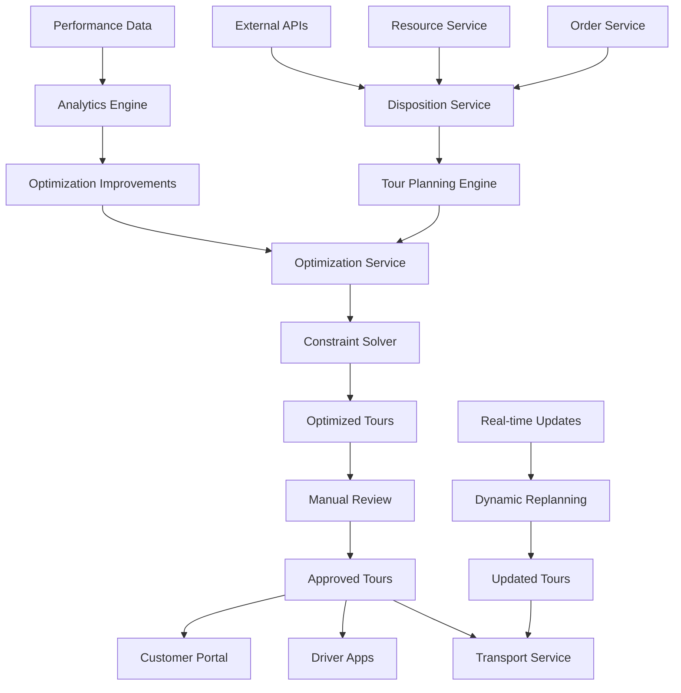

# Disposition Service - Tourenplanung & Einsatzplanung

## Service Overview

Der Disposition Service ist verantwortlich für die intelligente Planung und Optimierung von Transporttouren. Er kombiniert manuelle Planungsexpertise mit algorithmischer Optimierung und bietet einen Human-in-the-loop Ansatz für effiziente Tourenplanung.

### Hauptfunktionen
- **Tourenplanung**: Erstellung optimaler Touren basierend auf Aufträgen
- **Ressourcenverwaltung**: Zuweisung von Fahrern und Fahrzeugen
- **Optimierung**: Algorithmus-basierte Routenoptimierung
- **Kapazitätsplanung**: Berücksichtigung von Fahrzeugkapazitäten und Zeitfenstern
- **Echtzeitanpassung**: Dynamische Anpassung bei Änderungen

## Functions

### Tourenplanung
- **Automatische Tourenerstellung**: Algorithmus-basierte Grundplanung
- **Manuelle Anpassung**: Dispatcher-Interface für Feintuning
- **Zeitfenster-Management**: Berücksichtigung von Abhol- und Lieferzeiten
- **Kapazitätsoptimierung**: Maximale Auslastung bei minimalen Kosten
- **Multi-Depot-Planung**: Unterstützung mehrerer Standorte

### Ressourcenverwaltung
- **Fahrerverwaltung**: Verfügbarkeit, Qualifikationen, Arbeitszeiten
- **Fahrzeugverwaltung**: Kapazitäten, Ausstattung, Wartungszyklen
- **Qualifikations-Matching**: Automatische Zuordnung basierend auf Anforderungen
- **Kostenkalkulation**: Berücksichtigung aller Ressourcenkosten
- **Compliance-Prüfung**: Lenk- und Ruhezeiten, Gefahrgut-Qualifikationen

### Optimierungsalgorithmen
- **VRP-Solver**: Vehicle Routing Problem Optimierung
- **Constraint-Management**: Berücksichtigung aller Nebenbedingungen
- **Multi-Objective-Optimization**: Balance zwischen Kosten, Zeit und Service
- **Real-time Optimization**: Dynamische Anpassung bei Störungen
- **What-if-Szenarien**: Simulation verschiedener Planungsoptionen

## API Endpoints Design

### Tour Management
- **Tour CRUD Operations**: Erstellen, Lesen, Aktualisieren, Löschen von Touren
- **Tour Optimization**: Optimierungsalgorithmen für bestehende Touren
- **Tour Validation**: Prüfung auf Machbarkeit und Compliance
- **Tour Comparison**: Vergleich verschiedener Planungsszenarien
- **Tour Templates**: Wiederverwendbare Tourenvorlagen

### Resource Assignment
- **Driver Assignment**: Zuweisung von Fahrern zu Touren
- **Vehicle Assignment**: Zuweisung von Fahrzeugen zu Touren
- **Availability Check**: Prüfung der Ressourcenverfügbarkeit
- **Qualification Matching**: Automatische Zuordnung basierend auf Qualifikationen
- **Cost Calculation**: Berechnung der Ressourcenkosten

### Optimization Engine
- **Route Optimization**: Optimierung der Fahrtrouten
- **Load Optimization**: Optimierung der Beladung
- **Time Window Optimization**: Optimierung der Zeitfenster
- **Multi-Depot Optimization**: Optimierung über mehrere Standorte
- **Constraint Solving**: Lösung komplexer Nebenbedingungen

### Real-time Operations
- **Live Updates**: Echtzeitaktualisierung von Touren
- **Disruption Management**: Behandlung von Störungen und Änderungen
- **Emergency Replanning**: Notfall-Neuplanung bei kritischen Ereignissen
- **Status Tracking**: Verfolgung des Tourenfortschritts
- **Performance Monitoring**: Überwachung der Planungsqualität

**// TODO**: Implementierung der spezifischen API-Endpoints mit FastAPI
**// TODO**: Integration mit externen Optimierungsservices
**// TODO**: Real-time Event Processing für dynamische Anpassungen

## Data Model Design

### Tour Entity
- **Grunddaten**: Tour-ID, Datum, Status, Priorität
- **Ressourcen**: Zugewiesener Fahrer, Fahrzeug, Ausrüstung
- **Route**: Geplante Route mit Stopps und Zeitpunkten
- **Kapazitäten**: Gewicht, Volumen, Anzahl Sendungen
- **Kosten**: Kalkulierte Kosten für Kraftstoff, Personal, Fahrzeug
- **Optimierung**: Optimierungsparameter und -ergebnisse

### Tour Stop Entity
- **Location**: Adresse, GPS-Koordinaten, Geofence
- **Timing**: Geplante Ankunft, Abfahrt, Servicezeit
- **Orders**: Zugeordnete Aufträge (Abholung/Zustellung)
- **Requirements**: Spezielle Anforderungen (Gefahrgut, Kühlung)
- **Status**: Aktueller Bearbeitungsstatus
- **Constraints**: Zeitfenster, Zugangsrestriktionen

### Resource Entities
- **Driver**: Qualifikationen, Verfügbarkeit, Arbeitszeiten, Kosten
- **Vehicle**: Kapazitäten, Ausstattung, Wartungsstatus, Betriebskosten
- **Equipment**: Spezialausrüstung, Verfügbarkeit, Zuordnung

### Optimization Entities
- **Optimization Request**: Parameter, Constraints, Zielfunktionen
- **Optimization Result**: Optimierte Touren, Kennzahlen, Verbesserungen
- **Scenario**: Verschiedene Planungsszenarien zum Vergleich

**// TODO**: Detaillierte Datenbankschemas mit SQLAlchemy Models
**// TODO**: Indizierung für Performance-kritische Abfragen
**// TODO**: Historisierung für Planungsanalysen

## Service Architecture Design

### Core Components
- **Tour Planning Engine**: Zentrale Planungslogik
- **Optimization Service**: Algorithmus-basierte Optimierung
- **Resource Manager**: Verwaltung von Fahrern und Fahrzeugen
- **Constraint Solver**: Behandlung komplexer Nebenbedingungen
- **Real-time Processor**: Verarbeitung von Live-Updates

### Integration Layer
- **Order Service Integration**: Abruf neuer Aufträge für Planung
- **Transport Service Integration**: Übertragung geplanter Touren
- **Resource Service Integration**: Abfrage verfügbarer Ressourcen
- **External APIs**: Integration mit Verkehrsdaten und Kartendiensten

### Optimization Algorithms
- **VRP Solver**: Vehicle Routing Problem Algorithmen
- **Genetic Algorithm**: Evolutionäre Optimierungsverfahren
- **Simulated Annealing**: Metaheuristik für komplexe Probleme
- **Machine Learning**: Lernende Algorithmen für bessere Vorhersagen

### Caching & Performance
- **Route Caching**: Zwischenspeicherung berechneter Routen
- **Optimization Caching**: Wiederverwendung von Optimierungsergebnissen
- **Real-time Processing**: Stream-basierte Verarbeitung von Updates
- **Background Jobs**: Asynchrone Optimierung für große Probleme

**// TODO**: Implementierung der Service-Klassen mit FastAPI
**// TODO**: Integration von OR-Tools für VRP-Solving
**// TODO**: Machine Learning Pipeline für Demand Forecasting

## n8n Workflow Design

### Automatic Tour Planning
- **Trigger**: Neue Aufträge oder Planungsanforderung
- **Data Collection**: Sammlung aller relevanten Planungsdaten
- **Optimization**: Ausführung der Optimierungsalgorithmen
- **Validation**: Prüfung der Planungsergebnisse
- **Notification**: Benachrichtigung der Dispatcher

### Resource Availability Check
- **Trigger**: Ressourcenanfrage oder Statusänderung
- **Availability Query**: Abfrage der aktuellen Verfügbarkeit
- **Qualification Check**: Prüfung der erforderlichen Qualifikationen
- **Conflict Detection**: Erkennung von Ressourcenkonflikten
- **Alternative Suggestion**: Vorschlag alternativer Ressourcen

### Real-time Tour Updates
- **Trigger**: Statusänderungen oder Störungsmeldungen
- **Impact Analysis**: Analyse der Auswirkungen auf die Planung
- **Replanning**: Automatische Neuplanung bei Bedarf
- **Stakeholder Notification**: Information aller Beteiligten
- **Documentation**: Protokollierung aller Änderungen

### Performance Monitoring
- **Data Collection**: Sammlung von Planungs- und Ausführungsdaten
- **KPI Calculation**: Berechnung von Leistungskennzahlen
- **Trend Analysis**: Analyse von Planungsqualität über Zeit
- **Alert Generation**: Warnung bei Qualitätsverschlechterung
- **Report Generation**: Automatische Berichtserstellung

**// TODO**: Implementierung der n8n-Workflows
**// TODO**: Integration mit externen Optimierungsservices
**// TODO**: Machine Learning für Planungsqualitätsvorhersage

## Data Flow

## Integration Points

### Internal Service Integration
- **Order Management**: Abruf neuer Aufträge für Tourenplanung
- **Business Partner**: Zugriff auf Kunden- und Lieferantendaten
- **Transport Service**: Übertragung geplanter Touren zur Ausführung
- **Resource Management**: Abfrage verfügbarer Fahrer und Fahrzeuge
- **Billing Service**: Übertragung von Kostendaten für Abrechnung

### External API Integration
- **Mapping Services**: Google Maps, HERE, OpenStreetMap für Routenberechnung
- **Traffic Data**: Echtzeitverkehrsdaten für realistische Fahrzeiten
- **Weather Services**: Wetterdaten für Planungsanpassungen
- **Fuel Price APIs**: Aktuelle Kraftstoffpreise für Kostenkalkulation
- **Toll Road APIs**: Mautgebühren für Routenoptimierung

### Real-time Data Sources
- **GPS Tracking**: Live-Position der Fahrzeuge
- **Traffic Updates**: Aktuelle Verkehrslage und Störungen
- **Order Changes**: Kurzfristige Auftragsänderungen
- **Resource Updates**: Verfügbarkeitsänderungen von Ressourcen
- **Emergency Events**: Unfälle, Sperrungen, Notfälle

**// TODO**: Implementation der API-Integrationen
**// TODO**: Real-time Event Processing mit Apache Kafka
**// TODO**: Fallback-Mechanismen für externe Service-Ausfälle

## Optimization Algorithms

### Vehicle Routing Problem (VRP)
- **Classic VRP**: Grundlegende Tourenoptimierung
- **CVRP**: Capacitated VRP mit Kapazitätsbeschränkungen
- **VRPTW**: VRP with Time Windows für Zeitfenster
- **MDVRP**: Multi-Depot VRP für mehrere Standorte
- **DVRP**: Dynamic VRP für Echtzeitanpassungen

### Optimization Techniques
- **Exact Algorithms**: Branch-and-Bound, Dynamic Programming
- **Heuristics**: Nearest Neighbor, Savings Algorithm
- **Metaheuristics**: Genetic Algorithm, Simulated Annealing
- **Machine Learning**: Reinforcement Learning, Neural Networks
- **Hybrid Approaches**: Kombination verschiedener Verfahren

### Constraint Handling
- **Hard Constraints**: Kapazitäten, Zeitfenster, Qualifikationen
- **Soft Constraints**: Präferenzen, Kostenziele, Servicequalität
- **Dynamic Constraints**: Verkehrslage, Wetter, Notfälle
- **Regulatory Constraints**: Lenk- und Ruhezeiten, Gefahrgut
- **Business Rules**: Unternehmensspezifische Planungsregeln

### Performance Optimization
- **Parallel Processing**: Verteilte Berechnung großer Probleme
- **Incremental Optimization**: Schrittweise Verbesserung bestehender Pläne
- **Approximation Algorithms**: Schnelle Näherungslösungen
- **Caching Strategies**: Wiederverwendung berechneter Teilprobleme
- **Load Balancing**: Verteilung der Berechnungslast

**// TODO**: Implementierung mit OR-Tools und CPLEX
**// TODO**: Machine Learning Pipeline für Lernende Optimierung
**// TODO**: GPU-Acceleration für große Optimierungsprobleme

## Human-in-the-Loop Interface

### Dispatcher Dashboard
- **Tour Overview**: Übersicht aller geplanten Touren
- **Optimization Results**: Visualisierung der Optimierungsergebnisse
- **Manual Adjustments**: Interface für manuelle Planungsanpassungen
- **What-if Analysis**: Simulation verschiedener Szenarien
- **Performance Metrics**: KPIs und Qualitätskennzahlen

### Interactive Planning Tools
- **Drag-and-Drop**: Intuitive Neuordnung von Stopps
- **Map Visualization**: Geografische Darstellung der Touren
- **Timeline View**: Zeitliche Darstellung der Tourenabläufe
- **Resource Allocation**: Visuelle Ressourcenzuweisung
- **Constraint Visualization**: Anzeige von Planungsbeschränkungen

### Decision Support
- **Recommendation Engine**: KI-basierte Planungsvorschläge
- **Impact Analysis**: Auswirkungsanalyse von Änderungen
- **Alternative Solutions**: Mehrere Optimierungsalternativen
- **Risk Assessment**: Bewertung von Planungsrisiken
- **Cost-Benefit Analysis**: Kosten-Nutzen-Bewertung von Entscheidungen

### Approval Workflow
- **Review Process**: Mehrstufiger Genehmigungsprozess
- **Change Tracking**: Nachverfolgung aller Planungsänderungen
- **Approval Hierarchy**: Rollenbasierte Genehmigungsebenen
- **Audit Trail**: Vollständige Dokumentation aller Entscheidungen
- **Rollback Capability**: Rückgängigmachen von Planungsänderungen

**// TODO**: React-basierte Dispatcher-Oberfläche
**// TODO**: Real-time Collaboration Features
**// TODO**: Mobile App für Dispatcher

## Monitoring & KPIs

### Planning Quality Metrics
- **Route Efficiency**: Verhältnis geplante zu optimaler Route
- **Capacity Utilization**: Auslastung der Fahrzeugkapazitäten
- **Time Window Compliance**: Einhaltung der Zeitfenster
- **Cost Optimization**: Kostenreduktion durch Optimierung
- **Service Level**: Erfüllung der Servicequalitätsziele

### Operational Performance
- **Planning Time**: Zeit für Tourenplanung und Optimierung
- **Replanning Frequency**: Häufigkeit von Planungsänderungen
- **Resource Utilization**: Auslastung von Fahrern und Fahrzeugen
- **Customer Satisfaction**: Kundenzufriedenheit mit Planungsqualität
- **Dispatcher Productivity**: Effizienz der manuellen Planungsarbeit

### System Performance
- **Optimization Speed**: Geschwindigkeit der Optimierungsalgorithmen
- **API Response Times**: Performance der Disposition-APIs
- **Memory Usage**: Speicherverbrauch bei großen Optimierungsproblemen
- **Scalability Metrics**: Skalierbarkeit bei steigender Problemgröße
- **Error Rates**: Fehlerquote bei Optimierung und Planung

### Business Impact
- **Cost Savings**: Kosteneinsparungen durch bessere Planung
- **Delivery Performance**: Verbesserung der Lieferperformance
- **Customer Retention**: Kundenbindung durch besseren Service
- **Operational Efficiency**: Gesamteffizienz der Transportoperationen
- **ROI**: Return on Investment der Optimierungslösung

**// TODO**: Prometheus/Grafana Integration für Monitoring
**// TODO**: Machine Learning für Predictive Analytics
**// TODO**: Automated Alerting bei Performance-Verschlechterung

## Testing

### Unit Testing
- **Algorithm Testing**: Tests für Optimierungsalgorithmen
- **Constraint Testing**: Validierung der Constraint-Behandlung
- **Performance Testing**: Leistungstests für große Probleme
- **Edge Case Testing**: Tests für Grenzfälle und Sondersituationen
- **Mock Testing**: Tests mit simulierten externen Services

### Integration Testing
- **Service Integration**: Tests der Service-zu-Service-Kommunikation
- **API Testing**: Validierung aller REST-API-Endpoints
- **Database Testing**: Tests der Datenpersistierung
- **External API Testing**: Tests der externen API-Integrationen
- **Workflow Testing**: End-to-End-Tests der n8n-Workflows

### Performance Testing
- **Load Testing**: Tests mit hoher Anzahl gleichzeitiger Anfragen
- **Stress Testing**: Tests bei Überlastung des Systems
- **Scalability Testing**: Tests der Skalierbarkeit
- **Optimization Benchmarks**: Performance-Vergleiche der Algorithmen
- **Memory Profiling**: Analyse des Speicherverbrauchs

### User Acceptance Testing
- **Dispatcher Testing**: Tests mit echten Disponenten
- **Usability Testing**: Bewertung der Benutzerfreundlichkeit
- **Scenario Testing**: Tests mit realen Planungsszenarien
- **Training Validation**: Validierung der Schulungseffektivität
- **Feedback Integration**: Integration von Benutzerfeedback

**// TODO**: Automatisierte Testsuite mit pytest
**// TODO**: Performance-Regression-Tests
**// TODO**: Chaos Engineering für Resilience Testing