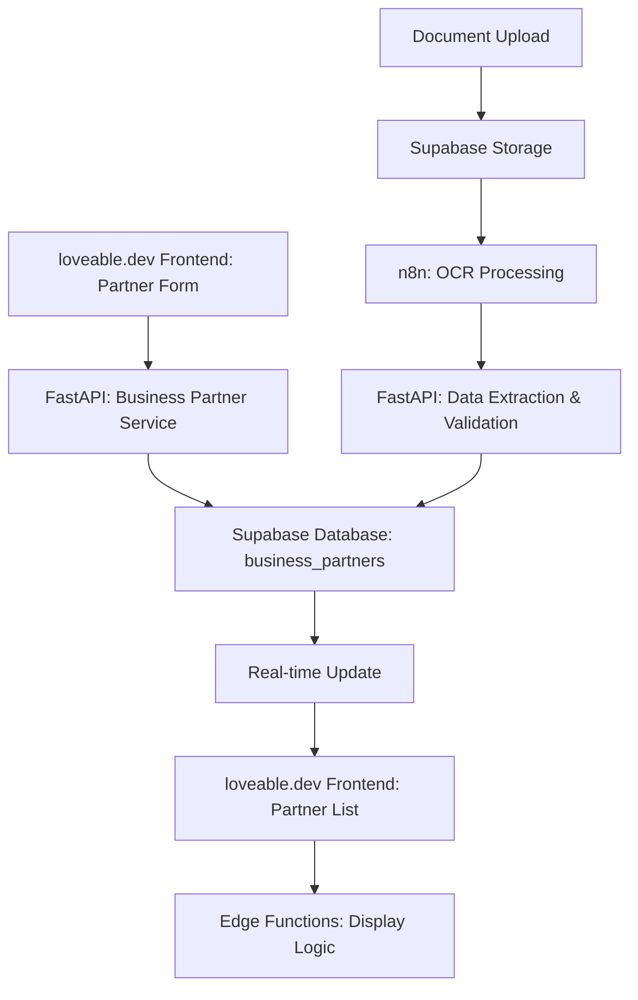

# Geschäftspartner-Management Service

## Service-Überblick

**Service Name**: Business Partner Service  
**Verantwortlichkeit**: Zentrale Verwaltung aller Geschäftspartner (Kunden, Lieferanten, Subunternehmer) mit vollständiger Stammdatenpflege  
**Architektur**: Eigenständiger FastAPI-Service mit direkter Datenbankanbindung

## Funktionen

### Stammdatenverwaltung
- **Grunddaten**: Name, Adresse, Kontaktdaten, Steuerinformationen
- **Kategorisierung**: Kunde, Lieferant, Subunternehmer, Spediteur
- **Adressvalidierung**: Automatische Prüfung und Standardisierung
- **Duplikatserkennung**: Intelligente Erkennung von Doppeleinträgen

### Dokumentenmanagement
- **Upload und Verwaltung**: Verträge, Zertifikate, Lizenzen
- **OCR-Verarbeitung**: Automatische Datenextraktion aus Dokumenten
- **Versionierung**: Historische Dokumentenverfolgung
- **Ablaufüberwachung**: Automatische Benachrichtigungen bei Ablauf

### Bewertungssystem
- **Qualitätsbewertung**: Performance-Tracking und KPIs
- **Automatische Scoring**: Basierend auf Transporthistorie
- **Compliance-Monitoring**: Überwachung rechtlicher Anforderungen
- **Blacklist-Management**: Sperrlisten und Risikobewertung

## API Design

### Partner Management Endpoints
- **CRUD-Operationen**: Vollständige Verwaltung der Geschäftspartner
- **Suchfunktionen**: Erweiterte Filterung und Sortierung
- **Bulk-Operationen**: Massenbearbeitung für Effizienz
- **// TODO**: Detaillierte Endpoint-Spezifikation mit OpenAPI Schema

### Dokumentenverwaltung Endpoints
- **Upload-Management**: Sichere Dokumentenübertragung
- **Metadaten-Verwaltung**: Strukturierte Dokumenteninformationen
- **Zugriffskontrolle**: Rollenbasierte Dokumentenberechtigungen
- **// TODO**: Integration mit Supabase Storage für Dateiverwaltung

### Bewertungssystem Endpoints
- **Rating-CRUD**: Bewertungsverwaltung
- **Aggregation**: Automatische Bewertungsberechnung
- **Historisierung**: Nachverfolgung von Bewertungsänderungen
- **// TODO**: KPI-Dashboard Integration

## Datenmodell Design

### Business Partner Entity
- **Identifikation**: Eindeutige ID, Mandantenzuordnung, Partnertyp
- **Stammdaten**: Firmenname, Rechtsform, Steuer-/Registrierungsnummern
- **Adressinformationen**: Vollständige Anschrift mit Ländercode
- **Kontaktdaten**: Telefon, E-Mail, Website
- **Geschäftsbedingungen**: Zahlungsziele, Kreditlimits, Währung
- **Status & Metadaten**: Aktiv/Inaktiv/Gesperrt, Zeitstempel
- **// TODO**: Pydantic Model Definition mit Validierungsregeln

### Partner Document Entity
- **Dokumententyp**: Verträge, Zertifikate, Lizenzen, Versicherungen
- **Dateimetadaten**: Name, Pfad, Größe, MIME-Type
- **Gültigkeitszeitraum**: Von-/Bis-Datum für zeitbasierte Dokumente
- **OCR-Daten**: Extrahierte Textinformationen und Strukturdaten
- **Versionierung**: Dokumentenhistorie und Änderungsverfolgung
- **// TODO**: Supabase Storage Integration Schema

### Partner Rating Entity
- **Bewertungsdimensionen**: Qualität, Zuverlässigkeit, Kommunikation
- **Performance-Metriken**: Pünktlichkeit, Schadensquote, Beschwerden
- **Scoring-Algorithmus**: Gewichtete Gesamtbewertung (1-5 Skala)
- **Zeitbasierte Trends**: Entwicklung der Bewertungen über Zeit
- **Automatische Berechnung**: KI-basierte Bewertungslogik
- **// TODO**: Machine Learning Model für Predictive Scoring

## Service-Architektur Design

### FastAPI Service Konzept
- **Service Layer**: Geschäftslogik für Partnerverwaltung
- **Repository Pattern**: Datenzugriff über Repository-Abstraktion
- **Dependency Injection**: Lose Kopplung zwischen Komponenten
- **Error Handling**: Strukturierte Fehlerbehandlung mit Custom Exceptions
- **// TODO**: Service-Implementierung mit async/await Pattern

### Core Service Functions
- **Partner Management**: CRUD-Operationen mit Validierung
- **Document Processing**: Upload, OCR, Metadaten-Extraktion
- **Rating Engine**: Performance-basierte Bewertungslogik
- **Duplicate Detection**: Intelligente Duplikatserkennung
- **// TODO**: Business Logic Implementation

### n8n Workflow Design

#### OCR Document Processing Workflow
- **Trigger**: Dokumenten-Upload Event
- **Processing**: OCR-Engine Integration (Tesseract/Cloud Vision)
- **Validation**: Datenqualitätsprüfung und Strukturvalidierung
- **Storage**: Metadaten-Update in Datenbank
- **// TODO**: Workflow-Konfiguration und Error-Handling

#### Rating Calculation Workflow
- **Trigger**: Transport-Abschluss Event
- **Data Collection**: Performance-Metriken aus verschiedenen Services
- **Calculation**: Gewichtete Bewertungsberechnung
- **Notification**: Automatische Benachrichtigung bei Bewertungsänderungen
- **// TODO**: ML-basierte Bewertungsalgorithmen

## Datenfluss

## Integration Points

### Inbound
- **Order Management Service**: Kundeninformationen für Aufträge
- **Transport Service**: Performance-Daten für Bewertungen
- **Billing Service**: Zahlungsverhalten für Scoring

### Outbound
- **External Address APIs**: Adressvalidierung
- **Credit Check APIs**: Bonitätsprüfung
- **Government APIs**: Lizenz- und Registrierungsprüfung

## Sicherheit & Compliance

### Datenschutz
- **DSGVO-Compliance**: Vollständige Datenschutz-Konformität
- **Data Retention**: Automatische Löschung nach Aufbewahrungsfristen
- **Audit Trail**: Vollständige Nachverfolgung aller Änderungen

### Zugriffskontrolle
- **Row Level Security**: Mandantentrennung auf Datenbankebene
- **Role-based Access**: Rollenbasierte Berechtigungen
- **API Authentication**: JWT-basierte Authentifizierung

## Monitoring & Observability

### Metriken
- **Partner Count**: Anzahl aktiver Partner pro Typ
- **Document Processing Time**: OCR-Verarbeitungszeit
- **Rating Distribution**: Verteilung der Partner-Bewertungen
- **API Response Times**: Service-Performance

### Alerts
- **Document Expiry**: Ablaufende Dokumente
- **Low Rating Partners**: Partner mit schlechten Bewertungen
- **Failed OCR Processing**: Fehlgeschlagene Dokumentenverarbeitung
- **Duplicate Detection**: Potentielle Duplikate

## Testing

### Unit Tests
- Partner CRUD Operations
- Document Upload & Processing
- Rating Calculation Logic
- Validation Rules

### Integration Tests
- API Endpoint Testing
- Database Operations
- File Storage Integration
- n8n Workflow Testing

### Performance Tests
- Large Partner Dataset Handling
- Concurrent Document Processing
- Search Performance
- Rating Calculation Performance