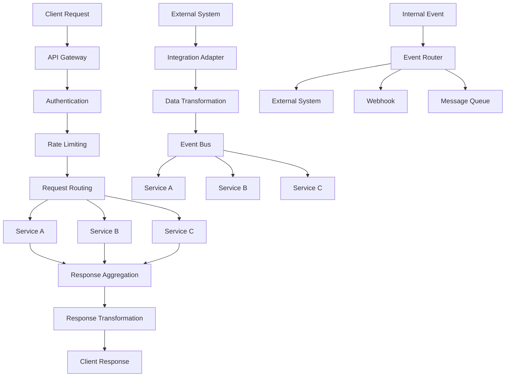

# Integration & API Gateway Service - Zentrale Kommunikationsschicht

## Service Overview

Der Integration & API Gateway Service fungiert als zentrale Kommunikationsschicht zwischen allen Microservices und externen Systemen. Er bietet einheitliche API-Verwaltung, Service-Discovery, Load Balancing und zentrale Sicherheitskontrolle für die gesamte Speditionslösung.

### Hauptfunktionen
- **API Gateway**: Zentrale Eingangsschnittstelle für alle API-Anfragen
- **Service Orchestration**: Koordination zwischen verschiedenen Microservices
- **External Integration**: Anbindung externer Systeme und APIs
- **Data Transformation**: Datenkonvertierung zwischen verschiedenen Formaten
- **Event-driven Architecture**: Asynchrone Kommunikation über Events

## Functions

### API Gateway Management
- **Request Routing**: Intelligente Weiterleitung von API-Anfragen
- **Load Balancing**: Verteilung der Last auf verfügbare Service-Instanzen
- **Rate Limiting**: Schutz vor API-Missbrauch und Überlastung
- **API Versioning**: Verwaltung verschiedener API-Versionen
- **Response Caching**: Performance-Optimierung durch Caching

### Service Integration
- **Service Discovery**: Automatische Erkennung verfügbarer Services
- **Health Monitoring**: Überwachung der Service-Gesundheit
- **Circuit Breaker**: Schutz vor kaskadierenden Ausfällen
- **Retry Logic**: Intelligente Wiederholung fehlgeschlagener Anfragen
- **Timeout Management**: Verwaltung von Request-Timeouts

### External System Integration
- **REST API Integration**: Anbindung externer REST-Services
- **SOAP Integration**: Legacy-System-Integration über SOAP
- **File-based Integration**: CSV, XML, EDI-Datenaustausch
- **Real-time Integration**: WebSocket und Server-Sent Events
- **Batch Processing**: Verarbeitung großer Datenmengen

### Data Transformation
- **Format Conversion**: JSON, XML, CSV, EDI-Konvertierung
- **Schema Mapping**: Zuordnung zwischen verschiedenen Datenmodellen
- **Data Validation**: Validierung eingehender und ausgehender Daten
- **Data Enrichment**: Anreicherung von Daten aus verschiedenen Quellen
- **Data Cleansing**: Bereinigung und Normalisierung von Daten

## API Endpoints Design

### Gateway Management
- **Route Configuration**: Konfiguration von API-Routen
- **Service Registration**: Registrierung neuer Services
- **Health Check**: Gesundheitsprüfung aller Services
- **Metrics Collection**: Sammlung von Performance-Metriken
- **Configuration Management**: Dynamische Konfigurationsänderungen

### Integration Endpoints
- **Webhook Management**: Verwaltung von Webhook-Endpunkten
- **Event Publishing**: Veröffentlichung von System-Events
- **Event Subscription**: Abonnement von Events
- **Message Queue**: Asynchrone Nachrichtenverarbeitung
- **Batch Job Management**: Verwaltung von Batch-Verarbeitungen

### External API Proxies
- **DATEV Integration**: Proxy für DATEV-API-Aufrufe
- **Spedion Integration**: Proxy für Spedion-API-Aufrufe
- **Maps API Proxy**: Proxy für Kartendienst-APIs
- **Weather API Proxy**: Proxy für Wetterdienst-APIs
- **Banking API Proxy**: Proxy für Banking-APIs

### Data Transformation
- **Format Converter**: Konvertierung zwischen Datenformaten
- **Schema Validator**: Validierung gegen definierte Schemas
- **Data Mapper**: Zuordnung zwischen verschiedenen Datenstrukturen
- **Enrichment Service**: Datenanreicherung aus externen Quellen
- **Cleansing Service**: Datenbereinigung und -normalisierung

### Monitoring & Analytics
- **API Analytics**: Detaillierte API-Nutzungsstatistiken
- **Performance Metrics**: Performance-Kennzahlen aller Services
- **Error Tracking**: Verfolgung und Analyse von Fehlern
- **Usage Reports**: Berichte über API-Nutzung
- **SLA Monitoring**: Überwachung von Service Level Agreements

**// TODO**: FastAPI-basierte Gateway-Implementation
**// TODO**: Kong oder Traefik Integration für Enterprise Features
**// TODO**: GraphQL Gateway für flexible Datenabfragen

## Data Model Design

### API Route Entity
- **Grunddaten**: Route-ID, Pfad, HTTP-Methoden, Ziel-Service
- **Konfiguration**: Timeout, Retry-Policy, Rate-Limits
- **Sicherheit**: Authentifizierung, Autorisierung, CORS
- **Transformation**: Request/Response-Transformationen
- **Monitoring**: Metriken, Logging, Alerting
- **Versionierung**: API-Version, Deprecation-Status

### Service Registry Entity
- **Service-Info**: Name, Version, Beschreibung, Tags
- **Endpoints**: Verfügbare Endpunkte und Methoden
- **Health Status**: Aktueller Gesundheitsstatus
- **Load Balancing**: Gewichtung, Verfügbarkeit
- **Dependencies**: Abhängigkeiten zu anderen Services
- **Metadata**: Zusätzliche Service-Informationen

### Integration Configuration
- **External System**: Name, Typ, Verbindungsdetails
- **Authentication**: API-Keys, OAuth-Tokens, Zertifikate
- **Data Mapping**: Schema-Zuordnungen und Transformationen
- **Error Handling**: Retry-Strategien, Fallback-Mechanismen
- **Monitoring**: SLA-Definitionen, Alert-Konfiguration
- **Scheduling**: Batch-Job-Zeitpläne und Trigger

### Event Schema
- **Event Definition**: Typ, Schema, Versionierung
- **Publishers**: Services, die Events veröffentlichen
- **Subscribers**: Services, die Events konsumieren
- **Routing**: Event-Routing-Regeln
- **Persistence**: Event-Store-Konfiguration
- **Replay**: Event-Replay-Mechanismen

**// TODO**: OpenAPI 3.0 Schema-Definitionen
**// TODO**: AsyncAPI für Event-Schema-Dokumentation
**// TODO**: Schema Registry für Versionsverwaltung

## Service Architecture Design

### Core Gateway Components
- **Request Router**: Intelligente Anfrage-Weiterleitung
- **Load Balancer**: Lastverteilung auf Service-Instanzen
- **Authentication Proxy**: Zentrale Authentifizierung
- **Rate Limiter**: API-Ratenbegrenzung
- **Response Aggregator**: Zusammenführung von Service-Antworten

### Integration Engine
- **Message Broker**: Asynchrone Nachrichtenverarbeitung
- **Event Bus**: Event-driven Communication
- **Transformation Engine**: Datenkonvertierung und -mapping
- **Workflow Engine**: Orchestrierung komplexer Integrationen
- **Adapter Framework**: Standardisierte externe Systemanbindung

### Monitoring & Observability
- **Metrics Collector**: Sammlung von Performance-Daten
- **Distributed Tracing**: Nachverfolgung von Request-Flows
- **Log Aggregator**: Zentrale Log-Sammlung und -analyse
- **Health Monitor**: Kontinuierliche Gesundheitsüberwachung
- **Alert Manager**: Intelligente Benachrichtigungen

### Security Layer
- **API Security**: Schutz vor API-Angriffen
- **Data Encryption**: Verschlüsselung sensibler Daten
- **Access Control**: Granulare Zugriffskontrolle
- **Audit Trail**: Vollständige Nachverfolgung
- **Threat Detection**: Erkennung von Sicherheitsbedrohungen

**// TODO**: Microservices Patterns Implementation
**// TODO**: Service Mesh Integration (Istio/Linkerd)
**// TODO**: Serverless Function Integration

## n8n Workflow Design

### API Orchestration
- **Trigger**: Eingehende API-Anfragen
- **Service Discovery**: Ermittlung verfügbarer Services
- **Request Routing**: Weiterleitung an entsprechende Services
- **Response Aggregation**: Zusammenführung von Service-Antworten
- **Error Handling**: Behandlung von Service-Fehlern

### External System Sync
- **Trigger**: Zeitbasiert oder Event-getriggert
- **Data Extraction**: Abruf von Daten aus externen Systemen
- **Data Transformation**: Konvertierung in interne Formate
- **Data Validation**: Validierung der transformierten Daten
- **Data Import**: Import in entsprechende Services

### Event Processing
- **Event Ingestion**: Aufnahme von System-Events
- **Event Filtering**: Filterung relevanter Events
- **Event Transformation**: Anpassung an Zielformate
- **Event Routing**: Weiterleitung an Subscriber
- **Event Persistence**: Speicherung für Audit und Replay

### Health Monitoring
- **Service Polling**: Regelmäßige Gesundheitsprüfung
- **Metric Collection**: Sammlung von Performance-Daten
- **Threshold Monitoring**: Überwachung kritischer Schwellwerte
- **Alert Generation**: Erzeugung von Benachrichtigungen
- **Auto-Recovery**: Automatische Wiederherstellungsversuche

### Data Synchronization
- **Change Detection**: Erkennung von Datenänderungen
- **Conflict Resolution**: Auflösung von Datenkonflikten
- **Batch Processing**: Verarbeitung großer Datenmengen
- **Real-time Sync**: Echtzeitdatensynchronisation
- **Rollback Handling**: Rückgängigmachen fehlerhafter Synchronisationen

**// TODO**: Complex Event Processing (CEP) Integration
**// TODO**: Machine Learning für Anomalieerkennung
**// TODO**: Automated Scaling basierend auf Load

## Data Flow

## Integration Points

### Internal Service Integration
- **Business Partner Service**: Stammdatensynchronisation
- **Order Management Service**: Auftragsverarbeitung
- **Disposition Service**: Tourenplanung und -optimierung
- **Transport Service**: Transportverfolgung und -management
- **POD Service**: Liefernachweise und Dokumentation
- **Billing Service**: Abrechnungsverarbeitung
- **User Management**: Authentifizierung und Autorisierung

### External System Integration
- **DATEV**: Buchhaltungsdatenexport und -synchronisation
- **Spedion**: Transportmanagement-Integration
- **Banking APIs**: Zahlungsverarbeitung und -abgleich
- **Maps Services**: Routenberechnung und Geocoding
- **Weather Services**: Wetterdaten für Transportplanung
- **Telematics**: Fahrzeugdaten und GPS-Tracking
- **E-Commerce Platforms**: Online-Shop-Integration
- **ERP Systems**: Enterprise Resource Planning Integration

### Communication Protocols
- **REST APIs**: Standard HTTP-basierte Kommunikation
- **GraphQL**: Flexible Datenabfragen
- **WebSockets**: Real-time bidirektionale Kommunikation
- **Message Queues**: Asynchrone Nachrichtenverarbeitung
- **Event Streaming**: Kontinuierliche Event-Verarbeitung
- **File Transfer**: FTP, SFTP, HTTP-basierte Dateiübertragung
- **Email Integration**: SMTP, IMAP für E-Mail-Verarbeitung

**// TODO**: gRPC Integration für High-Performance Communication
**// TODO**: Apache Kafka für Event Streaming
**// TODO**: Redis für Caching und Session Management

## External API Management

### API Lifecycle Management
- **API Design**: OpenAPI-basierte API-Spezifikation
- **API Development**: Entwicklung und Testing
- **API Deployment**: Automatisierte Bereitstellung
- **API Versioning**: Versionsverwaltung und Backward Compatibility
- **API Deprecation**: Kontrollierte Außerbetriebnahme

### API Security
- **API Key Management**: Sichere Verwaltung von API-Schlüsseln
- **OAuth 2.0**: Standardisierte Autorisierung
- **JWT Tokens**: Sichere Token-basierte Authentifizierung
- **API Throttling**: Schutz vor Missbrauch
- **IP Whitelisting**: Zugriffsbeschränkung nach IP-Adressen

### API Documentation
- **Interactive Documentation**: Swagger/OpenAPI UI
- **Code Examples**: Beispiele in verschiedenen Programmiersprachen
- **SDK Generation**: Automatische Client-SDK-Generierung
- **Postman Collections**: Vorgefertigte API-Test-Collections
- **Developer Portal**: Zentrale Entwickler-Dokumentation

### API Analytics
- **Usage Metrics**: Detaillierte Nutzungsstatistiken
- **Performance Monitoring**: Latenz und Durchsatz
- **Error Analysis**: Fehleranalyse und -trends
- **User Behavior**: Analyse des Entwicklerverhaltens
- **Business Intelligence**: API-basierte Geschäftseinblicke

**// TODO**: API Marketplace für Partner-Integration
**// TODO**: Automated API Testing und Monitoring
**// TODO**: API Monetization Features

## Event-Driven Architecture

### Event Types
- **Domain Events**: Geschäftslogik-relevante Ereignisse
- **Integration Events**: Service-übergreifende Ereignisse
- **System Events**: Technische System-Ereignisse
- **User Events**: Benutzerinteraktions-Ereignisse
- **External Events**: Ereignisse von externen Systemen

### Event Processing Patterns
- **Event Sourcing**: Speicherung aller Änderungen als Events
- **CQRS**: Command Query Responsibility Segregation
- **Saga Pattern**: Verteilte Transaktionen über Services
- **Event Streaming**: Kontinuierliche Event-Verarbeitung
- **Event Replay**: Wiederholung historischer Events

### Message Patterns
- **Publish-Subscribe**: Entkoppelte Kommunikation
- **Request-Reply**: Synchrone Kommunikation über Messages
- **Message Routing**: Intelligente Nachrichtenweiterleitung
- **Message Transformation**: Nachrichtenkonvertierung
- **Dead Letter Queue**: Behandlung nicht verarbeitbarer Nachrichten

### Event Store
- **Event Persistence**: Dauerhafte Speicherung aller Events
- **Event Versioning**: Versionierung von Event-Schemas
- **Event Indexing**: Effiziente Event-Suche
- **Event Archiving**: Langzeitarchivierung alter Events
- **Event Analytics**: Analyse von Event-Mustern

**// TODO**: Apache Kafka als Event Streaming Platform
**// TODO**: Event Schema Registry für Schema Evolution
**// TODO**: Event-driven Microservices Patterns

## Monitoring & KPIs

### Gateway Performance
- **Request Throughput**: Anzahl verarbeiteter Anfragen pro Sekunde
- **Response Latency**: Durchschnittliche Antwortzeiten
- **Error Rate**: Prozentsatz fehlgeschlagener Anfragen
- **Availability**: Verfügbarkeit des Gateway-Services
- **Concurrent Connections**: Anzahl gleichzeitiger Verbindungen

### Service Health
- **Service Uptime**: Verfügbarkeit einzelner Services
- **Health Check Success Rate**: Erfolgsquote der Gesundheitsprüfungen
- **Service Response Time**: Antwortzeiten der Backend-Services
- **Circuit Breaker Status**: Status der Circuit Breaker
- **Retry Success Rate**: Erfolgsquote von Wiederholungsversuchen

### Integration Metrics
- **External API Success Rate**: Erfolgsquote externer API-Aufrufe
- **Data Transformation Accuracy**: Genauigkeit der Datenkonvertierung
- **Event Processing Latency**: Verarbeitungszeit von Events
- **Message Queue Depth**: Anzahl wartender Nachrichten
- **Batch Job Success Rate**: Erfolgsquote von Batch-Verarbeitungen

### Security Metrics
- **Authentication Success Rate**: Erfolgsquote der Authentifizierung
- **Authorization Violations**: Anzahl unbefugter Zugriffe
- **Rate Limit Violations**: Überschreitungen der Rate-Limits
- **Security Incidents**: Anzahl Sicherheitsvorfälle
- **API Abuse Detection**: Erkennung von API-Missbrauch

### Business Metrics
- **API Adoption Rate**: Nutzung verschiedener APIs
- **Partner Integration Success**: Erfolg von Partner-Integrationen
- **Data Quality Score**: Qualität der integrierten Daten
- **SLA Compliance**: Einhaltung von Service Level Agreements
- **Cost per Transaction**: Kosten pro verarbeiteter Transaktion

**// TODO**: Real-time Dashboards mit Grafana
**// TODO**: Predictive Analytics für Capacity Planning
**// TODO**: Automated Alerting und Incident Response

## Testing

### API Testing
- **Contract Testing**: Validierung von API-Verträgen
- **Load Testing**: Performance-Tests bei hoher Last
- **Security Testing**: Sicherheitstests für alle APIs
- **Compatibility Testing**: Tests der API-Kompatibilität
- **End-to-End Testing**: Vollständige Workflow-Tests

### Integration Testing
- **Service Integration**: Tests der Service-zu-Service-Kommunikation
- **External System Testing**: Tests externer Systemintegrationen
- **Data Flow Testing**: Validierung der Datenflüsse
- **Error Handling Testing**: Tests der Fehlerbehandlung
- **Timeout Testing**: Tests von Timeout-Szenarien

### Performance Testing
- **Throughput Testing**: Maximaler Durchsatz-Tests
- **Latency Testing**: Antwortzeit-Messungen
- **Scalability Testing**: Skalierbarkeits-Tests
- **Stress Testing**: Tests bei Systemüberlastung
- **Endurance Testing**: Langzeit-Performance-Tests

### Chaos Engineering
- **Service Failure Simulation**: Simulation von Service-Ausfällen
- **Network Partition Testing**: Tests bei Netzwerkproblemen
- **Resource Exhaustion**: Tests bei Ressourcenknappheit
- **Dependency Failure**: Tests bei Abhängigkeitsausfällen
- **Recovery Testing**: Tests der Wiederherstellungsmechanismen

**// TODO**: Automated Testing Pipeline
**// TODO**: Contract Testing mit Pact
**// TODO**: Chaos Engineering mit Chaos Monkey