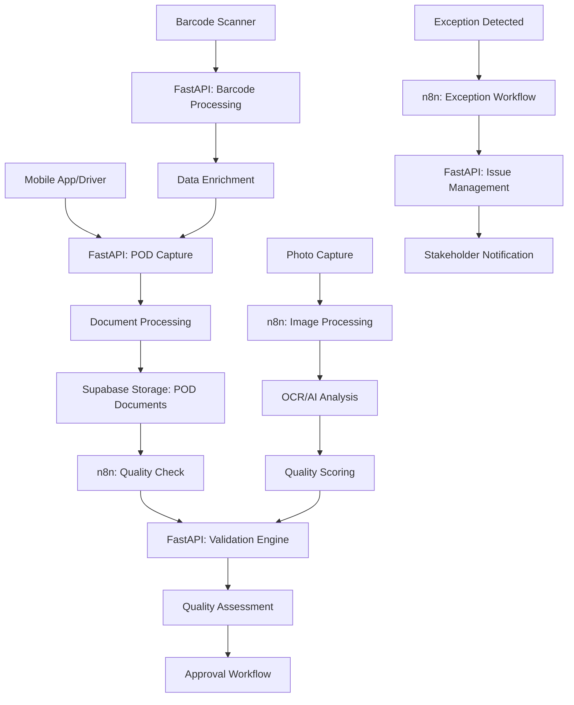

# POD Management Service

## Service-Überblick

**Service Name**: POD Management Service  
**Verantwortlichkeit**: Proof of Delivery Erfassung, Validierung und Qualitätssicherung  
**Architektur**: Eigenständiger FastAPI-Service mit n8n-Integration für POD-Workflows

## Funktionen

### POD-Erfassung
- **Multi-Channel Capture**: Mobile Apps, Web-Interface, API-Integration
- **Digital Signatures**: Elektronische Unterschriftenerfassung
- **Photo Documentation**: Bildbasierte Liefernachweise
- **Barcode Scanning**: Automatische Sendungserfassung
- **Voice Notes**: Sprachbasierte Zusatzinformationen

### Validierung & Qualitätssicherung
- **Completeness Check**: Vollständigkeitsprüfung der POD-Daten
- **Quality Assessment**: Qualitätsbewertung von Fotos und Unterschriften
- **Data Consistency**: Konsistenzprüfung mit Auftragsdaten
- **Fraud Detection**: Erkennung möglicher Manipulationen
- **Approval Workflow**: Mehrstufiger Freigabeprozess

### Dokumentenmanagement
- **Document Storage**: Sichere Speicherung aller POD-Dokumente
- **Version Control**: Versionierung und Änderungshistorie
- **Archive Management**: Langzeitarchivierung und Compliance
- **Search & Retrieval**: Effiziente Suche und Wiederauffindung
- **Export Functions**: Export in verschiedene Formate

## API Endpoints Design

### POD Capture Endpoints
- **POD Creation**: Erstellung neuer POD-Einträge
- **Document Upload**: Upload von Fotos und Dokumenten
- **Signature Capture**: Elektronische Unterschriftenerfassung
- **Barcode Processing**: Barcode-Scan-Verarbeitung
- **// TODO**: Real-time Mobile Synchronisation

### Validation Endpoints
- **Quality Check**: Automatische Qualitätsprüfung
- **Consistency Validation**: Konsistenzprüfung mit Auftragsdaten
- **Approval Process**: Freigabe-Workflow-Management
- **Exception Handling**: Behandlung von Abweichungen
- **// TODO**: AI-basierte Validierung

### Document Management Endpoints
- **Document CRUD**: Vollständige Dokumentenverwaltung
- **Search Functions**: Erweiterte Suchfunktionalität
- **Archive Operations**: Archivierungs- und Retrieval-Funktionen
- **Export Services**: Export in verschiedene Formate
- **// TODO**: Blockchain-basierte Unveränderlichkeit

### Analytics & Reporting Endpoints
- **Quality Metrics**: POD-Qualitätskennzahlen
- **Completion Rates**: Vollständigkeitsstatistiken
- **Performance Analytics**: Leistungsanalyse der POD-Prozesse
- **Compliance Reports**: Compliance-Berichte und Audittrails
- **// TODO**: Predictive Quality Analytics

## Datenmodell Design

### POD Entity
- **Identifikation**: POD-ID, Transport-Referenz, Sendungsnummer
- **Delivery Information**: Lieferzeit, Empfänger, Lieferadresse
- **Documentation**: Fotos, Unterschriften, Schadensmeldungen
- **Validation Status**: Prüfstatus, Freigabe, Qualitätsbewertung
- **Metadata**: Erstellungszeit, Bearbeiter, Änderungshistorie
- **// TODO**: Biometrische Authentifizierung

### Document Structure
- **File Metadata**: Dateiname, -größe, -typ, Erstellungsdatum
- **Content Information**: Dokumententyp, Beschreibung, Tags
- **Quality Metrics**: Bildqualität, Lesbarkeit, Vollständigkeit
- **Processing Status**: Verarbeitungsstatus, OCR-Ergebnisse
- **Access Control**: Berechtigungen, Zugriffsprotokolle
- **// TODO**: AI-basierte Dokumentenklassifizierung

### Signature Data
- **Signature Information**: Digitale Unterschrift, Zeitstempel
- **Signer Details**: Name, Position, Kontaktdaten
- **Device Information**: Geräteinformationen, GPS-Koordinaten
- **Verification Data**: Authentifizierungsdaten, Prüfsummen
- **Legal Compliance**: Rechtliche Gültigkeit, Zertifizierung
- **// TODO**: Biometrische Signaturverifikation

### Quality Assessment
- **Assessment Criteria**: Bewertungskriterien und -gewichtung
- **Quality Scores**: Qualitätsbewertungen und -indices
- **Issue Tracking**: Problemerfassung und -verfolgung
- **Improvement Actions**: Verbesserungsmaßnahmen und -pläne
- **Audit Information**: Prüfungshistorie und -ergebnisse
- **// TODO**: Machine Learning Quality Prediction

### Exception Management
- **Exception Types**: Kategorisierung von Abweichungen
- **Impact Assessment**: Bewertung der Auswirkungen
- **Resolution Process**: Lösungsprozess und -verantwortlichkeiten
- **Communication**: Kommunikation mit Stakeholdern
- **Learning Integration**: Integration in Verbesserungsprozesse
- **// TODO**: Predictive Exception Detection

## Service-Architektur Design

### FastAPI Service Konzept
- **POD Processing Engine**: Zentrale POD-Verarbeitung
- **Validation Framework**: Umfassendes Validierungssystem
- **Document Management**: Dokumentenverwaltung und -archivierung
- **Quality Assurance**: Qualitätssicherung und -kontrolle
- **// TODO**: Microservice-basierte Architektur

### Core Service Functions
- **Capture Engine**: POD-Erfassungslogik und -verarbeitung
- **Validation Engine**: Automatische und manuelle Validierung
- **Document Processor**: Dokumentenverarbeitung und -analyse
- **Quality Controller**: Qualitätskontrolle und -bewertung
- **// TODO**: AI-Integration für automatische Verarbeitung

### Mobile Integration
- **Mobile API**: Optimierte API für mobile Anwendungen
- **Offline Capability**: Offline-Funktionalität und Synchronisation
- **Real-time Sync**: Echtzeitübertragung von POD-Daten
- **Device Management**: Geräteverwaltung und -konfiguration
- **// TODO**: Progressive Web App Integration

### n8n Workflow Design

#### POD Capture Workflow
- **Data Ingestion**: Erfassung von POD-Daten aus verschiedenen Quellen
- **Initial Validation**: Erste Plausibilitätsprüfung
- **Document Processing**: Verarbeitung von Fotos und Dokumenten
- **Notification**: Benachrichtigung relevanter Stakeholder
- **// TODO**: Real-time Processing Pipeline

#### Quality Assurance Workflow
- **Automated Checks**: Automatische Qualitätsprüfungen
- **Manual Review**: Manuelle Überprüfung kritischer PODs
- **Approval Process**: Mehrstufiger Freigabeprozess
- **Exception Handling**: Behandlung von Qualitätsproblemen
- **// TODO**: AI-basierte Qualitätsbewertung

#### Document Archive Workflow
- **Classification**: Automatische Dokumentenklassifizierung
- **Indexing**: Erstellung von Suchindizes
- **Archive Storage**: Übertragung in Langzeitarchiv
- **Compliance Check**: Überprüfung rechtlicher Anforderungen
- **// TODO**: Blockchain-basierte Archivierung

#### Exception Resolution Workflow
- **Issue Detection**: Automatische Problemerkennung
- **Escalation**: Eskalation an zuständige Personen
- **Resolution Tracking**: Verfolgung des Lösungsprozesses
- **Communication**: Kommunikation mit allen Beteiligten
- **// TODO**: Predictive Issue Prevention

## Datenfluss

## Integration Points

### Inbound
- **Transport Service**: Transportdaten und Lieferinformationen
- **Mobile Applications**: Fahrer-Apps und mobile Erfassungsgeräte
- **Barcode Systems**: Barcode-Scanner und RFID-Lesegeräte
- **External APIs**: Drittanbieter-Systeme für POD-Daten

### Outbound
- **Billing Service**: POD-Daten für Rechnungsauslösung
- **Customer Portal**: POD-Informationen für Kunden
- **Analytics Service**: Qualitätsdaten für Reporting
- **Archive Systems**: Langzeitarchivierung und Compliance

## POD-Erfassungsmethoden

### Mobile Erfassung
- **Smartphone Apps**: Native und Web-basierte Anwendungen
- **Tablet Integration**: Optimierte Tablet-Oberflächen
- **Offline Capability**: Funktionalität ohne Internetverbindung
- **Real-time Sync**: Sofortige Datenübertragung bei Verbindung
- **// TODO**: Augmented Reality POD-Erfassung

### Automatische Erfassung
- **Barcode Scanning**: 1D/2D Barcode-Erkennung
- **RFID Integration**: RFID-Tag-Verarbeitung
- **OCR Processing**: Automatische Texterkennung
- **Image Recognition**: KI-basierte Bilderkennung
- **// TODO**: IoT-Sensor-Integration

## Qualitätssicherung

### Automatische Validierung
- **Completeness Check**: Vollständigkeitsprüfung aller Pflichtfelder
- **Data Consistency**: Konsistenzprüfung mit Auftragsdaten
- **Image Quality**: Bewertung der Foto- und Dokumentenqualität
- **Signature Validation**: Überprüfung digitaler Unterschriften
- **// TODO**: AI-basierte Anomalieerkennung

### Manuelle Überprüfung
- **Expert Review**: Überprüfung durch Qualitätsexperten
- **Sampling Process**: Stichprobenbasierte Kontrollen
- **Escalation Rules**: Eskalationsregeln für kritische Fälle
- **Feedback Integration**: Integration von Verbesserungsvorschlägen
- **// TODO**: Crowdsourced Quality Assessment

## Dokumentenmanagement

### Speicherung und Archivierung
- **Secure Storage**: Sichere Speicherung in Supabase Storage
- **Version Control**: Versionierung und Änderungsverfolgung
- **Access Control**: Rollenbasierte Zugriffskontrolle
- **Backup Strategy**: Umfassende Backup- und Recovery-Strategie
- **// TODO**: Distributed Storage Architecture

### Suche und Retrieval
- **Full-text Search**: Volltextsuche in allen Dokumenten
- **Metadata Search**: Suche basierend auf Metadaten
- **Advanced Filters**: Erweiterte Filter- und Sortieroptionen
- **Quick Access**: Schnellzugriff auf häufig benötigte Dokumente
- **// TODO**: AI-powered Semantic Search

## Compliance und Rechtliches

### Rechtliche Gültigkeit
- **Digital Signature Law**: Einhaltung digitaler Signaturgesetze
- **Evidence Standards**: Beweisstandards für rechtliche Verfahren
- **Data Protection**: Datenschutz und DSGVO-Compliance
- **Audit Trail**: Vollständige Nachverfolgbarkeit aller Aktionen
- **// TODO**: International Legal Compliance

### Archivierungsvorschriften
- **Retention Policies**: Aufbewahrungsrichtlinien und -fristen
- **Compliance Monitoring**: Überwachung der Compliance-Einhaltung
- **Audit Support**: Unterstützung bei internen und externen Audits
- **Legal Hold**: Rechtliche Aufbewahrungspflichten
- **// TODO**: Automated Compliance Reporting

## Monitoring und KPIs

### Quality KPIs
- **Completion Rate**: Vollständigkeitsrate der POD-Erfassung
- **Quality Score**: Durchschnittliche Qualitätsbewertung
- **Error Rate**: Fehlerquote in der POD-Verarbeitung
- **Processing Time**: Durchschnittliche Verarbeitungszeit
- **// TODO**: Predictive Quality Metrics

### Process KPIs
- **Capture Efficiency**: Effizienz der POD-Erfassung
- **Validation Speed**: Geschwindigkeit der Validierungsprozesse
- **Exception Rate**: Rate der Ausnahmebehandlungen
- **User Satisfaction**: Benutzerzufriedenheit mit POD-Prozessen
- **// TODO**: Real-time Process Analytics

### Compliance KPIs
- **Legal Compliance**: Einhaltung rechtlicher Anforderungen
- **Audit Readiness**: Bereitschaft für Audits und Prüfungen
- **Data Integrity**: Datenintegrität und -konsistenz
- **Security Metrics**: Sicherheitskennzahlen und -vorfälle
- **// TODO**: Automated Compliance Scoring

## Testing

### Unit Tests
- **Validation Logic**: Tests für Validierungslogik
- **Quality Assessment**: Tests für Qualitätsbewertung
- **Document Processing**: Tests für Dokumentenverarbeitung
- **Signature Verification**: Tests für Signaturverifikation
- **// TODO**: Comprehensive Test Coverage

### Integration Tests
- **API Endpoints**: Tests für alle API-Endpunkte
- **Mobile Integration**: Tests für mobile App-Integration
- **External Systems**: Tests für externe Systemintegrationen
- **Workflow Testing**: Tests für n8n-Workflows
- **// TODO**: End-to-End Testing Framework

### Performance Tests
- **High Volume Processing**: Tests mit hohem POD-Volumen
- **Concurrent Operations**: Tests mit parallelen Operationen
- **Mobile Performance**: Performance-Tests für mobile Anwendungen
- **Storage Performance**: Tests für Dokumentenspeicherung
- **// TODO**: Load Testing und Scalability Tests