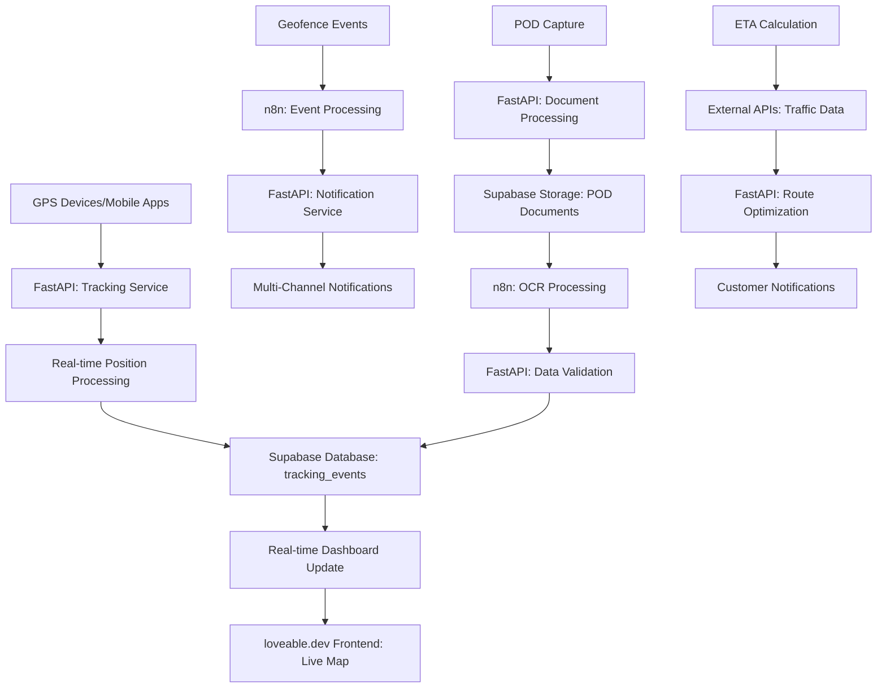

# Transport & Tracking Service

## Service-Überblick

**Service Name**: Transport & Tracking Service  
**Verantwortlichkeit**: Echtzeitverfolgung von Transporten mit GPS-Integration, Statusmanagement und POD-Verarbeitung  
**Architektur**: Eigenständiger FastAPI-Service mit n8n-Integration für Real-time Tracking und Event Processing

## Funktionen

### Real-time Tracking
- **GPS-Integration**: Kontinuierliche Positionsübermittlung von Fahrzeugen
- **Route Monitoring**: Überwachung der geplanten vs. tatsächlichen Route
- **Geofencing**: Automatische Benachrichtigungen bei Bereichsein-/ausfahrt
- **ETA Calculation**: Dynamische Ankunftszeitberechnung
- **Live Updates**: Echtzeitaktualisierung für Kunden und Disponenten

### Status Management
- **Transport Lifecycle**: Vollständige Statusverfolgung von Start bis Abschluss
- **Milestone Tracking**: Automatische Erfassung wichtiger Meilensteine
- **Exception Handling**: Erkennung und Management von Abweichungen
- **Delay Management**: Verspätungsmanagement mit Benachrichtigungen
- **Multi-Stop Tracking**: Verfolgung von Touren mit mehreren Stopps

### POD (Proof of Delivery)
- **Digital Signatures**: Elektronische Unterschriftenerfassung
- **Photo Documentation**: Bildnachweis der Lieferung
- **Damage Reports**: Schadensdokumentation mit Fotos
- **Time Stamps**: Präzise Zeiterfassung aller Ereignisse
- **Document Management**: Verwaltung aller Liefernachweise

## API Endpoints Design

### Transport Management Endpoints
- **Transport CRUD**: Vollständige Transportverwaltung
- **Status Updates**: Statusaktualisierungen mit Validierung
- **Route Management**: Routenplanung und -anpassung
- **Real-time Data**: Live-Datenabfrage für Tracking
- **// TODO**: WebSocket-Integration für Live-Updates

### Tracking Endpoints
- **Position Updates**: GPS-Positionsaktualisierungen
- **Route Tracking**: Routenverfolgung und -analyse
- **Geofence Management**: Geofence-Konfiguration und -überwachung
- **Event Logging**: Ereignisprotokollierung
- **// TODO**: Real-time Event Streaming

### POD Management Endpoints
- **POD Creation**: Erstellung von Liefernachweisen
- **Document Upload**: Upload von Fotos und Dokumenten
- **Signature Capture**: Elektronische Unterschriftenerfassung
- **Validation**: POD-Validierung und -freigabe
- **// TODO**: OCR-Integration für Dokumentenerkennung

### Analytics & Reporting Endpoints
- **Performance Metrics**: Transport-Performance-Kennzahlen
- **Route Analytics**: Routenanalyse und -optimierung
- **Delay Reports**: Verspätungsanalyse
- **Customer Reports**: Kundenspezifische Berichte
- **// TODO**: ML-basierte Predictive Analytics

## Datenmodell Design

### Transport Entity
- **Identifikation**: Transport-ID, Auftragsbezug, Fahrzeug-/Fahrerzuordnung
- **Route Information**: Start-/Zieladresse, geplante Route, Zwischenstopps
- **Timing**: Geplante/tatsächliche Start-/Ankunftszeiten
- **Status Tracking**: Aktueller Status, Meilensteine, Ereignishistorie
- **Performance Metrics**: Entfernung, Fahrzeit, Kraftstoffverbrauch
- **// TODO**: Erweiterte Telematik-Datenintegration

### Tracking Event Structure
- **Event Metadata**: Zeitstempel, Event-Typ, Datenquelle
- **Location Data**: GPS-Koordinaten, Adressinformationen
- **Vehicle Data**: Fahrzeugstatus, Telematik-Daten
- **Driver Data**: Fahrer-ID, Aktivitätsstatus
- **Environmental Data**: Wetter, Verkehrsbedingungen
- **// TODO**: IoT-Sensor-Datenintegration

### POD Structure
- **Delivery Information**: Lieferzeit, Empfänger, Lieferadresse
- **Documentation**: Fotos, Unterschriften, Schadensmeldungen
- **Validation Status**: Prüfstatus, Freigabe, Qualitätsbewertung
- **Metadata**: Erstellungszeit, Bearbeiter, Änderungshistorie
- **Integration Data**: Externe Referenzen, Systemverknüpfungen
- **// TODO**: Blockchain-basierte Unveränderlichkeit

### Transport Status Lifecycle
- **Created**: Transport angelegt und geplant
- **Assigned**: Fahrer und Fahrzeug zugewiesen
- **Started**: Transport begonnen
- **In Transit**: Unterwegs zu Zielen
- **At Pickup**: An Abholort angekommen
- **Loaded**: Ware geladen
- **At Delivery**: An Lieferort angekommen
- **Delivered**: Erfolgreich geliefert
- **Completed**: Transport abgeschlossen
- **// TODO**: Erweiterte Statusübergangsregeln

### Geofence Configuration
- **Zone Definition**: Geografische Bereiche und Grenzen
- **Event Triggers**: Ein-/Ausfahrt-Events und Aktionen
- **Notification Rules**: Benachrichtigungsregeln und -empfänger
- **Time Constraints**: Zeitbasierte Geofence-Aktivierung
- **Integration Points**: Verknüpfung mit anderen Services
- **// TODO**: KI-basierte dynamische Geofences

## Service-Architektur Design

### FastAPI Service Konzept
- **Real-time Processing**: Hochperformante Echtzeitverarbeitung
- **Event-driven Architecture**: Event-basierte Systemarchitektur
- **Microservice Pattern**: Lose gekoppelte Service-Architektur
- **Scalable Design**: Horizontal skalierbare Architektur
- **// TODO**: Container-basierte Deployment-Strategie

### Core Service Functions
- **Tracking Engine**: Zentrale Tracking-Logik und -verarbeitung
- **Event Processing**: Ereignisverarbeitung und -weiterleitung
- **POD Management**: Liefernachweis-Verwaltung und -validierung
- **Analytics Engine**: Datenanalyse und Reporting
- **// TODO**: Machine Learning Integration

### Tracking Service Components
- **GPS Data Processor**: Verarbeitung von GPS-Rohdaten
- **Route Calculator**: Routenberechnung und -optimierung
- **Geofence Engine**: Geofence-Überwachung und -management
- **Alert System**: Benachrichtigungs- und Alarmsystem
- **// TODO**: Predictive Analytics für Verspätungen

### n8n Workflow Design

#### GPS Data Processing Workflow
- **Data Ingestion**: Kontinuierliche GPS-Datenerfassung
- **Data Validation**: Plausibilitätsprüfung und Datenbereinigung
- **Position Calculation**: Positionsberechnung und -interpolation
- **Event Generation**: Automatische Ereignisgenerierung
- **// TODO**: Real-time Stream Processing

#### Geofence Monitoring Workflow
- **Zone Monitoring**: Kontinuierliche Überwachung definierter Bereiche
- **Event Detection**: Erkennung von Ein-/Ausfahrt-Events
- **Notification Dispatch**: Automatische Benachrichtigungsversendung
- **Action Triggers**: Auslösung definierter Aktionen
- **// TODO**: ML-basierte Anomalieerkennung

#### ETA Calculation Workflow
- **Traffic Data Integration**: Einbindung aktueller Verkehrsdaten
- **Route Analysis**: Analyse der verbleibenden Route
- **Delay Prediction**: Vorhersage möglicher Verspätungen
- **Customer Updates**: Automatische Kundenbenachrichtigungen
- **// TODO**: KI-basierte ETA-Optimierung

#### POD Processing Workflow
- **Document Capture**: Erfassung von POD-Dokumenten
- **Quality Validation**: Qualitätsprüfung der Dokumente
- **Data Extraction**: Automatische Datenextraktion
- **Integration Sync**: Synchronisation mit anderen Systemen
- **// TODO**: OCR und AI-basierte Dokumentenverarbeitung

## Datenfluss

## Integration Points

### Inbound
- **Order Management Service**: Transportaufträge und Routeninformationen
- **Disposition Service**: Tourenplanung und Fahrzeugzuweisungen
- **Vehicle Telematics**: GPS-Daten und Fahrzeugstatus
- **Mobile Apps**: Fahrer-Apps für POD und Statusupdates

### Outbound
- **Customer Portal**: Live-Tracking für Kunden
- **Billing Service**: Transportdaten für Abrechnung
- **Analytics Service**: Performance-Daten für Reporting
- **External APIs**: Verkehrsdaten, Wetter, Kartendienste

## GPS und Telematik-Verarbeitung

### Datenquellen
- **Fahrzeug-Telematik**: Integrierte GPS-Systeme
- **Mobile Apps**: Smartphone-basierte Positionsdaten
- **OBD-Geräte**: On-Board-Diagnostik-Datenerfassung
- **IoT-Sensoren**: Zusätzliche Sensor-Datenquellen
- **// TODO**: Integration verschiedener Telematik-Anbieter

### Datenverarbeitung
- **Real-time Processing**: Echtzeitverarbeitung eingehender Daten
- **Data Fusion**: Kombination verschiedener Datenquellen
- **Noise Filtering**: Filterung von GPS-Rauschen und Fehlern
- **Position Interpolation**: Berechnung von Zwischenpositionen
- **// TODO**: Machine Learning für Datenqualitätsverbesserung

## ETA-Berechnung

### Berechnungskomponenten
- **Distance Calculation**: Entfernungsberechnung über Routing-APIs
- **Traffic Integration**: Einbindung aktueller Verkehrslage
- **Historical Data**: Nutzung historischer Fahrzeiten
- **Driver Behavior**: Berücksichtigung individueller Fahrweise
- **// TODO**: KI-basierte ETA-Vorhersage

### Aktualisierungslogik
- **Continuous Updates**: Kontinuierliche ETA-Neuberechnung
- **Threshold-based Notifications**: Benachrichtigungen bei Abweichungen
- **Customer Communication**: Automatische Kundeninformation
- **Internal Alerts**: Interne Benachrichtigungen bei Verspätungen
- **// TODO**: Proaktive Verspätungsvorhersage

## POD-Verarbeitung

### Erfassungsmethoden
- **Digital Signatures**: Elektronische Unterschriftenerfassung
- **Photo Documentation**: Bildbasierte Liefernachweise
- **Barcode Scanning**: Automatische Paket-/Sendungserfassung
- **Voice Notes**: Sprachbasierte Zusatzinformationen
- **// TODO**: Biometrische Authentifizierung

### Validierungsprozess
- **Completeness Check**: Vollständigkeitsprüfung der POD-Daten
- **Quality Assessment**: Qualitätsbewertung von Fotos und Unterschriften
- **Data Consistency**: Konsistenzprüfung mit Auftragsdaten
- **Fraud Detection**: Erkennung möglicher Manipulationen
- **// TODO**: KI-basierte POD-Validierung

## Monitoring und Alerts

### Key Performance Indicators (KPIs)
- **On-time Delivery Rate**: Pünktlichkeitsquote
- **Route Efficiency**: Routeneffizienz und Abweichungen
- **Fuel Consumption**: Kraftstoffverbrauch pro Transport
- **Driver Performance**: Fahrer-Performance-Metriken
- **Customer Satisfaction**: Kundenzufriedenheit basierend auf Tracking
- **// TODO**: Predictive KPIs für Servicequalität

### Alert-Kategorien
- **Delay Alerts**: Verspätungsbenachrichtigungen
- **Route Deviations**: Routenabweichungs-Alarme
- **Geofence Violations**: Geofence-Verletzungen
- **Vehicle Issues**: Fahrzeugprobleme und Pannen
- **Security Alerts**: Sicherheitsrelevante Ereignisse
- **// TODO**: KI-basierte Anomalieerkennung

### Notification Channels
- **Real-time Dashboard**: Live-Updates im System
- **Email Notifications**: E-Mail-Benachrichtigungen
- **SMS Alerts**: SMS-Benachrichtigungen für kritische Events
- **Push Notifications**: Mobile App Benachrichtigungen
- **Webhook Integration**: API-basierte Benachrichtigungen
- **// TODO**: Multi-Channel Notification Orchestration

## Testing

### Unit Tests
- **GPS Data Processing**: Tests für GPS-Datenverarbeitung
- **ETA Calculation**: Tests für ETA-Berechnungslogik
- **Geofence Logic**: Tests für Geofence-Funktionalität
- **POD Validation**: Tests für POD-Validierungsregeln
- **// TODO**: Comprehensive Test Coverage

### Integration Tests
- **API Endpoints**: Tests für alle API-Endpunkte
- **External Integrations**: Tests für externe API-Integrationen
- **Real-time Processing**: Tests für Echtzeitverarbeitung
- **Event Workflows**: Tests für n8n-Workflows
- **// TODO**: End-to-End Testing Framework

### Performance Tests
- **High-frequency GPS Data**: Tests mit hoher GPS-Datenfrequenz
- **Concurrent Tracking**: Tests mit vielen gleichzeitigen Transporten
- **Real-time Updates**: Performance-Tests für Live-Updates
- **Database Load**: Tests für Datenbankperformance
- **// TODO**: Load Testing und Scalability Tests